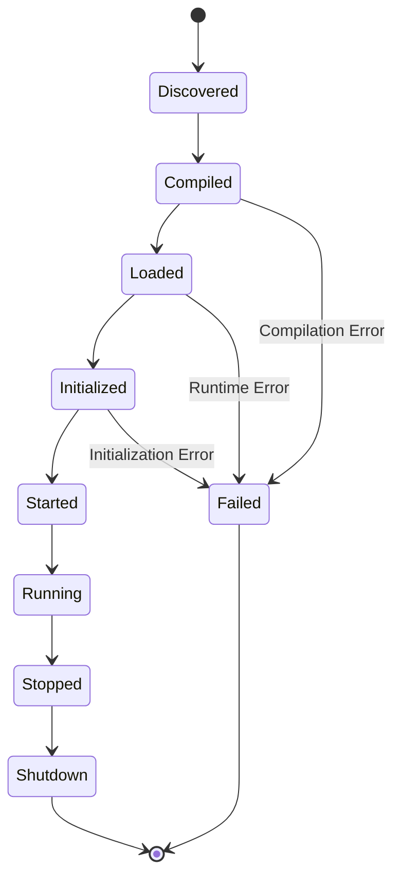
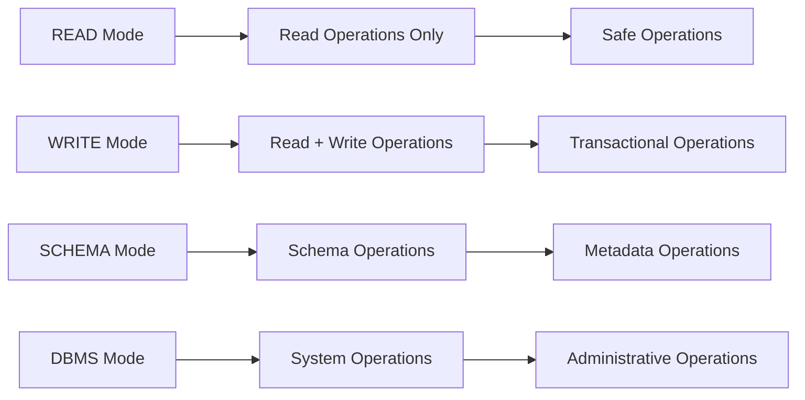
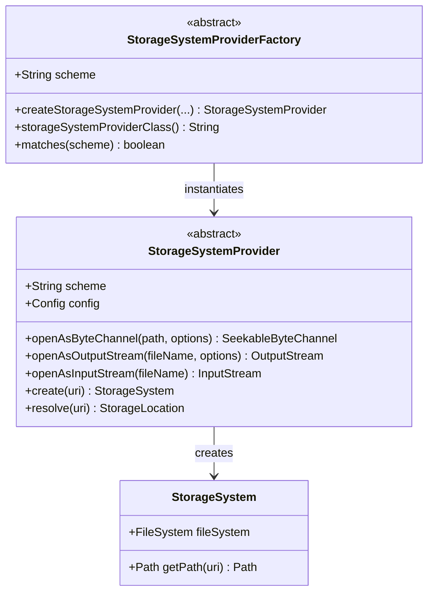
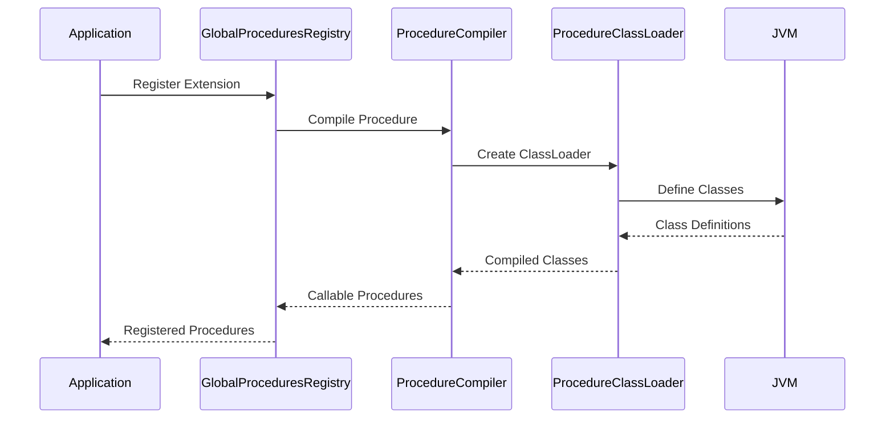
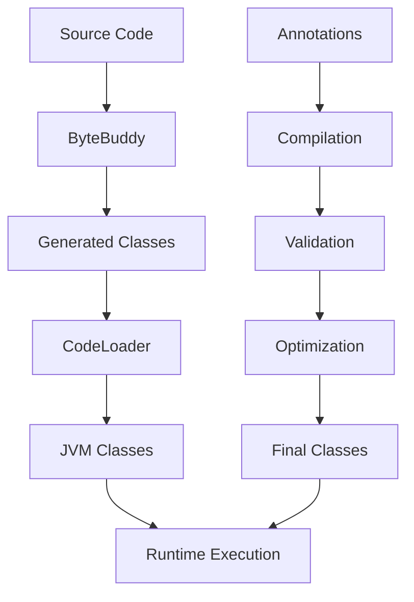
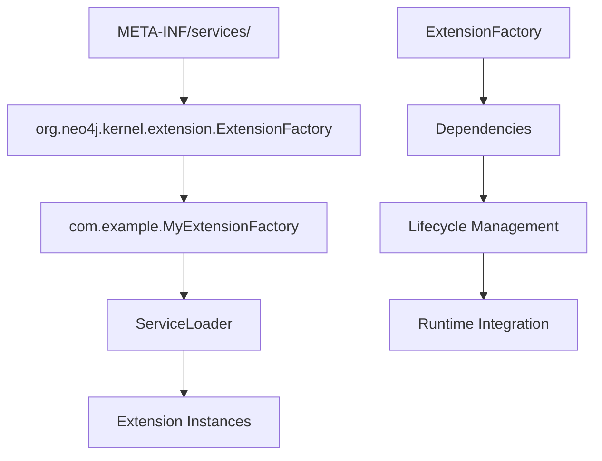
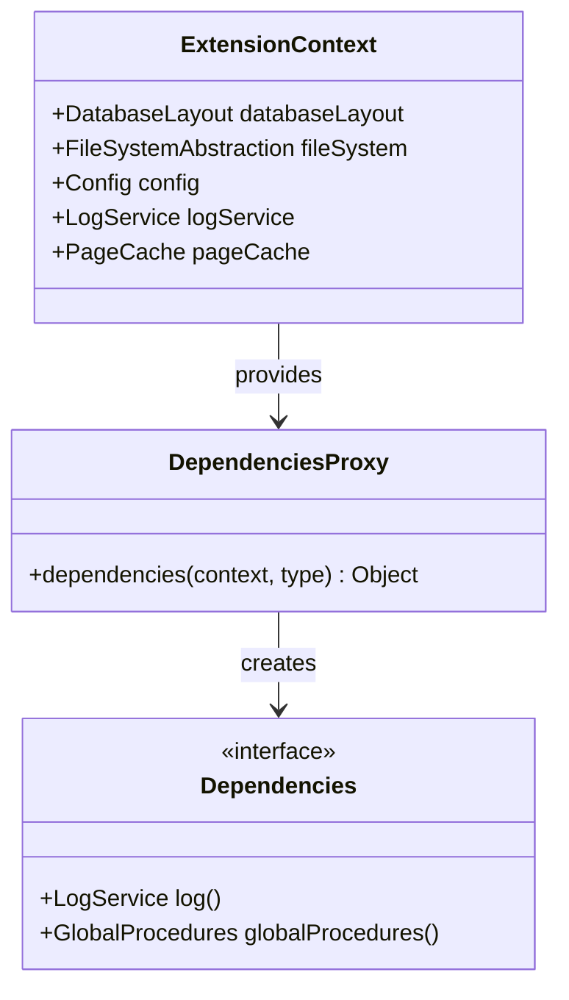

# Extension Points

<cite>
**Referenced Files in This Document**
- [Procedure.java](file://community\procedure-api\src\main\java\org\neo4j\procedure\Procedure.java)
- [UserFunction.java](file://community\procedure-api\src\main\java\org\neo4j\procedure\UserFunction.java)
- [UserAggregationFunction.java](file://community\procedure-api\src\main\java\org\neo4j\procedure\UserAggregationFunction.java)
- [Mode.java](file://community\procedure-api\src\main\java\org\neo4j\procedure\Mode.java)
- [ExtensionFactory.java](file://community\kernel\src\main\java\org\neo4j\kernel\extension\ExtensionFactory.java)
- [StorageSystemProvider.java](file://community\cloud\src\main\java\org\neo4j\cloud\storage\StorageSystemProvider.java)
- [StorageSystemProviderFactory.java](file://community\cloud\src\main\java\org\neo4j\cloud\storage\StorageSystemProviderFactory.java)
- [GlobalProceduresRegistry.java](file://community\procedure\src\main\java\org\neo4j\procedure\impl\GlobalProceduresRegistry.java)
- [ProcedureCompiler.java](file://community\procedure\src\main\java\org\neo4j\procedure\impl\ProcedureCompiler.java)
- [ProcedureClassLoader.java](file://community\procedure\src\main\java\org\neo4j\procedure\impl\ProcedureClassLoader.java)
- [Services.java](file://community\common\src\main\java\org\neo4j\service\Services.java)
- [ServiceAnnotationProcessor.java](file://community\annotations\src\main\java\org\neo4j\annotations\service\ServiceAnnotationProcessor.java)
- [CustomExtensionUtils.java](file://community\kernel-test-utils\src\main\java\org\neo4j\procedure\impl\CustomExtensionUtils.java)
- [CodeGenerator.java](file://community\codegen\src\main\java\org\neo4j\codegen\CodeGenerator.java)
- [CodeLoader.java](file://community\codegen\src\main\java\org\neo4j\codegen\CodeLoader.java)
</cite>

## Table of Contents
1. [Introduction](#introduction)
2. [Architecture Overview](#architecture-overview)
3. [Core Extension Mechanisms](#core-extension-mechanisms)
4. [Procedure Extensions](#procedure-extensions)
5. [Function Extensions](#function-extensions)
6. [Storage System Extensions](#storage-system-extensions)
7. [Extension Loading and Compilation](#extension-loading-and-compilation)
8. [Service Provider Pattern](#service-provider-pattern)
9. [Practical Implementation Examples](#practical-implementation-examples)
10. [Advanced Extension Patterns](#advanced-extension-patterns)
11. [Troubleshooting and Best Practices](#troubleshooting-and-best-practices)
12. [Conclusion](#conclusion)

## Introduction

Neo4j's extension points provide a powerful framework for customizing and integrating the database with external systems. These extension mechanisms allow developers to create custom procedures, functions, and storage providers that seamlessly integrate with Neo4j's core functionality while maintaining type safety and performance.

The extension architecture is built around several key concepts:
- **Pluggable Interfaces**: Well-defined contracts for extending core functionality
- **Service Provider Pattern**: Automatic discovery and loading of extensions
- **Class Loading Isolation**: Secure sandboxing of extension code
- **Compile-Time Validation**: Early detection of extension compatibility issues

## Architecture Overview

Neo4j's extension architecture follows a layered approach with clear separation of concerns:

```mermaid
graph TB
subgraph "Application Layer"
A[Custom Procedures]
B[Custom Functions]
C[Storage Providers]
D[Extension Factories]
end
subgraph "Framework Layer"
E[GlobalProceduresRegistry]
F[ProcedureCompiler]
G[ProcedureClassLoader]
H[ExtensionFactory]
end
subgraph "Infrastructure Layer"
I[ServiceLoader]
J[CodeGenerator]
K[CodeLoader]
L[DependencyResolver]
end
subgraph "Core Database"
M[Neo4j Kernel]
N[Query Engine]
O[Storage Engine]
end
A --> E
B --> E
C --> H
D --> H
E --> F
F --> G
G --> I
H --> L
I --> J
J --> K
E --> M
H --> M
M --> N
M --> O
```



**Diagram sources**
- [GlobalProceduresRegistry.java](file://community\procedure\src\main\java\org\neo4j\procedure\impl\GlobalProceduresRegistry.java#L57-L85)
- [ExtensionFactory.java](file://community\kernel\src\main\java\org\neo4j\kernel\extension\ExtensionFactory.java#L29-L83)
- [Services.java](file://community\common\src\main\java\org\neo4j\service\Services.java#L36-L73)

## Core Extension Mechanisms

### Extension Types

Neo4j supports several types of extensions, each serving specific purposes:

| Extension Type | Purpose | Interface | Scope |
|----------------|---------|-----------|-------|
| **Procedures** | Custom database operations | `@Procedure` annotation | Database-wide |
| **Functions** | Scalar value computations | `@UserFunction` annotation | Query-level |
| **Aggregation Functions** | Aggregate value computations | `@UserAggregationFunction` annotation | Query-level |
| **Storage Providers** | Custom storage backends | `StorageSystemProvider` | Database-wide |
| **Extension Factories** | Kernel-level extensions | `ExtensionFactory` | System-wide |

### Extension Lifecycle

All extensions follow a standardized lifecycle managed by Neo4j's extension framework:



**Section sources**
- [ExtensionFactory.java](file://community\kernel\src\main\java\org\neo4j\kernel\extension\ExtensionFactory.java#L48-L56)
- [GlobalProceduresRegistry.java](file://community\procedure\src\main\java\org\neo4j\procedure\impl\GlobalProceduresRegistry.java#L205-L218)

## Procedure Extensions

### Defining Custom Procedures

Custom procedures are the primary way to extend Neo4j's functionality. They are defined using the `@Procedure` annotation and can perform various operations on the graph database.

#### Basic Procedure Structure

```java
// Example procedure structure (not actual code)
public class MyCustomProcedure {
    @Context
    public GraphDatabaseService db;
    
    @Context
    public Log log;
    
    @Procedure
    @Mode(Mode.READ)
    public Stream<Result> myProcedure(@Name("param") String input) {
        // Procedure implementation
    }
    
    public static class Result {
        public String output;
        public long count;
    }
}
```

#### Procedure Annotations and Configuration

| Annotation | Purpose | Required | Default |
|------------|---------|----------|---------|
| `@Procedure` | Marks method as procedure | Yes | - |
| `@Name` | Names input parameters | Yes | - |
| `@Mode` | Sets operation mode | No | `READ` |
| `@Eager` | Forces eager evaluation | No | `false` |
| `@Warning` | Adds warning messages | No | `""` |
| `@Deprecated` | Marks as deprecated | No | - |

### Procedure Modes and Security

Neo4j enforces strict security boundaries through procedure modes:



**Diagram sources**
- [Mode.java](file://community\procedure-api\src\main\java\org\neo4j\procedure\Mode.java#L29-L40)

**Section sources**
- [Procedure.java](file://community\procedure-api\src\main\java\org\neo4j\procedure\Procedure.java#L28-L169)
- [Mode.java](file://community\procedure-api\src\main\java\org\neo4j\procedure\Mode.java#L28-L41)

## Function Extensions

### User Functions

User functions provide scalar value computations within Cypher queries. They are read-only and cannot modify the graph.

#### Function Definition Pattern

```java
// Example function structure (not actual code)
public class MyUserFunctions {
    @Context
    public GraphDatabaseService db;
    
    @Context
    public Log log;
    
    @UserFunction
    public String myFunction(@Name("input") String input) {
        // Function implementation
        return "processed_" + input;
    }
}
```

#### Function Types and Signatures

| Input Type | Output Type | Description |
|------------|-------------|-------------|
| `String` | `String` | Text processing |
| `Long` | `Double` | Numeric calculations |
| `Node` | `String` | Node property extraction |
| `Relationship` | `Long` | Relationship counting |
| `Map` | `List` | Complex data transformations |
| `List` | `Map` | Collection processing |

### Aggregation Functions

Aggregation functions operate on groups of values and produce aggregated results:

```java
// Example aggregation function structure (not actual code)
public class MyAggregationFunctions {
    @Context
    public Log log;
    
    @UserAggregationFunction
    public MyAggregator myAggregator() {
        return new MyAggregator();
    }
    
    public static class MyAggregator implements UserAggregationFunction {
        private List<String> values = new ArrayList<>();
        
        public void add(@Name("value") String value) {
            values.add(value);
        }
        
        public String result() {
            return String.join(",", values);
        }
    }
}
```

**Section sources**
- [UserFunction.java](file://community\procedure-api\src\main\java\org\neo4j\procedure\UserFunction.java#L28-L129)
- [UserAggregationFunction.java](file://community\procedure-api\src\main\java\org\neo4j\procedure\UserAggregationFunction.java#L56-L87)

## Storage System Extensions

### Storage Provider Architecture

Neo4j's storage system extensibility allows integration with external storage backends through the `StorageSystemProvider` interface.

#### Storage Provider Components



**Diagram sources**
- [StorageSystemProvider.java](file://community\cloud\src\main\java\org\neo4j\cloud\storage\StorageSystemProvider.java#L61-L298)
- [StorageSystemProviderFactory.java](file://community\cloud\src\main\java\org\neo4j\cloud\storage\StorageSystemProviderFactory.java#L42-L131)

### Cloud Storage Integration

The storage system extension enables seamless integration with cloud storage solutions:

```java
// Example storage provider implementation (not actual code)
public class CloudStorageProvider extends StorageSystemProvider {
    private final String bucketName;
    
    public CloudStorageProvider(String scheme, 
                               ChunkChannelSupplier tempSupplier,
                               Config config,
                               InternalLogProvider logProvider,
                               MemoryTracker memoryTracker) {
        super(scheme, tempSupplier, config, logProvider, memoryTracker);
        this.bucketName = config.get(CloudStorageSettings.BUCKET_NAME);
    }
    
    @Override
    protected SeekableByteChannel openAsByteChannel(StoragePath path, Set<? extends OpenOption> options) {
        // Cloud-specific implementation
        return new CloudByteChannel(bucketName, path.getFileName(), options);
    }
    
    @Override
    protected StorageSystem create(URI storageUri) {
        // Create cloud storage system
        return new CloudStorageSystem(this, storageUri);
    }
}
```

**Section sources**
- [StorageSystemProvider.java](file://community\cloud\src\main\java\org\neo4j\cloud\storage\StorageSystemProvider.java#L61-L298)
- [StorageSystemProviderFactory.java](file://community\cloud\src\main\java\org\neo4j\cloud\storage\StorageSystemProviderFactory.java#L42-L131)

## Extension Loading and Compilation

### Class Loading Architecture

Neo4j employs sophisticated class loading mechanisms to isolate extension code and ensure security:



**Diagram sources**
- [ProcedureClassLoader.java](file://community\procedure\src\main\java\org\neo4j\procedure\impl\ProcedureClassLoader.java#L84-L260)
- [GlobalProceduresRegistry.java](file://community\procedure\src\main\java\org\neo4j\procedure\impl\GlobalProceduresRegistry.java#L58-L85)

### Code Generation and Compilation

Neo4j uses bytecode generation for dynamic procedure creation:



**Diagram sources**
- [CodeGenerator.java](file://community\codegen\src\main\java\org\neo4j\codegen\CodeGenerator.java#L33-L188)
- [CustomExtensionUtils.java](file://community\kernel-test-utils\src\main\java\org\neo4j\procedure\impl\CustomExtensionUtils.java#L35-L454)

**Section sources**
- [ProcedureClassLoader.java](file://community\procedure\src\main\java\org\neo4j\procedure\impl\ProcedureClassLoader.java#L84-L260)
- [CodeGenerator.java](file://community\codegen\src\main\java\org\neo4j\codegen\CodeGenerator.java#L33-L188)

## Service Provider Pattern

### Service Discovery and Loading

Neo4j leverages Java's Service Provider Interface (SPI) pattern for automatic extension discovery:



**Diagram sources**
- [Services.java](file://community\common\src\main\java\org\neo4j\service\Services.java#L36-L73)
- [ServiceAnnotationProcessor.java](file://community\annotations\src\main\java\org\neo4j\annotations\service\ServiceAnnotationProcessor.java#L60-L191)

### Extension Factory Implementation

Extension factories serve as the entry point for kernel-level extensions:

```java
// Example extension factory (not actual code)
public class MyExtensionFactory extends ExtensionFactory<MyDependencies> {
    public MyExtensionFactory() {
        super(ExtensionType.DATABASE, "MY_EXTENSION");
    }
    
    @Override
    public Lifecycle newInstance(ExtensionContext context, MyDependencies dependencies) {
        return new MyExtension(dependencies);
    }
}

public class MyExtension implements Lifecycle {
    private final MyDependencies dependencies;
    
    public MyExtension(MyDependencies dependencies) {
        this.dependencies = dependencies;
    }
    
    @Override
    public void init() {
        // Initialization logic
    }
    
    @Override
    public void start() {
        // Startup logic
    }
    
    @Override
    public void stop() {
        // Cleanup logic
    }
    
    @Override
    public void shutdown() {
        // Shutdown logic
    }
}
```

**Section sources**
- [ExtensionFactory.java](file://community\kernel\src\main\java\org\neo4j\kernel\extension\ExtensionFactory.java#L29-L83)
- [Services.java](file://community\common\src\main\java\org\neo4j\service\Services.java#L36-L133)

## Practical Implementation Examples

### Creating a Custom Procedure

Here's a complete example of implementing a custom procedure:

```java
// Complete procedure implementation (not actual code)
public class CustomDataProcessor {
    @Context
    public GraphDatabaseService db;
    
    @Context
    public Log log;
    
    @Context
    public TerminationGuard terminationGuard;
    
    @Procedure
    @Mode(Mode.WRITE)
    @Eager
    public Stream<ProcessingResult> processData(
            @Name("nodeLabels") List<String> nodeLabels,
            @Name("propertyKey") String propertyKey,
            @Name("threshold") double threshold) {
        
        log.info("Processing nodes with labels: %s", nodeLabels);
        
        return db.findNodes(Label.label(nodeLabels.get(0)))
            .stream()
            .filter(node -> shouldProcess(node, propertyKey, threshold))
            .map(this::processNode)
            .peek(result -> log.debug("Processed: %s", result.nodeId));
    }
    
    private boolean shouldProcess(Node node, String propertyKey, double threshold) {
        return node.hasProperty(propertyKey) && 
               ((Number)node.getProperty(propertyKey)).doubleValue() > threshold;
    }
    
    private ProcessingResult processNode(Node node) {
        // Complex processing logic
        return new ProcessingResult(node.getId(), node.getProperty("name"));
    }
    
    public static class ProcessingResult {
        public long nodeId;
        public String nodeName;
        public String processedData;
        
        public ProcessingResult(long nodeId, String nodeName) {
            this.nodeId = nodeId;
            this.nodeName = nodeName;
        }
    }
}
```

### Building Extension JARs

Neo4j provides utilities for creating extension JARs without classloader contamination:

```java
// Extension JAR creation (not actual code)
public class ExtensionBuilder {
    public static void createCustomExtensionJar(Path outputPath) throws IOException {
        // Generate extension classes dynamically
        Extension extension = CustomExtensionUtils.createExtension();
        
        // Create JAR with proper META-INF/services
        extension.toJar(outputPath);
        
        // Add custom procedures
        CustomExtensionUtils.createProcedureWithExtensionJar(outputPath);
    }
}
```

**Section sources**
- [CustomExtensionUtils.java](file://community\kernel-test-utils\src\main\java\org\neo4j\procedure\impl\CustomExtensionUtils.java#L82-L434)

## Advanced Extension Patterns

### Dependency Injection and Lifecycle Management

Neo4j's extension framework supports sophisticated dependency injection:



**Diagram sources**
- [ExtensionFactory.java](file://community\kernel\src\main\java\org\neo4j\kernel\extension\ExtensionFactory.java#L29-L83)
- [CustomExtensionUtils.java](file://community\kernel-test-utils\src\main\java\org\neo4j\procedure\impl\CustomExtensionUtils.java#L304-L356)

### Extension Failure Strategies

Neo4j provides configurable failure handling for extensions:

| Strategy | Behavior | Use Case |
|----------|----------|----------|
| `fail()` | Throws exception on failure | Production environments |
| `ignore()` | Continues with missing extension | Development/testing |
| `print()` | Logs warnings and continues | Debugging scenarios |

### Custom Storage Provider Implementation

Advanced storage providers can implement sophisticated caching and retry logic:

```java
// Advanced storage provider (not actual code)
public class ResilientStorageProvider extends StorageSystemProvider {
    private final RetryPolicy retryPolicy;
    private final Cache<String, StorageChannel> channelCache;
    
    @Override
    protected SeekableByteChannel openAsByteChannel(StoragePath path, Set<? extends OpenOption> options) {
        String cacheKey = path.toString();
        
        return channelCache.computeIfAbsent(cacheKey, key -> {
            try {
                return retryPolicy.execute(() -> createChannel(path, options));
            } catch (Exception e) {
                throw new IOException("Failed to open channel: " + path, e);
            }
        });
    }
}
```

**Section sources**
- [ExtensionFailureStrategies.java](file://community\kernel\src\main\java\org\neo4j\kernel\extension\ExtensionFailureStrategies.java#L53-L90)
- [StorageSystemProvider.java](file://community\cloud\src\main\java\org\neo4j\cloud\storage\StorageSystemProvider.java#L61-L298)

## Troubleshooting and Best Practices

### Common Extension Issues

| Issue | Symptoms | Solution |
|-------|----------|----------|
| **Class Loading Conflicts** | `ClassNotFoundException` | Use isolated class loaders |
| **Security Violations** | `SecurityException` | Review procedure modes |
| **Compilation Failures** | `ProcedureException` | Validate signatures |
| **Dependency Resolution** | `UnsatisfiedDependencyException` | Check service registrations |

### Performance Optimization

1. **Minimize Object Creation**: Reuse objects where possible
2. **Batch Operations**: Group database operations
3. **Caching Strategies**: Implement appropriate caching
4. **Async Processing**: Use background threads for long-running tasks

### Security Considerations

1. **Input Validation**: Always validate procedure inputs
2. **Resource Limits**: Implement timeouts and limits
3. **Privilege Separation**: Use appropriate procedure modes
4. **Audit Logging**: Log sensitive operations

### Testing Extension Code

```java
// Extension testing pattern (not actual code)
@Test
public void testCustomProcedure() {
    // Setup test environment
    TestGraphDatabaseFactory factory = new TestGraphDatabaseFactory();
    GraphDatabaseService db = factory.newImpermanentDatabase();
    
    try {
        // Register extension
        GlobalProcedures procedures = db.getDependencyResolver()
            .resolveDependency(GlobalProcedures.class);
        
        // Execute procedure
        Result result = db.execute("CALL my.custom.procedure($input)", 
                                 Map.of("input", "test"));
        
        // Verify results
        assertThat(result.hasNext()).isTrue();
    } finally {
        db.shutdown();
    }
}
```

## Conclusion

Neo4j's extension points provide a robust and flexible framework for customizing database functionality. The architecture balances power and safety through:

- **Type Safety**: Compile-time validation ensures extension compatibility
- **Security Boundaries**: Strict mode enforcement prevents unauthorized operations
- **Performance Optimization**: Efficient class loading and compilation
- **Integration Flexibility**: Seamless integration with external systems

The extension framework enables developers to:
- Extend Neo4j with custom business logic
- Integrate with external data sources and services
- Implement specialized storage backends
- Create domain-specific query functions

By following the patterns and best practices outlined in this documentation, developers can create robust, secure, and performant extensions that enhance Neo4j's capabilities while maintaining system stability and security.