# Plugin System

<cite>
**Referenced Files in This Document**
- [ExtensionFactory.java](file://community/kernel/src/main/java/org/neo4j/kernel/extension/ExtensionFactory.java)
- [AbstractExtensions.java](file://community/kernel/src/main/java/org/neo4j/kernel/extension/AbstractExtensions.java)
- [GlobalExtensions.java](file://community/kernel/src/main/java/org/neo4j/kernel/extension/GlobalExtensions.java)
- [DatabaseExtensions.java](file://community/kernel/src/main/java/org/neo4j/kernel/extension/DatabaseExtensions.java)
- [ExtensionType.java](file://community/kernel/src/main/java/org/neo4j/kernel/extension/ExtensionType.java)
- [ExtensionContext.java](file://community/kernel/src/main/java/org/neo4j/kernel/extension/context/ExtensionContext.java)
- [BaseExtensionContext.java](file://community/kernel/src/main/java/org/neo4j/kernel/extension/context/BaseExtensionContext.java)
- [GlobalExtensionContext.java](file://community/kernel/src/main/java/org/neo4j/kernel/extension/context/GlobalExtensionContext.java)
- [DatabaseExtensionContext.java](file://community/kernel/src/main/java/org/neo4j/kernel/extension/context/DatabaseExtensionContext.java)
- [UserDataCollectorExtensionFactory.java](file://community/udc/src/main/java/org/neo4j/udc/UserDataCollectorExtensionFactory.java)
- [DataCollectorExtensionFactory.java](file://community/data-collector/src/main/java/org/neo4j/internal/collector/extension/DataCollectorExtensionFactory.java)
- [StorageSystemProvider.java](file://community/cloud/src/main/java/org/neo4j/cloud/storage/StorageSystemProvider.java)
- [StorageSystemProviderFactory.java](file://community/cloud/src/main/java/org/neo4j/cloud/storage/StorageSystemProviderFactory.java)
- [VectorEncoding.java](file://community/genai-plugin/src/main/java/org/neo4j/genai/vector/VectorEncoding.java)
- [Services.java](file://community/common/src/main/java/org/neo4j/service/Services.java)
- [ProcedureClassLoader.java](file://community/procedure/src/main/java/org/neo4j/procedure/impl/ProcedureClassLoader.java)
- [LifecycleAdapter.java](file://community/common/src/main/java/org/neo4j/kernel/lifecycle/LifecycleAdapter.java)
- [DatabaseEventListeners.java](file://community/kernel/src/main/java/org/neo4j/kernel/monitoring/DatabaseEventListeners.java)
- [DatabaseEventListener.java](file://community/graphdb-api/src/main/java/org/neo4j/graphdb/event/DatabaseEventListener.java)
</cite>

## Table of Contents
1. [Introduction](#introduction)
2. [Architecture Overview](#architecture-overview)
3. [Core Components](#core-components)
4. [Extension Factory System](#extension-factory-system)
5. [Storage System Providers](#storage-system-providers)
6. [Vector Encoding Implementation](#vector-encoding-implementation)
7. [Plugin Discovery and Configuration](#plugin-discovery-and-configuration)
8. [Lifecycle Management](#lifecycle-management)
9. [Common Issues and Solutions](#common-issues-and-solutions)
10. [Best Practices](#best-practices)
11. [Troubleshooting Guide](#troubleshooting-guide)

## Introduction

Neo4j's plugin system provides a powerful and extensible framework for adding custom functionality to the database engine. The system is built around the concept of extension factories that create and manage lifecycle-aware components, enabling developers to integrate custom logic, storage providers, and specialized functionality seamlessly with the core database operations.

The plugin system supports two primary extension types: **GLOBAL** extensions that operate at the database management service level, and **DATABASE** extensions that are scoped to individual databases. This dual-layer architecture allows for both system-wide and database-specific functionality while maintaining clear separation of concerns.

## Architecture Overview

The Neo4j plugin system follows a layered architecture that separates concerns between extension discovery, instantiation, lifecycle management, and integration with the core database components.

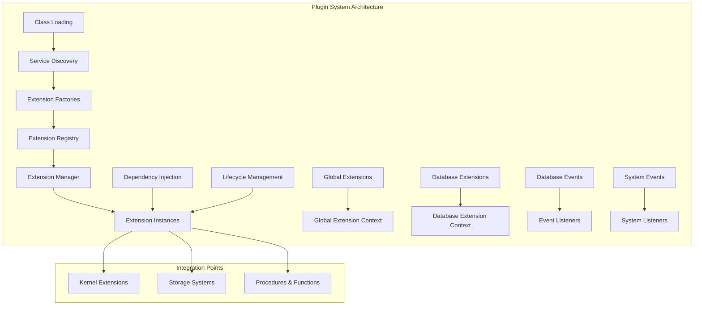

**Diagram sources**
- [ExtensionFactory.java](file://community/kernel/src/main/java/org/neo4j/kernel/extension/ExtensionFactory.java#L29-L83)
- [AbstractExtensions.java](file://community/kernel/src/main/java/org/neo4j/kernel/extension/AbstractExtensions.java#L36-L127)
- [Services.java](file://community/common/src/main/java/org/neo4j/service/Services.java#L36-L133)

## Core Components

### Extension Factory Base Classes

The foundation of the plugin system consists of several key abstract classes that define the contract for creating and managing extensions.

#### ExtensionFactory Abstract Class

The [`ExtensionFactory`](file://community/kernel/src/main/java/org/neo4j/kernel/extension/ExtensionFactory.java#L29-L83) serves as the base class for all extension factories, providing the essential infrastructure for creating extension instances.

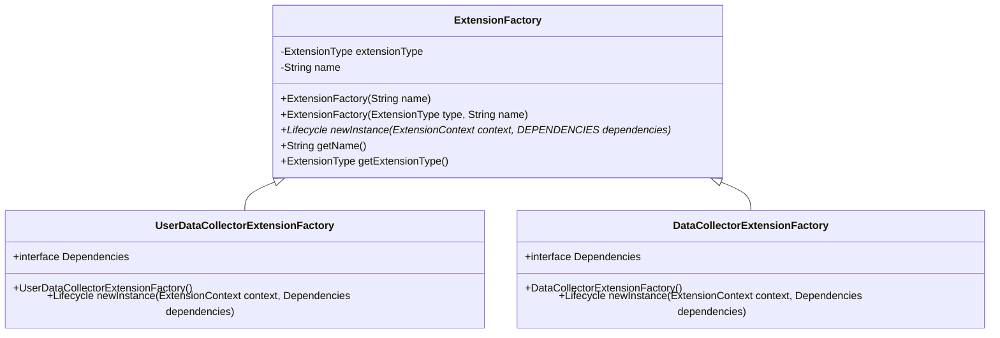

**Diagram sources**
- [ExtensionFactory.java](file://community/kernel/src/main/java/org/neo4j/kernel/extension/ExtensionFactory.java#L29-L83)
- [UserDataCollectorExtensionFactory.java](file://community/udc/src/main/java/org/neo4j/udc/UserDataCollectorExtensionFactory.java#L33-L63)
- [DataCollectorExtensionFactory.java](file://community/data-collector/src/main/java/org/neo4j/internal/collector/extension/DataCollectorExtensionFactory.java#L35-L62)

#### Extension Types

The system defines two distinct extension types that determine the scope and lifecycle of the extensions:

- **GLOBAL Extensions**: Operate at the database management service level, providing system-wide functionality
- **DATABASE Extensions**: Scoped to individual databases, allowing database-specific behavior

**Section sources**
- [ExtensionType.java](file://community/kernel/src/main/java/org/neo4j/kernel/extension/ExtensionType.java#L25-L34)
- [ExtensionFactory.java](file://community/kernel/src/main/java/org/neo4j/kernel/extension/ExtensionFactory.java#L34-L40)

### Extension Context System

The extension context provides the environment and dependencies required for extension initialization and operation.

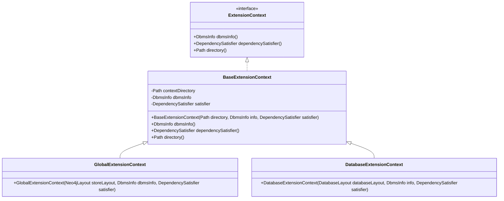

**Diagram sources**
- [ExtensionContext.java](file://community/kernel/src/main/java/org/neo4j/kernel/extension/context/ExtensionContext.java#L29-L41)
- [BaseExtensionContext.java](file://community/kernel/src/main/java/org/neo4j/kernel/extension/context/BaseExtensionContext.java#L26-L52)
- [GlobalExtensionContext.java](file://community/kernel/src/main/java/org/neo4j/kernel/extension/context/GlobalExtensionContext.java#L26-L30)
- [DatabaseExtensionContext.java](file://community/kernel/src/main/java/org/neo4j/kernel/extension/context/DatabaseExtensionContext.java#L26-L31)

**Section sources**
- [ExtensionContext.java](file://community/kernel/src/main/java/org/neo4j/kernel/extension/context/ExtensionContext.java#L29-L41)
- [BaseExtensionContext.java](file://community/kernel/src/main/java/org/neo4j/kernel/extension/context/BaseExtensionContext.java#L26-L52)

## Extension Factory System

### Implementation Patterns

The extension factory system follows consistent patterns for creating and managing extensions across different subsystems.

#### Basic Extension Factory Implementation

Here's how a typical extension factory is implemented:

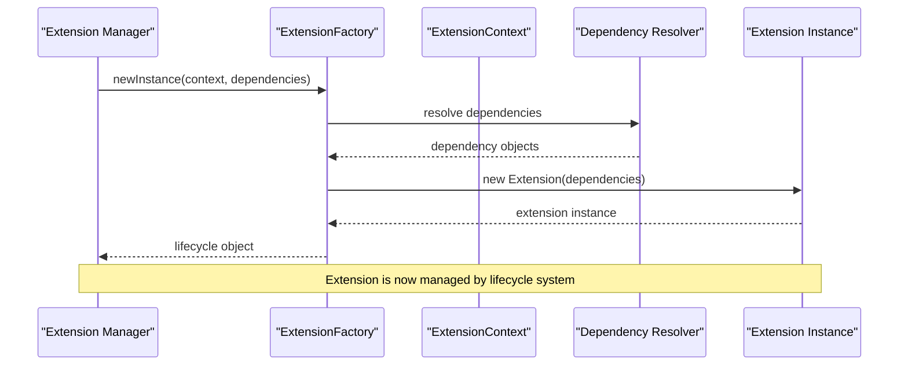

**Diagram sources**
- [AbstractExtensions.java](file://community/kernel/src/main/java/org/neo4j/kernel/extension/AbstractExtensions.java#L58-L70)
- [ExtensionFactory.java](file://community/kernel/src/main/java/org/neo4j/kernel/extension/ExtensionFactory.java#L55-L56)

#### Dependency Resolution

The system uses sophisticated dependency resolution to inject required services and components into extension instances.

**Section sources**
- [AbstractExtensions.java](file://community/kernel/src/main/java/org/neo4j/kernel/extension/AbstractExtensions.java#L109-L126)
- [ExtensionFactory.java](file://community/kernel/src/main/java/org/neo4j/kernel/extension/ExtensionFactory.java#L55-L56)

### Extension Lifecycle Management

Extensions follow a standardized lifecycle that ensures proper initialization, operation, and cleanup.

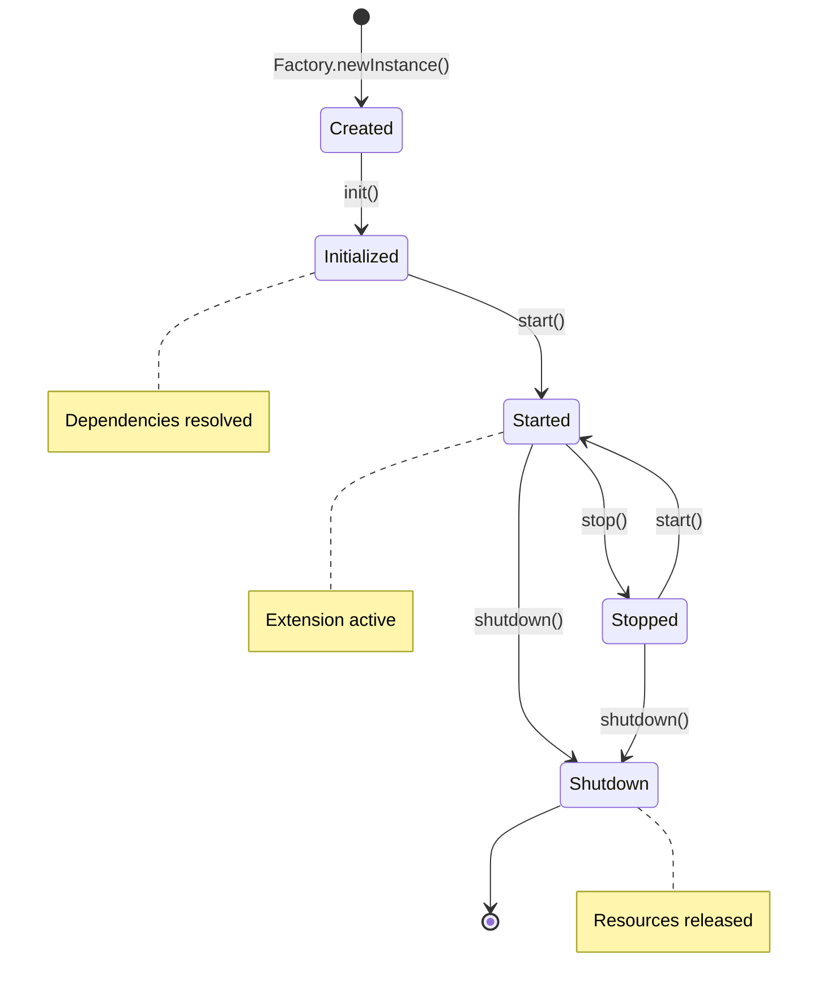

**Diagram sources**
- [LifecycleAdapter.java](file://community/common/src/main/java/org/neo4j/kernel/lifecycle/LifecycleAdapter.java#L41-L89)

**Section sources**
- [AbstractExtensions.java](file://community/kernel/src/main/java/org/neo4j/kernel/extension/AbstractExtensions.java#L58-L88)
- [LifecycleAdapter.java](file://community/common/src/main/java/org/neo4j/kernel/lifecycle/LifecycleAdapter.java#L41-L89)

## Storage System Providers

### Cloud Storage Integration

Neo4j's storage system provider framework enables seamless integration with cloud storage solutions, allowing databases to be stored remotely while maintaining local filesystem semantics.

#### StorageSystemProvider Architecture

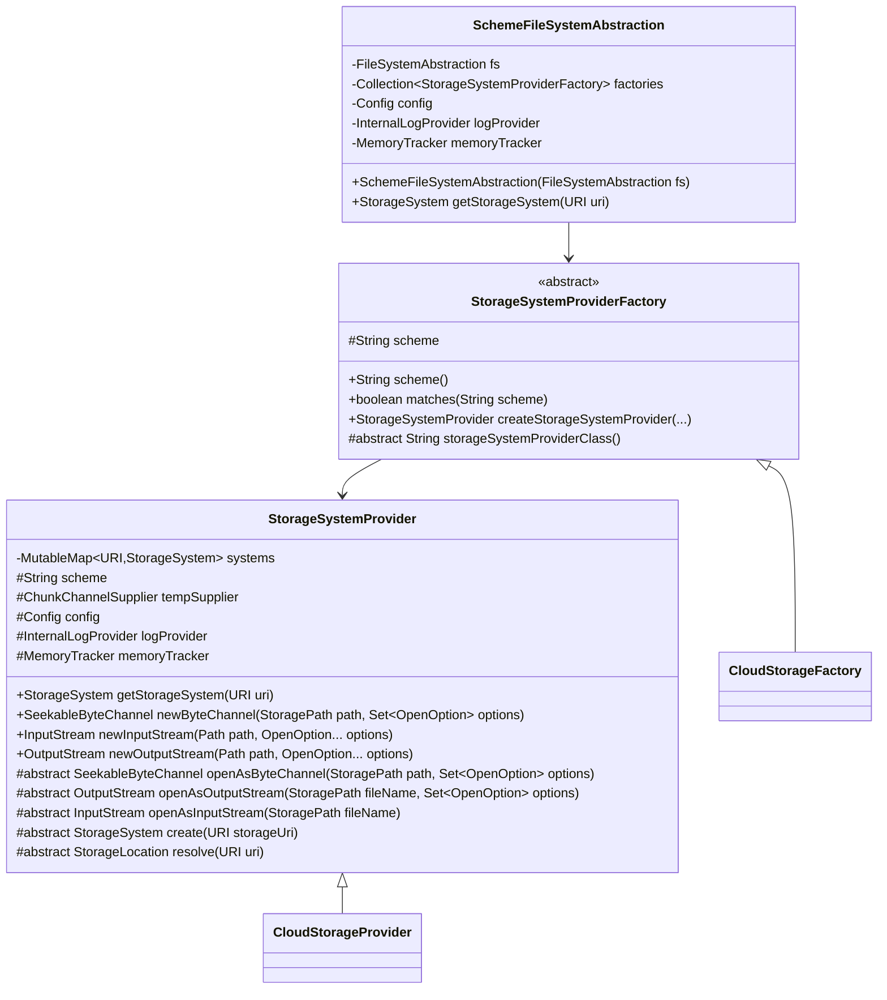

**Diagram sources**
- [StorageSystemProvider.java](file://community/cloud/src/main/java/org/neo4j/cloud/storage/StorageSystemProvider.java#L60-L298)
- [StorageSystemProviderFactory.java](file://community/cloud/src/main/java/org/neo4j/cloud/storage/StorageSystemProviderFactory.java#L42-L131)

#### Implementation Example: Cloud Storage Provider

The cloud storage provider demonstrates how to implement a storage system that integrates with remote storage services while maintaining local filesystem compatibility.

**Section sources**
- [StorageSystemProvider.java](file://community/cloud/src/main/java/org/neo4j/cloud/storage/StorageSystemProvider.java#L60-L298)
- [StorageSystemProviderFactory.java](file://community/cloud/src/main/java/org/neo4j/cloud/storage/StorageSystemProviderFactory.java#L42-L131)

## Vector Encoding Implementation

### GenAI Plugin Architecture

The vector encoding system showcases advanced plugin capabilities, providing AI-powered vector embeddings for graph data processing.

#### Vector Encoding System

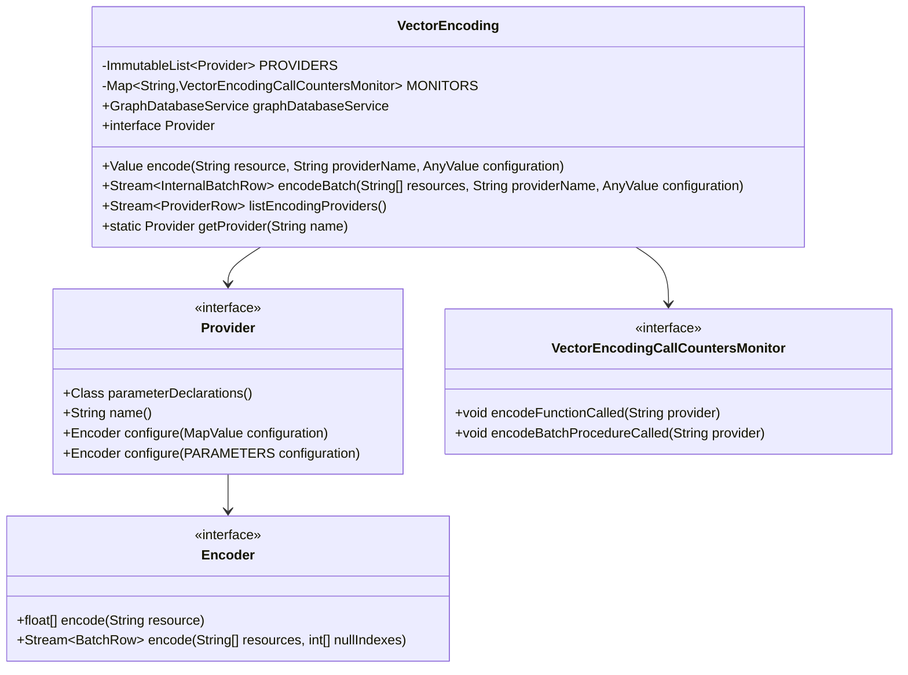

**Diagram sources**
- [VectorEncoding.java](file://community/genai-plugin/src/main/java/org/neo4j/genai/vector/VectorEncoding.java#L62-L343)

#### Provider Implementation Pattern

The vector encoding system uses a service provider pattern to support multiple AI providers:

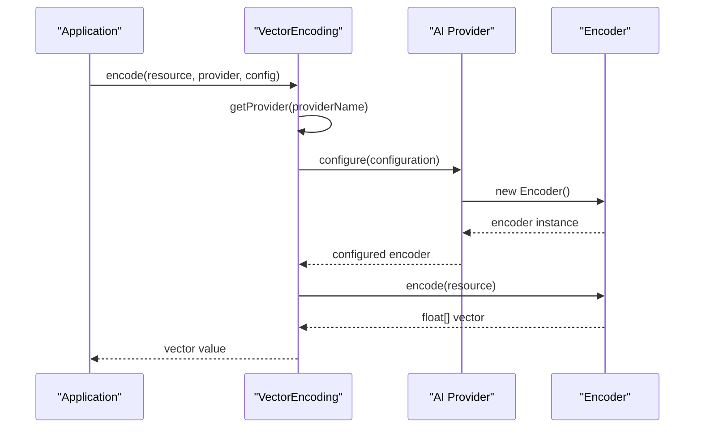

**Diagram sources**
- [VectorEncoding.java](file://community/genai-plugin/src/main/java/org/neo4j/genai/vector/VectorEncoding.java#L144-L176)

**Section sources**
- [VectorEncoding.java](file://community/genai-plugin/src/main/java/org/neo4j/genai/vector/VectorEncoding.java#L62-L343)

## Plugin Discovery and Configuration

### Service Discovery Mechanism

Neo4j uses Java's ServiceLoader mechanism combined with annotation processing to discover and register plugins automatically.

#### Plugin Discovery Process

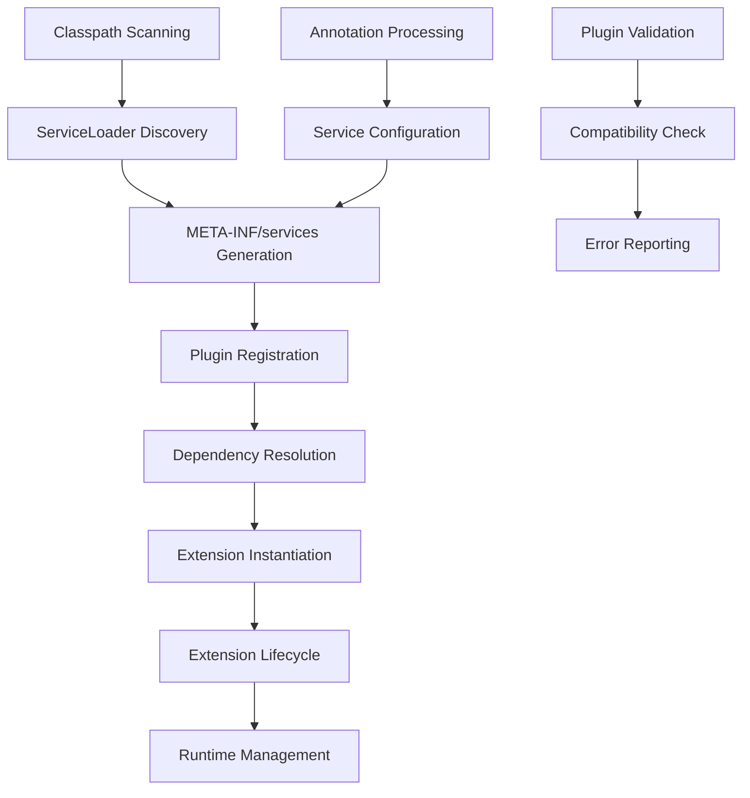

**Diagram sources**
- [Services.java](file://community/common/src/main/java/org/neo4j/service/Services.java#L36-L133)
- [ProcedureClassLoader.java](file://community/procedure/src/main/java/org/neo4j/procedure/impl/ProcedureClassLoader.java#L176-L250)

#### Configuration Options

The plugin system supports various configuration mechanisms:

| Configuration Type | Scope | Purpose | Example |
|-------------------|-------|---------|---------|
| META-INF/services | Global | Automatic discovery | ExtensionFactory implementations |
| Classpath scanning | Runtime | Dynamic loading | Plugin JAR files |
| Dependency injection | Per-extension | Service resolution | Database services, logging |
| Lifecycle management | Per-instance | State coordination | Initialization, shutdown |

**Section sources**
- [Services.java](file://community/common/src/main/java/org/neo4j/service/Services.java#L36-L133)
- [ProcedureClassLoader.java](file://community/procedure/src/main/java/org/neo4j/procedure/impl/ProcedureClassLoader.java#L176-L250)

### Classpath Management

The system handles complex classpath scenarios to prevent conflicts and ensure proper isolation.

#### ClassLoader Hierarchy

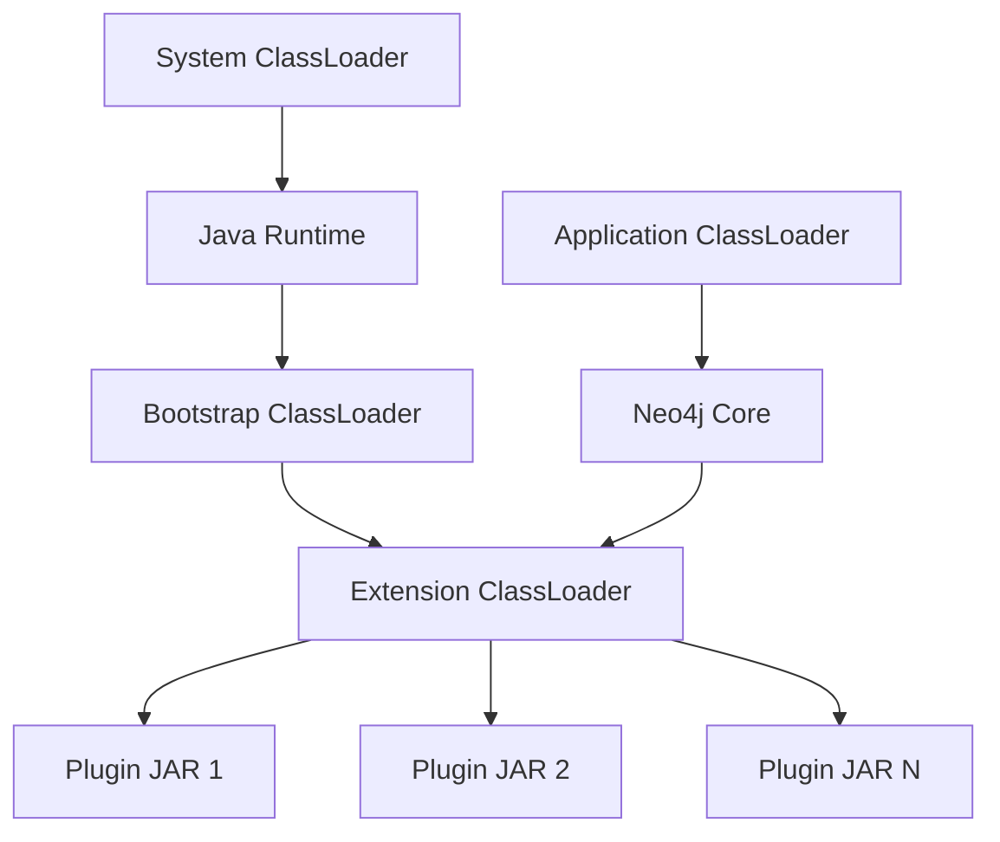

**Diagram sources**
- [ProcedureClassLoader.java](file://community/procedure/src/main/java/org/neo4j/procedure/impl/ProcedureClassLoader.java#L176-L250)

**Section sources**
- [ProcedureClassLoader.java](file://community/procedure/src/main/java/org/neo4j/procedure/impl/ProcedureClassLoader.java#L176-L250)

## Lifecycle Management

### Database Event Integration

The plugin system integrates deeply with Neo4j's database lifecycle events, enabling extensions to respond to database state changes.

#### Database Event Lifecycle

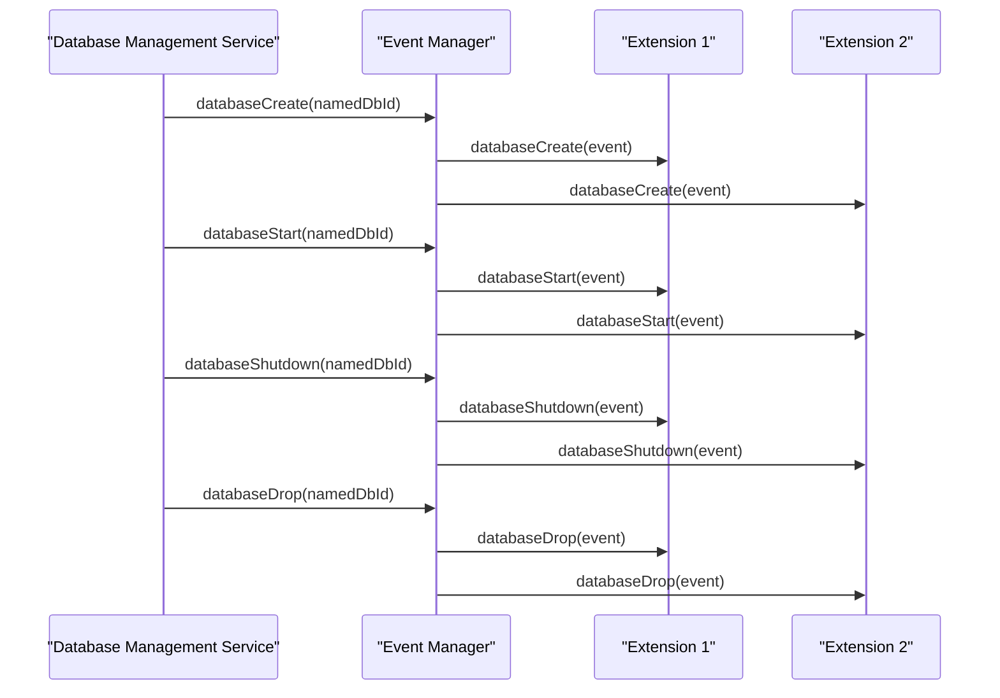

**Diagram sources**
- [DatabaseEventListeners.java](file://community/kernel/src/main/java/org/neo4j/kernel/monitoring/DatabaseEventListeners.java#L34-L107)
- [DatabaseEventListener.java](file://community/graphdb-api/src/main/java/org/neo4j/graphdb/event/DatabaseEventListener.java#L32-L61)

#### Event Listener Implementation

Extensions can register themselves as database event listeners to participate in the database lifecycle:

**Section sources**
- [DatabaseEventListeners.java](file://community/kernel/src/main/java/org/neo4j/kernel/monitoring/DatabaseEventListeners.java#L34-L107)
- [DatabaseEventListener.java](file://community/graphdb-api/src/main/java/org/neo4j/graphdb/event/DatabaseEventListener.java#L32-L61)

### Resource Management

The system provides comprehensive resource management capabilities to ensure proper cleanup and prevent resource leaks.

#### Resource Lifecycle

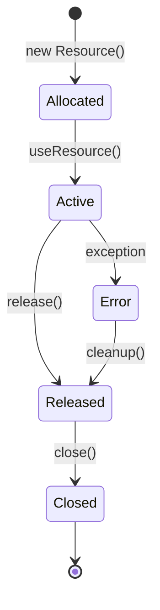

**Diagram sources**
- [AbstractExtensions.java](file://community/kernel/src/main/java/org/neo4j/kernel/extension/AbstractExtensions.java#L58-L88)

**Section sources**
- [AbstractExtensions.java](file://community/kernel/src/main/java/org/neo4j/kernel/extension/AbstractExtensions.java#L58-L88)

## Common Issues and Solutions

### Classpath Conflicts

**Problem**: Multiple versions of the same library in the classpath causing linkage errors.

**Solution**: Use isolated classloaders for each plugin and implement proper dependency versioning.

**Example**: The [`ProcedureClassLoader`](file://community/procedure/src/main/java/org/neo4j/procedure/impl/ProcedureClassLoader.java#L176-L250) handles classpath conflicts by isolating plugin classes.

### Version Compatibility

**Problem**: Plugins compiled against different Neo4j versions causing compatibility issues.

**Solution**: Implement version checking and provide compatibility layers.

**Example**: The [`Services`](file://community/common/src/main/java/org/neo4j/service/Services.java#L36-L133) utility provides version-aware service loading.

### Proper Shutdown Procedures

**Problem**: Extensions not properly releasing resources during shutdown.

**Solution**: Implement proper lifecycle management with cleanup hooks.

**Example**: The [`VectorEncoding.MonitorsCleaner`](file://community/genai-plugin/src/main/java/org/neo4j/genai/vector/VectorEncoding.java#L306-L342) extension cleans up monitors on database shutdown.

**Section sources**
- [ProcedureClassLoader.java](file://community/procedure/src/main/java/org/neo4j/procedure/impl/ProcedureClassLoader.java#L176-L250)
- [Services.java](file://community/common/src/main/java/org/neo4j/service/Services.java#L36-L133)
- [VectorEncoding.java](file://community/genai-plugin/src/main/java/org/neo4j/genai/vector/VectorEncoding.java#L306-L342)

## Best Practices

### Thread Safety in Extensions

Extensions should be designed with thread safety in mind, especially when sharing state across multiple database operations.

**Guidelines**:
- Use immutable objects where possible
- Implement proper synchronization for shared state
- Avoid static mutable state
- Use thread-local storage for request-specific data

### Resource Management

Proper resource management is crucial for preventing memory leaks and ensuring system stability.

**Best Practices**:
- Implement proper cleanup in shutdown methods
- Use try-with-resources for automatic resource management
- Register cleanup callbacks for asynchronous operations
- Monitor resource usage and implement limits

### Configuration Management

Effective configuration management ensures plugins work correctly across different environments.

**Recommendations**:
- Use type-safe configuration objects
- Provide sensible defaults
- Validate configuration at startup
- Support configuration hot-reloading where appropriate

## Troubleshooting Guide

### Plugin Loading Issues

**Symptoms**: Plugin classes not found or service providers not discovered.

**Diagnosis Steps**:
1. Check META-INF/services files are properly generated
2. Verify plugin JAR files are in the correct directory
3. Review classpath configuration
4. Check for compilation errors in plugin code

**Resolution**:
- Ensure proper annotation processing
- Verify service provider registration
- Check classpath ordering

### Lifecycle Management Problems

**Symptoms**: Extensions not initializing or shutting down correctly.

**Diagnosis**:
1. Verify extension implements Lifecycle interface
2. Check dependency resolution
3. Review extension factory implementation
4. Examine lifecycle event handling

**Common Solutions**:
- Implement proper dependency injection
- Add error handling to lifecycle methods
- Ensure proper resource cleanup

### Performance Issues

**Symptoms**: Slow plugin initialization or degraded database performance.

**Investigation**:
1. Profile plugin initialization time
2. Monitor resource usage
3. Check for blocking operations
4. Review thread usage patterns

**Optimization Strategies**:
- Implement lazy initialization
- Use connection pooling
- Optimize resource allocation
- Reduce synchronous operations

**Section sources**
- [ProcedureClassLoader.java](file://community/procedure/src/main/java/org/neo4j/procedure/impl/ProcedureClassLoader.java#L176-L250)
- [AbstractExtensions.java](file://community/kernel/src/main/java/org/neo4j/kernel/extension/AbstractExtensions.java#L58-L88)