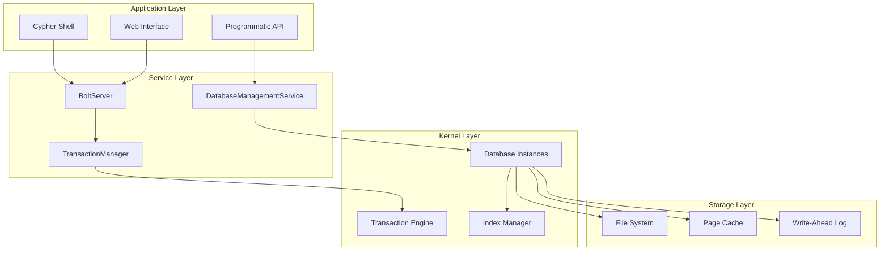
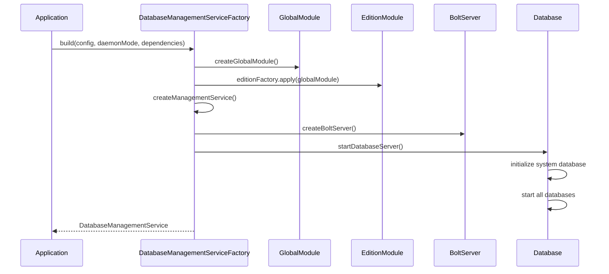
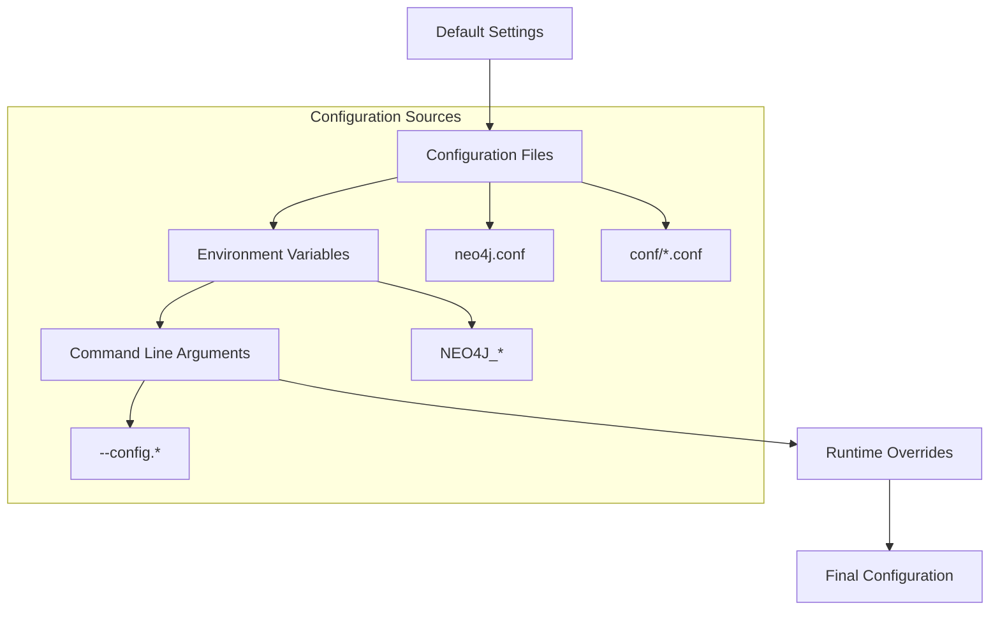
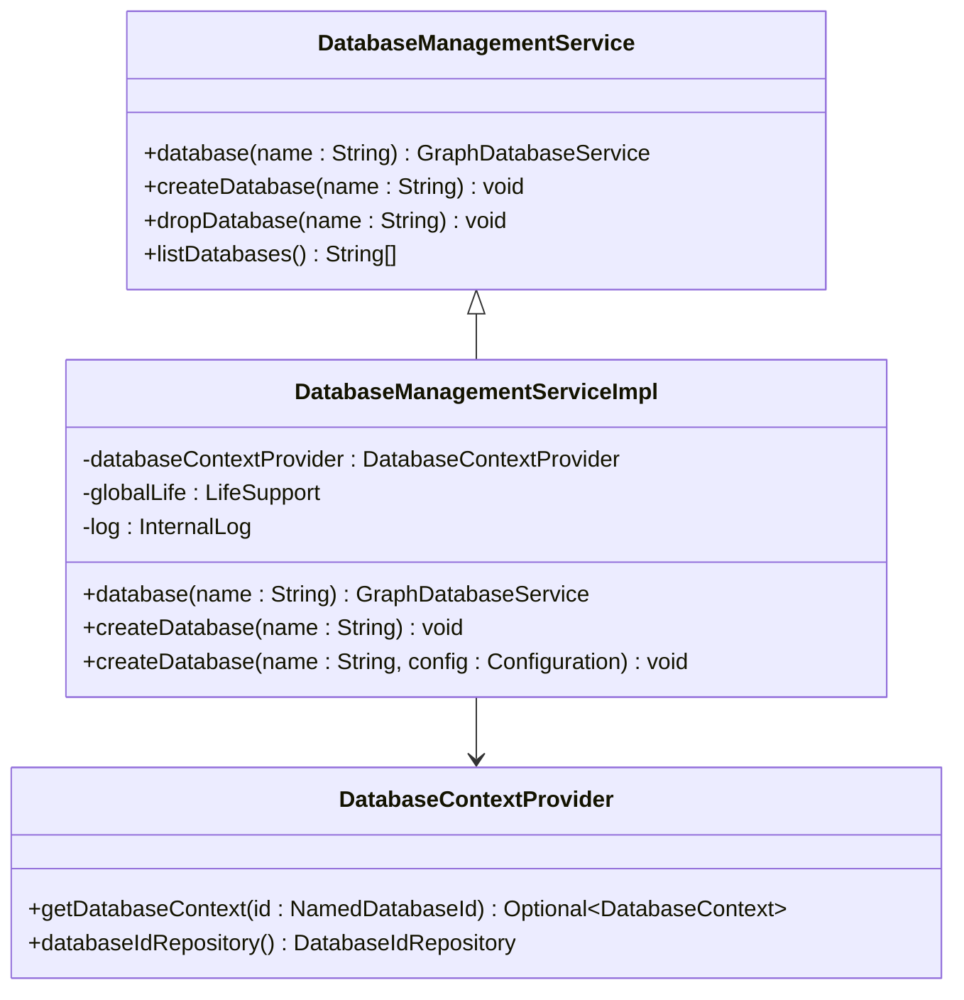
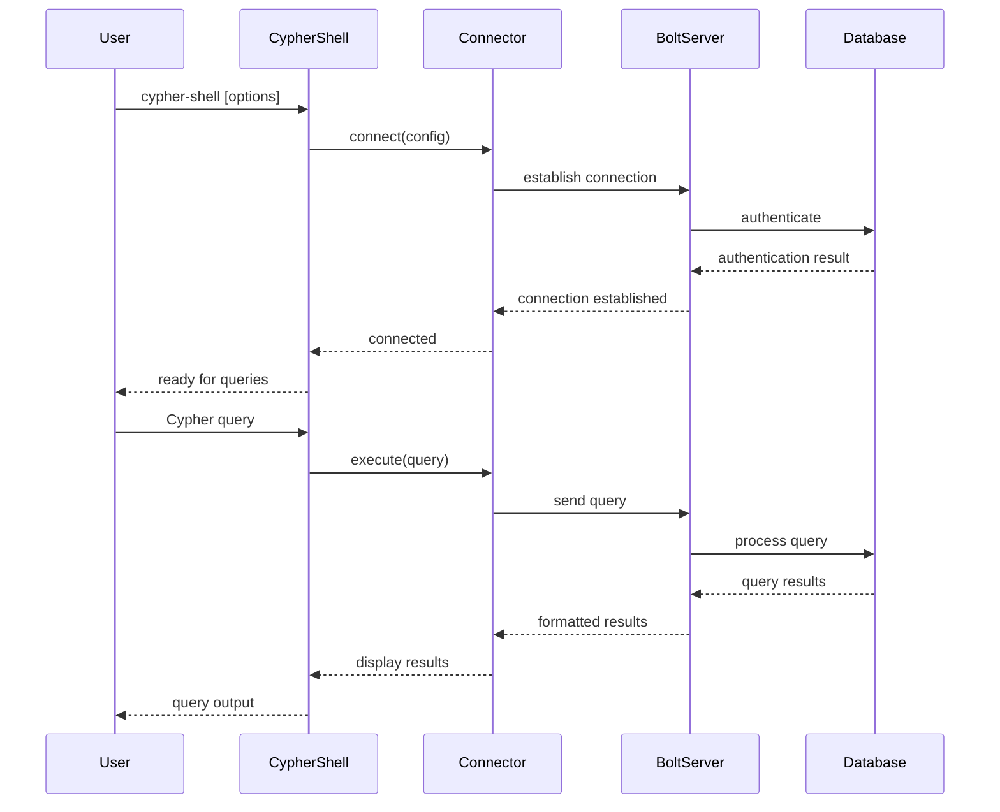

# Getting Started

<cite>
**Referenced Files in This Document**
- [DatabaseManagementServiceFactory.java](file://community/neo4j/src/main/java/org/neo4j/graphdb/facade/DatabaseManagementServiceFactory.java)
- [DatabaseManagementServiceBuilderImplementation.java](file://community/neo4j/src/main/java/org/neo4j/dbms/api/DatabaseManagementServiceBuilderImplementation.java)
- [TestDatabaseManagementServiceBuilder.java](file://community/community-it/it-test-support/src/main/java/org/neo4j/test/TestDatabaseManagementServiceBuilder.java)
- [Config.java](file://community/configuration/src/main/java/org/neo4j/configuration/Config.java)
- [BoltServer.java](file://community/bolt/src/main/java/org/neo4j/bolt/BoltServer.java)
- [SystemDatabaseRunner.java](file://community/neo4j/src/main/java/org/neo4j/graphdb/facade/SystemDatabaseRunner.java)
- [DatabaseManagementServiceImpl.java](file://community/kernel/src/main/java/org/neo4j/dbms/database/DatabaseManagementServiceImpl.java)
- [CypherShell.java](file://community/cypher-shell/cypher-shell/src/main/java/org/neo4j/shell/CypherShell.java)
- [Connector.java](file://community/cypher-shell/cypher-shell/src/main/java/org/neo4j/shell/Connector.java)
- [CliArgs.java](file://community/cypher-shell/cypher-shell/src/main/java/org/neo4j/shell/cli/CliArgs.java)
- [Main.java](file://community/cypher-shell/cypher-shell/src/main/java/org/neo4j/shell/Main.java)
- [README.asciidoc](file://README.asciidoc)
</cite>

## Table of Contents
1. [Introduction](#introduction)
2. [Understanding Neo4j Architecture](#understanding-neo4j-architecture)
3. [Installation and Setup](#installation-and-setup)
4. [Bootstrapping Process](#bootstrapping-process)
5. [Configuration Management](#configuration-management)
6. [Database Management Services](#database-management-services)
7. [Connecting to Neo4j](#connecting-to-neo4j)
8. [Practical Examples](#practical-examples)
9. [Troubleshooting](#troubleshooting)
10. [Next Steps](#next-steps)

## Introduction

Neo4j is the world's leading Graph Database, offering high-performance graph storage with all the features expected of a mature and robust database. Unlike traditional relational databases that use static tables, Neo4j allows programmers to work with flexible network structures of nodes and relationships while enjoying enterprise-quality database benefits like ACID transactions.

This guide covers the complete journey from downloading Neo4j to establishing connections and performing basic operations, suitable for both beginners learning graph databases and experienced developers working with Neo4j's architecture.

## Understanding Neo4j Architecture

Neo4j follows a layered architecture that separates concerns between database management, transaction processing, and network connectivity. Understanding this architecture helps in grasping the bootstrapping process and configuration management.



**Diagram sources**
- [DatabaseManagementServiceFactory.java](file://community/neo4j/src/main/java/org/neo4j/graphdb/facade/DatabaseManagementServiceFactory.java#L115-L123)
- [BoltServer.java](file://community/bolt/src/main/java/org/neo4j/bolt/BoltServer.java#L114-L120)

### Core Components Overview

The Neo4j architecture consists of several key components:

- **DatabaseManagementService**: Central service managing database instances
- **DatabaseManagementServiceFactory**: Creates and configures database services
- **BoltServer**: Handles network connections and protocol communication
- **Config**: Manages configuration settings and overrides
- **TransactionManager**: Coordinates transaction processing across databases

**Section sources**
- [DatabaseManagementServiceFactory.java](file://community/neo4j/src/main/java/org/neo4j/graphdb/facade/DatabaseManagementServiceFactory.java#L115-L123)

## Installation and Setup

### Prerequisites

Before installing Neo4j, ensure your system meets the requirements:

- **Java**: Java 17 or Java 21 (Java 8 for Cypher Shell boot)
- **Operating System**: Linux, macOS, or Windows
- **Memory**: Minimum 2GB RAM (4GB+ recommended)
- **Disk Space**: At least 1GB for installation
- **Maven**: Version 3.8.2+ for building from source

### Download Options

Neo4j is available in multiple distributions:

1. **Neo4j Desktop**: GUI-based development environment
2. **Standalone Server**: Production-ready server distribution
3. **Embedded Library**: Java library for embedding in applications
4. **Cloud**: Managed Neo4j cloud services

### Building from Source

For development or customization, you can build Neo4j from source:

```bash
# Clone the repository
git clone https://github.com/neo4j/neo4j.git
cd neo4j

# Set Maven memory limits
export MAVEN_OPTS="-Xmx2048m"

# Build the project
mvn clean install -T1C
```

**Section sources**
- [README.asciidoc](file://README.asciidoc#L38-L57)

## Bootstrapping Process

The bootstrapping process initializes Neo4j's core services and establishes the foundation for database operations. This process involves multiple stages handled by specialized factories and modules.



**Diagram sources**
- [DatabaseManagementServiceFactory.java](file://community/neo4j/src/main/java/org/neo4j/graphdb/facade/DatabaseManagementServiceFactory.java#L143-L233)

### Step-by-Step Bootstrapping

The bootstrapping process follows these key steps:

1. **Global Module Creation**: Establishes core infrastructure
2. **Edition Module Initialization**: Configures edition-specific features
3. **System Database Setup**: Initializes the system database
4. **Service Registration**: Registers all required services
5. **Network Server Startup**: Starts Bolt protocol server
6. **Database Lifecycle Management**: Manages database startup sequence

### DatabaseManagementServiceFactory Implementation

The [`DatabaseManagementServiceFactory`](file://community/neo4j/src/main/java/org/neo4j/graphdb/facade/DatabaseManagementServiceFactory.java) serves as the central orchestrator for the bootstrapping process. It delegates creation to specialized modules that handle specific aspects of the system.

Key responsibilities include:
- Creating global and edition modules
- Managing service dependencies
- Coordinating server startup
- Handling configuration loading
- Initializing database contexts

**Section sources**
- [DatabaseManagementServiceFactory.java](file://community/neo4j/src/main/java/org/neo4j/graphdb/facade/DatabaseManagementServiceFactory.java#L143-L233)

## Configuration Management

Neo4j uses a hierarchical configuration system that loads settings from multiple sources with specific precedence rules.



**Diagram sources**
- [Config.java](file://community/configuration/src/main/java/org/neo4j/configuration/Config.java#L265-L330)

### Configuration Loading Process

The [`Config`](file://community/configuration/src/main/java/org/neo4j/configuration/Config.java) class handles the complex process of loading and merging configuration from various sources:

1. **Default Values**: Built-in defaults for all settings
2. **File Loading**: Reads from configuration files
3. **Environment Variables**: Processes environment-based settings
4. **Command Line Overrides**: Applies explicit command-line arguments
5. **Validation**: Ensures configuration consistency

### Configuration Sources Priority

Configuration settings are loaded in the following priority order (highest to lowest):

1. **Command Line Arguments** (`--config.*`)
2. **Environment Variables** (`NEO4J_*`)
3. **Configuration Files** (`neo4j.conf`, `conf/*.conf`)
4. **Default Values**

### Embedded vs Server Mode Configuration

Different configuration approaches apply depending on the deployment mode:

- **Embedded Mode**: Configuration through builder methods
- **Server Mode**: Configuration through neo4j.conf and environment variables
- **Testing Mode**: Configuration through TestDatabaseManagementServiceBuilder

**Section sources**
- [Config.java](file://community/configuration/src/main/java/org/neo4j/configuration/Config.java#L265-L330)
- [DatabaseManagementServiceBuilderImplementation.java](file://community/neo4j/src/main/java/org/neo4j/dbms/api/DatabaseManagementServiceBuilderImplementation.java#L141-L170)

## Database Management Services

The Database Management Service (DMS) provides the primary interface for database operations and lifecycle management.



**Diagram sources**
- [DatabaseManagementServiceImpl.java](file://community/kernel/src/main/java/org/neo4j/dbms/database/DatabaseManagementServiceImpl.java#L58-L89)

### Database Context Management

The [`DatabaseContextProvider`](file://community/kernel/src/main/java/org/neo4j/dbms/database/DatabaseManagementServiceImpl.java) manages database instances and their lifecycle. Each database context encapsulates:

- Database instance
- Configuration
- Dependencies
- Lifecycle management

### Service Lifecycle

Database services follow a well-defined lifecycle managed by the [`LifeSupport`](file://community/neo4j/src/main/java/org/neo4j/graphdb/facade/DatabaseManagementServiceFactory.java) framework:

1. **Initialization**: Service creation and dependency injection
2. **Start**: Activation of service components
3. **Running**: Normal operational state
4. **Stop**: Graceful shutdown of active components
5. **Shutdown**: Complete cleanup and resource release

**Section sources**
- [DatabaseManagementServiceImpl.java](file://community/kernel/src/main/java/org/neo4j/dbms/database/DatabaseManagementServiceImpl.java#L58-L89)

## Connecting to Neo4j

Neo4j provides multiple connection methods for different use cases and environments.

### Cypher Shell Connection

The Cypher Shell offers an interactive command-line interface for executing Cypher queries.



**Diagram sources**
- [CypherShell.java](file://community/cypher-shell/cypher-shell/src/main/java/org/neo4j/shell/CypherShell.java#L35-L63)
- [Connector.java](file://community/cypher-shell/cypher-shell/src/main/java/org/neo4j/shell/Connector.java#L29-L77)

### Programmatic API Connection

Applications can connect to Neo4j using the Java API:

```java
// Embedded mode connection
DatabaseManagementService dbms = new TestDatabaseManagementServiceBuilder(homeDirectory)
    .setConfig(GraphDatabaseSettings.page_cache_memory, "512M")
    .build();

GraphDatabaseService db = dbms.database("neo4j");

// Server mode connection
Driver driver = GraphDatabase.driver("bolt://localhost:7687", 
    AuthTokens.basic("username", "password"));
GraphDatabaseService db = driver.session().beginTransaction();
```

### Connection Configuration

Connection parameters are configured through multiple mechanisms:

- **URI Format**: `bolt://host:port` or `neo4j://host:port`
- **Authentication**: Username/password or custom authentication providers
- **Encryption**: TLS/SSL configuration
- **Database Selection**: Target database specification
- **Access Modes**: Read/write transaction modes

**Section sources**
- [CypherShell.java](file://community/cypher-shell/cypher-shell/src/main/java/org/neo4j/shell/CypherShell.java#L35-L63)
- [Connector.java](file://community/cypher-shell/cypher-shell/src/main/java/org/neo4j/shell/Connector.java#L29-L77)
- [CliArgs.java](file://community/cypher-shell/cypher-shell/src/main/java/org/neo4j/shell/cli/CliArgs.java#L158-L260)

## Practical Examples

### Example 1: Embedded Database Setup

```java
// Create a test database management service
TestDatabaseManagementServiceBuilder builder = new TestDatabaseManagementServiceBuilder(Paths.get("./data"))
    .setConfig(GraphDatabaseSettings.page_cache_memory, "256M")
    .setConfig(GraphDatabaseSettings.record_store_allocation_ratio, "0.5")
    .setConfig(GraphDatabaseSettings.transaction_log_rotation_threshold, "32M");

DatabaseManagementService dbms = builder.build();

// Access the default database
GraphDatabaseService db = dbms.database("neo4j");

// Execute Cypher queries
try (Transaction tx = db.beginTx()) {
    Node node = tx.createNode(Label.label("Person"));
    node.setProperty("name", "Alice");
    tx.commit();
}

// Clean up
dbms.shutdown();
```

### Example 2: Server Mode Configuration

```java
// Configure server mode
Config config = Config.newBuilder()
    .set(GraphDatabaseSettings.dbms_mode, "SERVER")
    .set(GraphDatabaseSettings.default_database, "mydb")
    .set(BoltConnector.listen_address, new SocketAddress("0.0.0.0", 7687))
    .set(BoltConnector.encryption_level, EncryptionLevel.REQUIRED)
    .build();

// Create database management service
DatabaseManagementServiceFactory factory = new DatabaseManagementServiceFactory(
    DbmsInfo.COMMUNITY, 
    GlobalModule::new
);

DatabaseManagementService dbms = factory.build(config, false, ExternalDependencies.newDependencies());
```

### Example 3: Cypher Shell Usage

```bash
# Connect to local server
cypher-shell -u neo4j -p password

# Connect to remote server
cypher-shell -a bolt://remote-host:7687 -u neo4j -p password

# Execute queries from file
cypher-shell < queries.cypher

# Non-interactive mode
echo "CREATE (n:Test {name: 'value'})" | cypher-shell -u neo4j -p password
```

### Example 4: Custom Configuration

```java
// Load configuration from file
Config config = Config.newBuilder()
    .fromFile(Paths.get("conf/neo4j.conf"))
    .set(GraphDatabaseSettings.page_cache_memory, "1G")
    .set(GraphDatabaseSettings.heap_memory, "1G")
    .build();

// Create with custom configuration
DatabaseManagementService dbms = new DatabaseManagementServiceBuilderImplementation(homePath)
    .setConfig(config)
    .build();
```

**Section sources**
- [TestDatabaseManagementServiceBuilder.java](file://community/community-it/it-test-support/src/main/java/org/neo4j/test/TestDatabaseManagementServiceBuilder.java#L61-L127)
- [DatabaseManagementServiceBuilderImplementation.java](file://community/neo4j/src/main/java/org/neo4j/dbms/api/DatabaseManagementServiceBuilderImplementation.java#L73-L82)

## Troubleshooting

### Common Issues and Solutions

#### Database Startup Failures

**Problem**: Database fails to start with "Unable to start database" error.

**Solution**: 
1. Check disk space and permissions
2. Verify configuration settings
3. Review logs in `logs/neo4j.log`
4. Ensure no other process is using the database files

#### Connection Refused

**Problem**: Cannot connect to Neo4j server.

**Solution**:
1. Verify Bolt connector is enabled
2. Check firewall settings
3. Confirm server is running
4. Validate connection parameters

#### Memory Issues

**Problem**: Out of memory errors during startup or operation.

**Solution**:
1. Increase heap memory allocation
2. Adjust page cache settings
3. Optimize query patterns
4. Monitor memory usage

### Debugging Configuration

Use the configuration validation tools:

```bash
# Check configuration syntax
neo4j-admin config validate

# View effective configuration
neo4j-admin config show

# Test connection
neo4j-admin server status
```

### Log Analysis

Key log locations:
- `logs/neo4j.log`: Main application logs
- `logs/debug.log`: Detailed debug information
- `logs/query.log`: Query execution logs
- `logs/security.log`: Authentication and authorization logs

**Section sources**
- [DatabaseManagementServiceFactory.java](file://community/neo4j/src/main/java/org/neo4j/graphdb/facade/DatabaseManagementServiceFactory.java#L270-L303)

## Next Steps

After successfully setting up and connecting to Neo4j, consider these next steps:

### Learning Resources

1. **Cypher Query Language**: Master the declarative query language
2. **Graph Data Modeling**: Learn optimal patterns for graph data structures
3. **Performance Tuning**: Understand optimization techniques
4. **Advanced Features**: Explore graph algorithms and full-text search

### Development Patterns

1. **Embedded Applications**: Integrate Neo4j directly into applications
2. **Microservices Architecture**: Use Neo4j as a service component
3. **Batch Processing**: Implement efficient data import and export
4. **Real-time Analytics**: Build reactive graph processing systems

### Production Considerations

1. **High Availability**: Set up clustering and replication
2. **Backup Strategies**: Implement reliable backup and recovery
3. **Monitoring**: Deploy comprehensive monitoring and alerting
4. **Security**: Configure authentication, authorization, and encryption

### Community Engagement

Join the Neo4j community to stay updated and get support:

- **Discord**: Real-time chat and discussions
- **Discourse Forums**: In-depth technical discussions
- **GitHub**: Issue tracking and contributions
- **Stack Overflow**: Q&A platform for technical questions

**Section sources**
- [README.asciidoc](file://README.asciidoc#L1-L74)