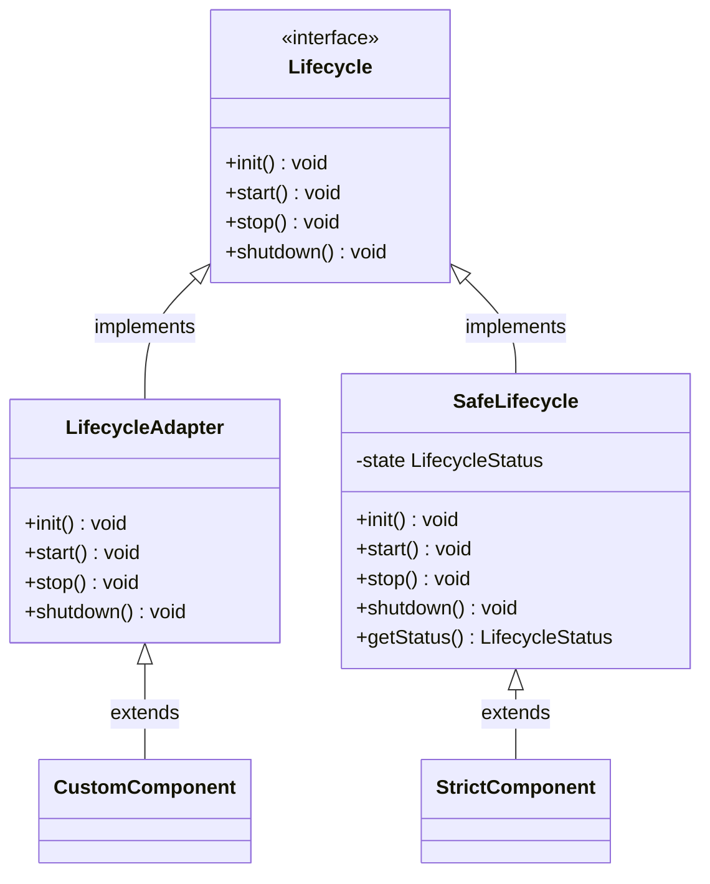
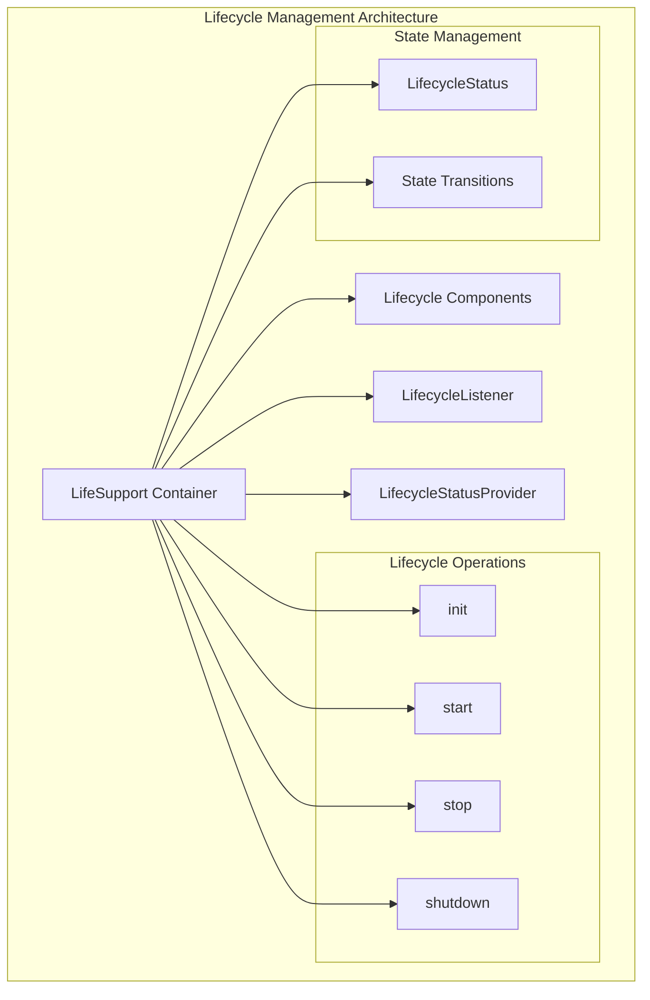
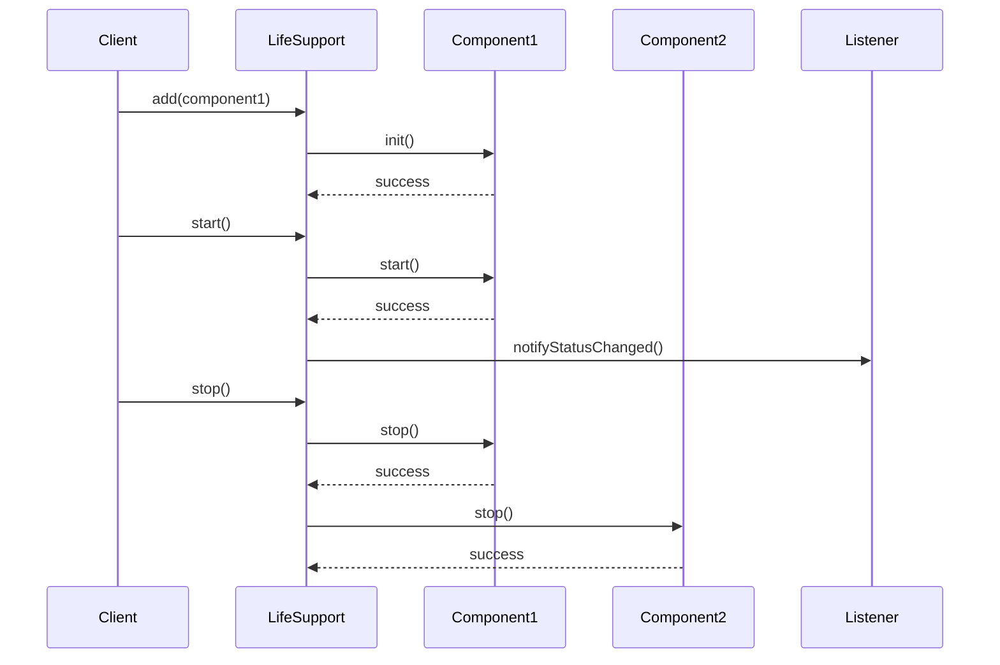
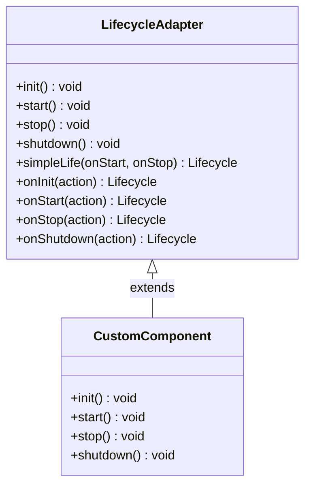
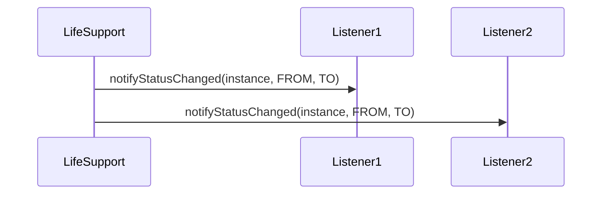
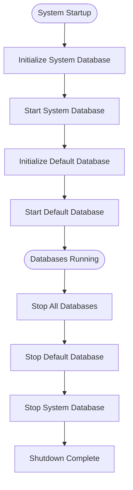
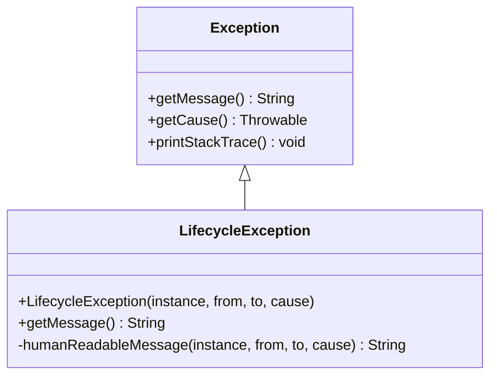
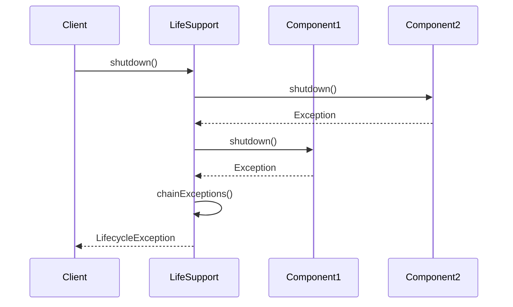

# Lifecycle Management

<cite>
**Referenced Files in This Document**
- [Lifecycle.java](file://community/common/src/main/java/org/neo4j/kernel/lifecycle/Lifecycle.java)
- [LifeSupport.java](file://community/common/src/main/java/org/neo4j/kernel/lifecycle/LifeSupport.java)
- [LifecycleAdapter.java](file://community/common/src/main/java/org/neo4j/kernel/lifecycle/LifecycleAdapter.java)
- [SafeLifecycle.java](file://community/common/src/main/java/org/neo4j/kernel/lifecycle/SafeLifecycle.java)
- [LifecycleStatus.java](file://community/common/src/main/java/org/neo4j/kernel/lifecycle/LifecycleStatus.java)
- [LifecycleListener.java](file://community/common/src/main/java/org/neo4j/kernel/lifecycle/LifecycleListener.java)
- [LifecycleStatusProvider.java](file://community/common/src/main/java/org/neo4j/kernel/lifecycle/LifecycleStatusProvider.java)
- [LifecycleException.java](file://community/common/src/main/java/org/neo4j/kernel/lifecycle/LifecycleException.java)
- [LifeContainer.java](file://community/common/src/main/java/org/neo4j/kernel/lifecycle/LifeContainer.java)
- [Lifespan.java](file://community/common/src/main/java/org/neo4j/kernel/lifecycle/Lifespan.java)
- [DatabaseLifecycles.java](file://community/neo4j/src/main/java/org/neo4j/dbms/database/DatabaseLifecycles.java)
- [AbstractDatabase.java](file://community/kernel/src/main/java/org/neo4j/kernel/database/AbstractDatabase.java)
</cite>

## Table of Contents
1. [Introduction](#introduction)
2. [Core Concepts](#core-concepts)
3. [Architecture Overview](#architecture-overview)
4. [Lifecycle States](#lifecycle-states)
5. [Core Components](#core-components)
6. [Implementation Patterns](#implementation-patterns)
7. [Practical Examples](#practical-examples)
8. [Error Handling and Graceful Shutdown](#error-handling-and-graceful-shutdown)
9. [Best Practices](#best-practices)
10. [Troubleshooting Guide](#troubleshooting-guide)

## Introduction

Neo4j's lifecycle management system provides a robust framework for managing the startup, running, and shutdown phases of database components. This system ensures that components are properly initialized, started, stopped, and shut down in a controlled manner, with proper error handling and resource cleanup.

The lifecycle management system is built around several key concepts:
- **Lifecycle Interface**: Defines the contract for components that participate in the lifecycle
- **LifeSupport Container**: Orchestrates the lifecycle of multiple components
- **Lifecycle States**: Defines the progression through different phases of component lifecycle
- **Graceful Shutdown**: Ensures proper cleanup and resource deallocation

## Core Concepts

### The Lifecycle Interface

The [`Lifecycle`](file://community/common/src/main/java/org/neo4j/kernel/lifecycle/Lifecycle.java) interface defines four fundamental operations that every lifecycle-aware component must implement:



**Diagram sources**
- [Lifecycle.java](file://community/common/src/main/java/org/neo4j/kernel/lifecycle/Lifecycle.java#L38-L45)
- [LifecycleAdapter.java](file://community/common/src/main/java/org/neo4j/kernel/lifecycle/LifecycleAdapter.java#L27-L38)
- [SafeLifecycle.java](file://community/common/src/main/java/org/neo4j/kernel/lifecycle/SafeLifecycle.java#L89-L135)

### Lifecycle Phases

Each component follows a specific sequence of phases:

1. **INITIALIZING** → **STOPPED** (after `init()`)
2. **STARTING** → **STARTED** (after `start()`)
3. **STOPPING** → **STOPPED** (after `stop()`)
4. **SHUTTING_DOWN** → **SHUTDOWN** (after `shutdown()`)

**Section sources**
- [Lifecycle.java](file://community/common/src/main/java/org/neo4j/kernel/lifecycle/Lifecycle.java#L34-L46)

## Architecture Overview

The lifecycle management system consists of several interconnected components that work together to manage component lifecycles:



**Diagram sources**
- [LifeSupport.java](file://community/common/src/main/java/org/neo4j/kernel/lifecycle/LifeSupport.java#L37-L414)
- [LifecycleStatus.java](file://community/common/src/main/java/org/neo4j/kernel/lifecycle/LifecycleStatus.java#L25-L33)

**Section sources**
- [LifeSupport.java](file://community/common/src/main/java/org/neo4j/kernel/lifecycle/LifeSupport.java#L30-L36)

## Lifecycle States

The [`LifecycleStatus`](file://community/common/src/main/java/org/neo4j/kernel/lifecycle/LifecycleStatus.java) enumeration defines the eight possible states a component can be in:

| State | Description | Valid Transitions |
|-------|-------------|-------------------|
| `NONE` | Component not yet initialized | `INITIALIZING` → `STOPPED` |
| `INITIALIZING` | Component is being initialized | `STOPPED` |
| `STOPPED` | Component initialized but not started | `STARTING` → `STARTED` |
| `STARTING` | Component is starting | `STARTED` |
| `STARTED` | Component is running | `STOPPING` → `STOPPED` |
| `STOPPING` | Component is stopping | `STOPPED` |
| `SHUTTING_DOWN` | Component is shutting down | `SHUTDOWN` |
| `SHUTDOWN` | Component is completely shut down |

**Section sources**
- [LifecycleStatus.java](file://community/common/src/main/java/org/neo4j/kernel/lifecycle/LifecycleStatus.java#L25-L33)

## Core Components

### LifeSupport Container

The [`LifeSupport`](file://community/common/src/main/java/org/neo4j/kernel/lifecycle/LifeSupport.java) class serves as the central orchestrator for managing multiple lifecycle components. It maintains a list of registered components and coordinates their state transitions.

Key features:
- **Thread-safe operations**: All lifecycle operations are synchronized
- **Automatic state propagation**: Newly added components are brought to the current LifeSupport state
- **Graceful error handling**: Proper cleanup on failures
- **Listener support**: Notifies registered listeners of state changes



**Diagram sources**
- [LifeSupport.java](file://community/common/src/main/java/org/neo4j/kernel/lifecycle/LifeSupport.java#L50-L106)
- [LifeSupport.java](file://community/common/src/main/java/org/neo4j/kernel/lifecycle/LifeSupport.java#L116-L125)

**Section sources**
- [LifeSupport.java](file://community/common/src/main/java/org/neo4j/kernel/lifecycle/LifeSupport.java#L37-L414)

### Lifecycle Adapters

#### LifecycleAdapter

The [`LifecycleAdapter`](file://community/common/src/main/java/org/neo4j/kernel/lifecycle/LifecycleAdapter.java) provides a convenient base class for implementing the Lifecycle interface:



**Diagram sources**
- [LifecycleAdapter.java](file://community/common/src/main/java/org/neo4j/kernel/lifecycle/LifecycleAdapter.java#L27-L89)

#### SafeLifecycle

The [`SafeLifecycle`](file://community/common/src/main/java/org/neo4j/kernel/lifecycle/SafeLifecycle.java) provides stricter semantics with guaranteed cleanup:

- **Strict state transitions**: Prevents invalid state changes
- **Automatic cleanup**: Ensures proper cleanup on partial failures
- **Immutable after shutdown**: Prevents reinitialization after shutdown

**Section sources**
- [LifecycleAdapter.java](file://community/common/src/main/java/org/neo4j/kernel/lifecycle/LifecycleAdapter.java#L27-L90)
- [SafeLifecycle.java](file://community/common/src/main/java/org/neo4j/kernel/lifecycle/SafeLifecycle.java#L89-L135)

### Supporting Components

#### LifecycleListener

The [`LifecycleListener`](file://community/common/src/main/java/org/neo4j/kernel/lifecycle/LifecycleListener.java) interface enables components to monitor lifecycle state changes:



**Diagram sources**
- [LifecycleListener.java](file://community/common/src/main/java/org/neo4j/kernel/lifecycle/LifecycleListener.java#L26-L28)

#### LifecycleStatusProvider

The [`LifecycleStatusProvider`](file://community/common/src/main/java/org/neo4j/kernel/lifecycle/LifecycleStatusProvider.java) interface provides status information:

**Section sources**
- [LifecycleListener.java](file://community/common/src/main/java/org/neo4j/kernel/lifecycle/LifecycleListener.java#L26-L29)
- [LifecycleStatusProvider.java](file://community/common/src/main/java/org/neo4j/kernel/lifecycle/LifecycleStatusProvider.java#L26-L32)

## Implementation Patterns

### Basic Lifecycle Component

```java
// Example implementation pattern
public class MyComponent extends LifecycleAdapter {
    @Override
    public void init() throws Exception {
        // Initialize resources, create objects, register handlers
        setupResources();
        registerHandlers();
    }
    
    @Override
    public void start() throws Exception {
        // Activate functionality, start threads, open connections
        activateFunctionality();
        startBackgroundTasks();
    }
    
    @Override
    public void stop() throws Exception {
        // Deactivate functionality, stop threads, close connections
        deactivateFunctionality();
        stopBackgroundTasks();
    }
    
    @Override
    public void shutdown() throws Exception {
        // Clean up resources, release memory, finalize cleanup
        cleanupResources();
        releaseMemory();
    }
}
```

### Using LifeSupport

```java
// Example usage pattern
public class DatabaseService {
    private final LifeSupport life = new LifeSupport();
    
    public void initialize() {
        life.add(new ConnectionPool());
        life.add(new CacheManager());
        life.add(new BackgroundScheduler());
    }
    
    public void start() throws Exception {
        life.start();
    }
    
    public void stop() throws Exception {
        life.stop();
    }
    
    public void shutdown() throws Exception {
        life.shutdown();
    }
}
```

### Database Lifecycle Management

The [`DatabaseLifecycles`](file://community/neo4j/src/main/java/org/neo4j/dbms/database/DatabaseLifecycles.java) class demonstrates advanced lifecycle management for database systems:



**Diagram sources**
- [DatabaseLifecycles.java](file://community/neo4j/src/main/java/org/neo4j/dbms/database/DatabaseLifecycles.java#L137-L188)

**Section sources**
- [DatabaseLifecycles.java](file://community/neo4j/src/main/java/org/neo4j/dbms/database/DatabaseLifecycles.java#L40-L188)

## Practical Examples

### Example 1: Simple Component Implementation

```java
public class SimpleService extends LifecycleAdapter {
    private final String serviceName;
    
    public SimpleService(String serviceName) {
        this.serviceName = serviceName;
    }
    
    @Override
    public void init() throws Exception {
        System.out.println("Initializing " + serviceName);
        // Resource allocation, configuration loading
    }
    
    @Override
    public void start() throws Exception {
        System.out.println("Starting " + serviceName);
        // Activate functionality
    }
    
    @Override
    public void stop() throws Exception {
        System.out.println("Stopping " + serviceName);
        // Cleanup and deactivation
    }
    
    @Override
    public void shutdown() throws Exception {
        System.out.println("Shutting down " + serviceName);
        // Final cleanup
    }
}
```

### Example 2: Using LifeSupport with Multiple Components

```java
public class ApplicationServices {
    private final LifeSupport services = new LifeSupport();
    
    public ApplicationServices() {
        services.add(new DatabaseConnectionPool());
        services.add(new MessageQueue());
        services.add(new CacheService());
        services.add(new MonitoringAgent());
    }
    
    public void startApplication() throws Exception {
        services.start();
        // Application is now ready to serve requests
    }
    
    public void stopApplication() throws Exception {
        services.stop();
        // All services have been gracefully stopped
    }
}
```

### Example 3: Database Component Lifecycle

```java
public class DatabaseComponent extends LifecycleAdapter {
    private final DatabaseConfig config;
    private ConnectionPool connectionPool;
    private SchemaManager schemaManager;
    
    public DatabaseComponent(DatabaseConfig config) {
        this.config = config;
    }
    
    @Override
    public void init() throws Exception {
        // Initialize database-specific resources
        connectionPool = new ConnectionPool(config.getConnectionSettings());
        schemaManager = new SchemaManager(config.getSchemaSettings());
        
        // Load initial schema if needed
        if (config.shouldInitializeSchema()) {
            schemaManager.initialize();
        }
    }
    
    @Override
    public void start() throws Exception {
        // Activate database functionality
        connectionPool.start();
        schemaManager.activate();
        
        // Perform health checks
        performHealthChecks();
    }
    
    @Override
    public void stop() throws Exception {
        // Deactivate database functionality
        schemaManager.deactivate();
        connectionPool.stop();
    }
    
    @Override
    public void shutdown() throws Exception {
        // Final cleanup
        connectionPool.shutdown();
        schemaManager.cleanup();
    }
}
```

### Example 4: Using Lifespan for Resource Management

```java
public class ResourceManagedService {
    public void performOperation() {
        try (Lifespan lifespan = new Lifespan(
                new DatabaseConnection(),
                new CacheManager(),
                new BackgroundWorker())) {
            
            // Service is automatically started
            // Perform operations...
            
            // Resources are automatically cleaned up when exiting try-with-resources
        }
        // All components have been properly shut down
    }
}
```

**Section sources**
- [LifecycleAdapter.java](file://community/common/src/main/java/org/neo4j/kernel/lifecycle/LifecycleAdapter.java#L40-L89)
- [Lifespan.java](file://community/common/src/main/java/org/neo4j/kernel/lifecycle/Lifespan.java#L26-L63)

## Error Handling and Graceful Shutdown

### LifecycleException

The [`LifecycleException`](file://community/common/src/main/java/org/neo4j/kernel/lifecycle/LifecycleException.java) class provides detailed error information about lifecycle failures:



**Diagram sources**
- [LifecycleException.java](file://community/common/src/main/java/org/neo4j/kernel/lifecycle/LifecycleException.java#L35-L66)

### Graceful Shutdown Pattern

The lifecycle system implements several mechanisms for graceful shutdown:

1. **Forward Propagation**: Failed operations propagate backward for cleanup
2. **Reverse Order Shutdown**: Components are shut down in reverse registration order
3. **Exception Aggregation**: Multiple exceptions are chained together
4. **State Validation**: Prevents invalid state transitions



**Diagram sources**
- [LifeSupport.java](file://community/common/src/main/java/org/neo4j/kernel/lifecycle/LifeSupport.java#L135-L159)

### Error Recovery Strategies

1. **Fail-Fast Initialization**: Fail immediately if initialization fails
2. **Partial Success Handling**: Continue shutdown even if some components fail
3. **Resource Cleanup**: Ensure resources are released even on errors
4. **State Consistency**: Maintain consistent state across all components

**Section sources**
- [LifecycleException.java](file://community/common/src/main/java/org/neo4j/kernel/lifecycle/LifecycleException.java#L35-L66)
- [LifeSupport.java](file://community/common/src/main/java/org/neo4j/kernel/lifecycle/LifeSupport.java#L50-L159)

## Best Practices

### Component Design Guidelines

1. **Separation of Concerns**: Each component should have a single responsibility
2. **Resource Management**: Always pair resource allocation with cleanup
3. **State Validation**: Validate state before performing operations
4. **Exception Handling**: Provide meaningful error messages and stack traces

### LifeSupport Usage Patterns

1. **Single Responsibility**: Use LifeSupport for coordinating related components
2. **Registration Order**: Register components in dependency order
3. **Error Isolation**: Handle component failures individually
4. **Monitoring**: Use LifecycleListener for monitoring and logging

### Database-Specific Considerations

1. **Startup Dependencies**: Ensure dependent components are started first
2. **Graceful Degradation**: Handle partial failures gracefully
3. **Resource Limits**: Monitor and enforce resource limits
4. **Backup and Recovery**: Implement proper backup and recovery mechanisms

### Testing Strategies

1. **Unit Testing**: Test individual components in isolation
2. **Integration Testing**: Test component interactions
3. **Failure Testing**: Test error handling and recovery
4. **Performance Testing**: Verify lifecycle operations under load

## Troubleshooting Guide

### Common Issues and Solutions

#### Issue: Component Fails to Initialize

**Symptoms:**
- `LifecycleException` during `init()`
- Component remains in `NONE` state

**Solutions:**
- Check configuration parameters
- Verify resource availability (ports, files, memory)
- Review initialization logic
- Enable debug logging

#### Issue: Startup Failure During Start Phase

**Symptoms:**
- `init()` succeeds but `start()` fails
- Partially started components

**Solutions:**
- Implement proper cleanup in `start()` method
- Use try-catch blocks with fallback logic
- Add health checks before activation
- Review dependency availability

#### Issue: Shutdown Hangs or Times Out

**Symptoms:**
- `shutdown()` takes too long or never completes
- Threads blocked in shutdown

**Solutions:**
- Implement timeout mechanisms
- Cancel long-running operations
- Ensure proper thread termination
- Review resource cleanup logic

#### Issue: Memory Leaks During Shutdown

**Symptoms:**
- Memory usage increases during shutdown
- Garbage collection issues

**Solutions:**
- Properly close all resources
- Clear references to large objects
- Use weak references where appropriate
- Review finalizer implementations

### Debugging Techniques

1. **Enable Lifecycle Logging**: Add logging to track state transitions
2. **Use LifecycleListener**: Monitor state changes programmatically
3. **Stack Trace Analysis**: Examine exception stack traces
4. **Resource Monitoring**: Track resource usage during lifecycle operations
5. **Unit Testing**: Isolate and test individual components

### Performance Considerations

1. **Minimize Initialization Time**: Optimize resource allocation
2. **Parallel Startup**: Start independent components concurrently
3. **Lazy Loading**: Defer expensive operations until needed
4. **Resource Pooling**: Reuse expensive resources
5. **Monitoring**: Track lifecycle operation performance

**Section sources**
- [LifeSupport.java](file://community/common/src/main/java/org/neo4j/kernel/lifecycle/LifeSupport.java#L50-L159)
- [LifecycleException.java](file://community/common/src/main/java/org/neo4j/kernel/lifecycle/LifecycleException.java#L35-L66)