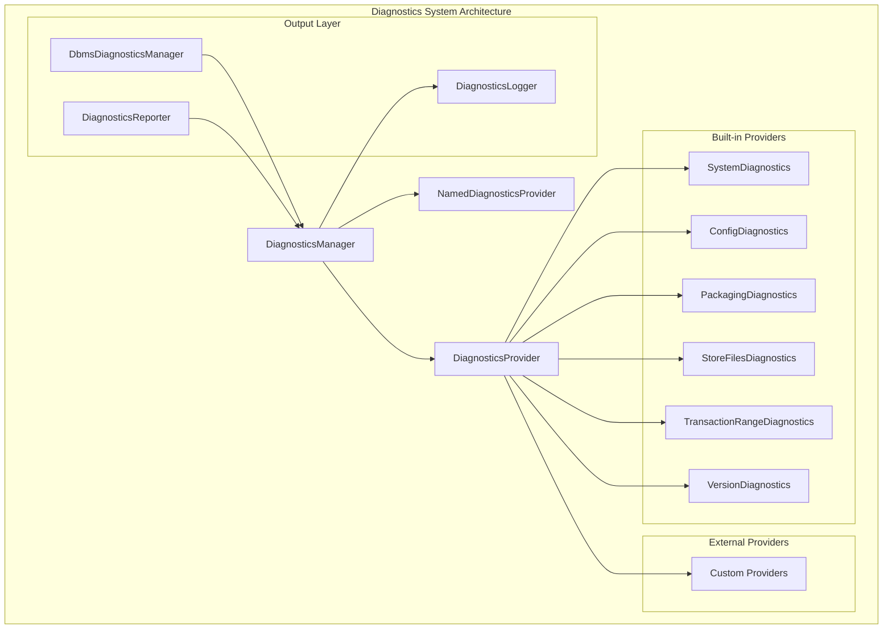
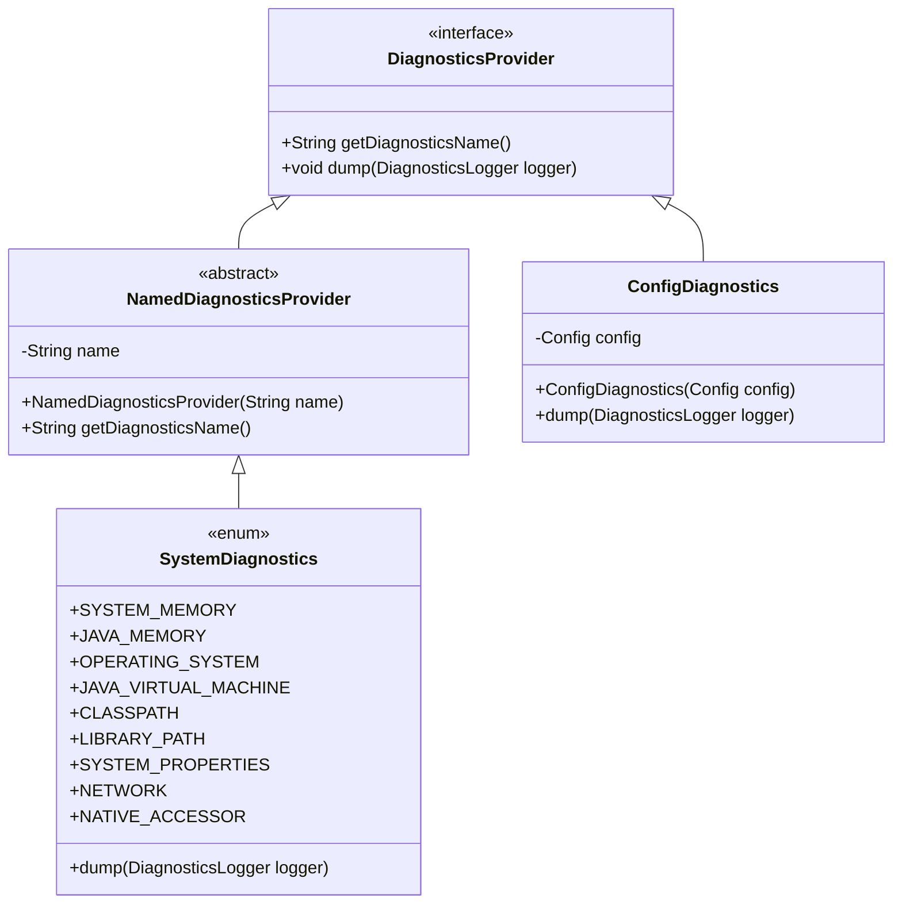
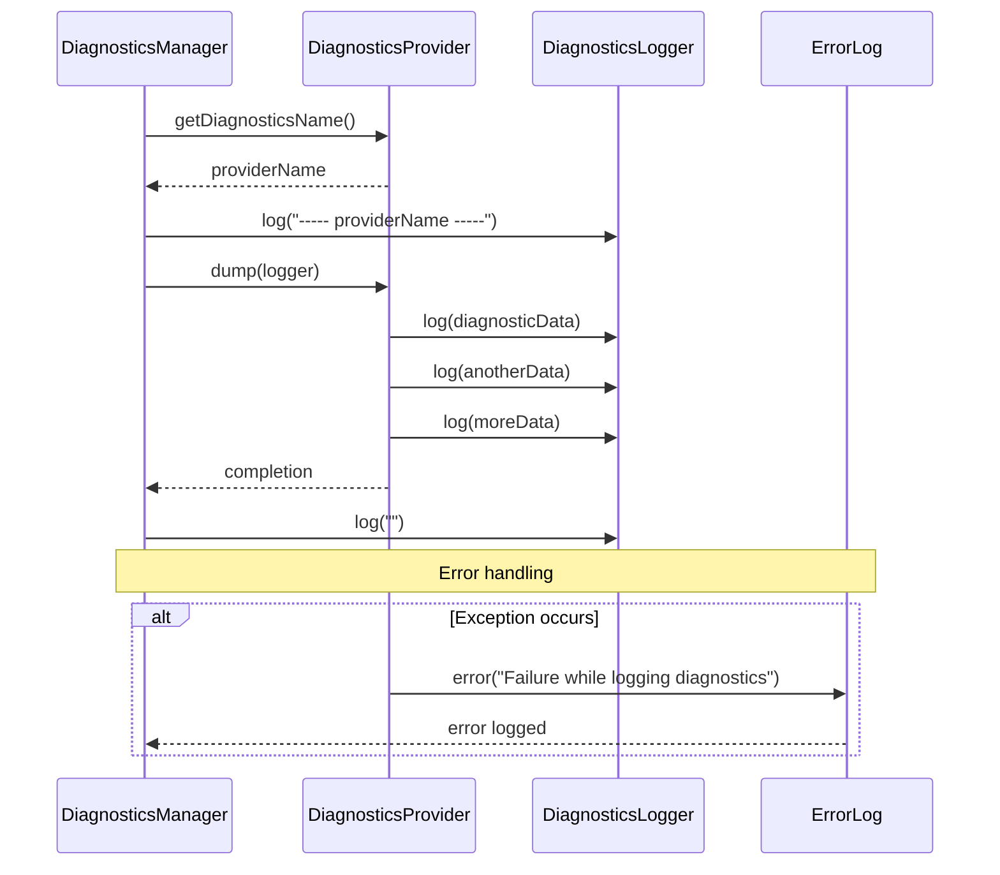
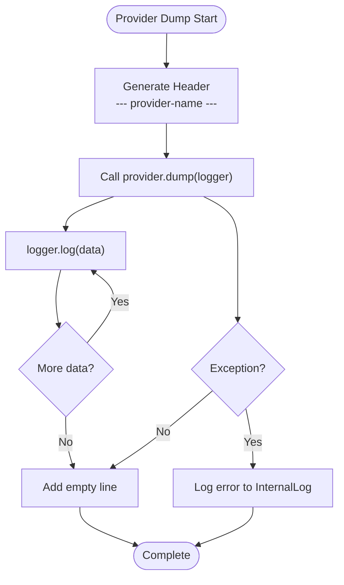
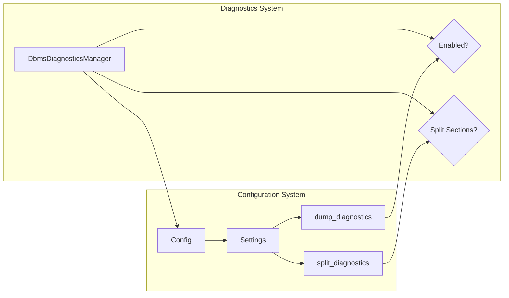
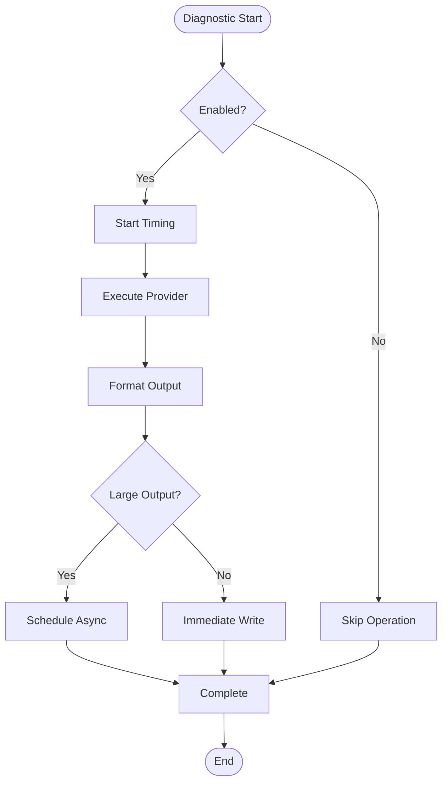

# Diagnostics Reporting

<cite>
**Referenced Files in This Document**
- [DiagnosticsManager.java](file://community/diagnostics/src/main/java/org/neo4j/internal/diagnostics/DiagnosticsManager.java)
- [DiagnosticsProvider.java](file://community/diagnostics/src/main/java/org/neo4j/internal/diagnostics/DiagnosticsProvider.java)
- [NamedDiagnosticsProvider.java](file://community/diagnostics/src/main/java/org/neo4j/internal/diagnostics/NamedDiagnosticsProvider.java)
- [DiagnosticsLogger.java](file://community/diagnostics/src/main/java/org/neo4j/internal/diagnostics/DiagnosticsLogger.java)
- [DbmsDiagnosticsManager.java](file://community/kernel/src/main/java/org/neo4j/kernel/diagnostics/providers/DbmsDiagnosticsManager.java)
- [SystemDiagnostics.java](file://community/kernel/src/main/java/org/neo4j/kernel/diagnostics/providers/SystemDiagnostics.java)
- [ConfigDiagnostics.java](file://community/kernel/src/main/java/org/neo4j/kernel/diagnostics/providers/ConfigDiagnostics.java)
- [PackagingDiagnostics.java](file://community/kernel/src/main/java/org/neo4j/kernel/diagnostics/providers/PackagingDiagnostics.java)
- [StoreFilesDiagnostics.java](file://community/kernel/src/main/java/org/neo4j/kernel/diagnostics/providers/StoreFilesDiagnostics.java)
- [TransactionRangeDiagnostics.java](file://community/kernel/src/main/java/org/neo4j/kernel/diagnostics/providers/TransactionRangeDiagnostics.java)
- [VersionDiagnostics.java](file://community/kernel/src/main/java/org/neo4j/kernel/diagnostics/providers/VersionDiagnostics.java)
- [DiagnosticsReportCommand.java](file://community/dbms/src/main/java/org/neoj/commandline/dbms/DiagnosticsReportCommand.java)
- [DiagnosticsReporter.java](file://community/kernel/src/main/java/org/neo4j/kernel/diagnostics/DiagnosticsReporter.java)
- [DiagnosticsOfflineReportProvider.java](file://community/kernel/src/main/java/org/neo4j/kernel/diagnostics/DiagnosticsOfflineReportProvider.java)
</cite>

## Table of Contents
1. [Introduction](#introduction)
2. [Architecture Overview](#architecture-overview)
3. [Core Components](#core-components)
4. [Diagnostics Provider System](#diagnostics-provider-system)
5. [Diagnostics Manager](#diagnostics-manager)
6. [Built-in Diagnostic Providers](#built-in-diagnostic-providers)
7. [Custom Diagnostic Providers](#custom-diagnostic-providers)
8. [Integration with Configuration System](#integration-with-configuration-system)
9. [Performance Considerations](#performance-considerations)
10. [Common Issues and Solutions](#common-issues-and-solutions)
11. [Best Practices](#best-practices)
12. [Conclusion](#conclusion)

## Introduction

Neo4j's diagnostics reporting system provides a comprehensive framework for collecting, organizing, and presenting diagnostic information about the database system. This system enables administrators and support teams to gather essential information for troubleshooting, performance analysis, and system assessment. The architecture is designed to be extensible, allowing custom diagnostic providers to be easily integrated while maintaining consistent formatting and reliable data collection.

The diagnostics system operates through a centralized manager that coordinates multiple specialized providers, each responsible for collecting specific types of information. This modular approach ensures that diagnostic data is organized logically and can be collected efficiently without impacting system performance unnecessarily.

## Architecture Overview

The diagnostics reporting system follows a hierarchical architecture with clear separation of concerns:



**Diagram sources**
- [DiagnosticsManager.java](file://community/diagnostics/src/main/java/org/neo4j/internal/diagnostics/DiagnosticsManager.java#L32-L71)
- [DiagnosticsProvider.java](file://community/diagnostics/src/main/java/org/neo4j/internal/diagnostics/DiagnosticsProvider.java#L22-L50)
- [DbmsDiagnosticsManager.java](file://community/kernel/src/main/java/org/neo4j/kernel/diagnostics/providers/DbmsDiagnosticsManager.java#L57-L323)

The architecture consists of several key layers:

- **Provider Layer**: Specialized diagnostic collectors that gather specific types of information
- **Manager Layer**: Central coordination system that orchestrates data collection and formatting
- **Output Layer**: Logging and reporting systems that present diagnostic information
- **Integration Layer**: Connections to configuration, logging, and external systems

## Core Components

### DiagnosticsProvider Interface

The [`DiagnosticsProvider`](file://community/diagnostics/src/main/java/org/neo4j/internal/diagnostics/DiagnosticsProvider.java#L22-L50) interface serves as the foundation for all diagnostic data collection. It defines two essential methods:

- `getDiagnosticsName()`: Returns a stable identifier for the provider
- `dump(DiagnosticsLogger)`: Collects and outputs diagnostic information



**Diagram sources**
- [DiagnosticsProvider.java](file://community/diagnostics/src/main/java/org/neo4j/internal/diagnostics/DiagnosticsProvider.java#L22-L50)
- [NamedDiagnosticsProvider.java](file://community/diagnostics/src/main/java/org/neo4j/internal/diagnostics/NamedDiagnosticsProvider.java#L22-L33)
- [SystemDiagnostics.java](file://community/kernel/src/main/java/org/neo4j/kernel/diagnostics/providers/SystemDiagnostics.java#L62-L291)
- [ConfigDiagnostics.java](file://community/kernel/src/main/java/org/neo4j/kernel/diagnostics/providers/ConfigDiagnostics.java#L35-L84)

### NamedDiagnosticsProvider Abstract Class

The [`NamedDiagnosticsProvider`](file://community/diagnostics/src/main/java/org/neo4j/internal/diagnostics/NamedDiagnosticsProvider.java#L22-L33) provides a convenient base implementation for diagnostic providers that need to specify a name. It implements the `getDiagnosticsName()` method automatically, reducing boilerplate code for simple providers.

### DiagnosticsLogger Interface

The [`DiagnosticsLogger`](file://community/diagnostics/src/main/java/org/neo4j/internal/diagnostics/DiagnosticsLogger.java#L22-L25) interface defines the contract for diagnostic output. It's a simple functional interface with a single `log(String)` method that accepts diagnostic messages.

**Section sources**
- [DiagnosticsProvider.java](file://community/diagnostics/src/main/java/org/neo4j/internal/diagnostics/DiagnosticsProvider.java#L22-L50)
- [NamedDiagnosticsProvider.java](file://community/diagnostics/src/main/java/org/neo4j/internal/diagnostics/NamedDiagnosticsProvider.java#L22-L33)
- [DiagnosticsLogger.java](file://community/diagnostics/src/main/java/org/neo4j/internal/diagnostics/DiagnosticsLogger.java#L22-L25)

## Diagnostics Provider System

### Invocation Relationship Model

The diagnostics system follows a producer-consumer pattern where providers produce diagnostic information and the manager consumes it:



**Diagram sources**
- [DiagnosticsManager.java](file://community/diagnostics/src/main/java/org/neo4j/internal/diagnostics/DiagnosticsManager.java#L46-L53)

### Domain Model of Diagnostic Information Flow

The diagnostic information flow follows a structured pattern:

1. **Provider Registration**: Providers are registered with the system through dependency injection or service loading
2. **Collection Phase**: The manager iterates through registered providers and invokes their `dump()` method
3. **Formatting Phase**: Each provider formats its data according to its own logic
4. **Aggregation Phase**: Results are aggregated and formatted consistently by the manager
5. **Output Phase**: Formatted results are written to the configured logger

**Section sources**
- [DiagnosticsManager.java](file://community/diagnostics/src/main/java/org/neo4j/internal/diagnostics/DiagnosticsManager.java#L39-L53)
- [DbmsDiagnosticsManager.java](file://community/kernel/src/main/java/org/neo4j/kernel/diagnostics/providers/DbmsDiagnosticsManager.java#L151-L170)

## Diagnostics Manager

### Central Coordination Role

The [`DiagnosticsManager`](file://community/diagnostics/src/main/java/org/neo4j/internal/diagnostics/DiagnosticsManager.java#L32-L71) serves as the central coordinator for the entire diagnostics system. It provides two primary methods:

- **Enum-based Collection**: `dump(Class<E>, InternalLog, DiagnosticsLogger)` for collecting from enum providers
- **Direct Provider Collection**: `dump(DiagnosticsProvider, InternalLog, DiagnosticsLogger)` for individual providers

### Formatting and Presentation

The manager applies consistent formatting to all diagnostic output:



**Diagram sources**
- [DiagnosticsManager.java](file://community/diagnostics/src/main/java/org/neo4j/internal/diagnostics/DiagnosticsManager.java#L46-L53)

### Section Organization

The manager provides section organization capabilities through the `section()` method, which creates visually distinct sections in diagnostic output:

- Uses asterisk borders for clear visual separation
- Centers section titles for emphasis
- Maintains consistent width formatting

**Section sources**
- [DiagnosticsManager.java](file://community/diagnostics/src/main/java/org/neo4j/internal/diagnostics/DiagnosticsManager.java#L39-L71)

## Built-in Diagnostic Providers

### SystemDiagnostics Enum

The [`SystemDiagnostics`](file://community/kernel/src/main/java/org/neo4j/kernel/diagnostics/providers/SystemDiagnostics.java#L62-L291) enum provides comprehensive system-level diagnostics across multiple categories:

#### System Memory Information
Collects physical memory, virtual memory, and swap space statistics using OS bean utilities.

#### JVM Memory Information  
Gathers heap memory usage, garbage collector information, and memory pool details.

#### Operating System Information
Includes OS version, architecture, CPU count, file descriptor limits, process information, and byte order details.

#### Java Virtual Machine Information
Captures JVM vendor, version, JIT compiler details, and runtime arguments.

#### Classpath Information
Builds comprehensive classpath information including bootstrap, system, and custom class loaders.

#### Library Path Information
Lists library paths with canonicalization for accurate file system representation.

#### System Properties
Enumerates system properties while filtering out sensitive or redundant information.

### ConfigDiagnostics Provider

The [`ConfigDiagnostics`](file://community/kernel/src/main/java/org/neo4j/kernel/diagnostics/providers/ConfigDiagnostics.java#L35-L84) provider focuses on configuration-related information:

- **Explicit Settings**: Lists all explicitly set configuration parameters
- **Directory Information**: Identifies important directory settings
- **Path Validation**: Performs basic path existence checks
- **Filtering Logic**: Excludes internal and dynamic settings

### PackagingDiagnostics Provider

The [`PackagingDiagnostics`](file://community/kernel/src/main/java/org/neo4j/kernel/diagnostics/providers/PackagingDiagnostics.java#L32-L62) provider extracts information from packaging metadata:

- **Version Information**: Reads version details from packaging files
- **Error Handling**: Gracefully handles missing or inaccessible files
- **Configuration Access**: Uses configuration to locate packaging information

### StoreFilesDiagnostics Provider

The [`StoreFilesDiagnostics`](file://community/kernel/src/main/java/org/neo4j/kernel/diagnostics/providers/StoreFilesDiagnostics.java#L45-L178) provider examines storage engine files:

- **File Listing**: Recursively lists all store files with metadata
- **Size Calculation**: Computes total sizes and mapped file counts
- **Disk Space Analysis**: Reports available disk space and usage percentages
- **File Filtering**: Distinguishes between managed and unmapped files

### TransactionRangeDiagnostics Provider

The [`TransactionRangeDiagnostics`](file://community/kernel/src/main/java/org/neo4j/kernel/diagnostics/providers/TransactionRangeDiagnostics.java#L44-L61) provider analyzes transaction log information:

- **Transaction Range**: Determines the range of transactions in the log
- **Checkpoint Analysis**: Examines checkpoint files for recovery information
- **Log File Inspection**: Analyzes transaction log files for completeness

### VersionDiagnostics Provider

The [`VersionDiagnostics`](file://community/kernel/src/main/java/org/neo4j/kernel/diagnostics/providers/VersionDiagnostics.java#L28-L42) provider provides version information:

- **DBMS Version**: Reports Neo4j version and build information
- **Kernel Version**: Shows internal kernel version
- **Store Version**: Indicates storage engine compatibility

**Section sources**
- [SystemDiagnostics.java](file://community/kernel/src/main/java/org/neo4j/kernel/diagnostics/providers/SystemDiagnostics.java#L62-L291)
- [ConfigDiagnostics.java](file://community/kernel/src/main/java/org/neo4j/kernel/diagnostics/providers/ConfigDiagnostics.java#L35-L84)
- [PackagingDiagnostics.java](file://community/kernel/src/main/java/org/neo4j/kernel/diagnostics/providers/PackagingDiagnostics.java#L32-L62)
- [StoreFilesDiagnostics.java](file://community/kernel/src/main/java/org/neo4j/kernel/diagnostics/providers/StoreFilesDiagnostics.java#L45-L178)
- [TransactionRangeDiagnostics.java](file://community/kernel/src/main/java/org/neo4j/kernel/diagnostics/providers/TransactionRangeDiagnostics.java#L44-L61)
- [VersionDiagnostics.java](file://community/kernel/src/main/java/org/neo4j/kernel/diagnostics/providers/VersionDiagnostics.java#L28-L42)

## Custom Diagnostic Providers

### Creating a Custom Provider

To create a custom diagnostic provider, implement the `DiagnosticsProvider` interface or extend `NamedDiagnosticsProvider`:

```java
// Example custom provider implementation
public class CustomFeatureDiagnostics extends NamedDiagnosticsProvider {
    private final FeatureManager featureManager;
    
    public CustomFeatureDiagnostics(FeatureManager featureManager) {
        super("Custom Features");
        this.featureManager = featureManager;
    }
    
    @Override
    public void dump(DiagnosticsLogger logger) {
        logger.log("Enabled features:");
        featureManager.getEnabledFeatures().forEach(feature -> 
            logger.log("  - " + feature.getName() + ": " + feature.getStatus()));
        
        logger.log("Feature configuration:");
        featureManager.getFeatureConfigurations().forEach((name, config) -> 
            logger.log("  " + name + " = " + config));
    }
}
```

### Registration Methods

Custom providers can be registered through several mechanisms:

#### Dependency Injection
Providers can be registered as dependencies in the Neo4j dependency resolution system:

```java
// In a module or factory
dependencies.satisfyDependency(new CustomFeatureDiagnostics(featureManager));
```

#### Service Loading
Implement the `DiagnosticsProvider` interface and register through service loading:

```java
// META-INF/services/org.neo4j.internal.diagnostics.DiagnosticsProvider
com.example.CustomFeatureDiagnostics
```

#### Programmatic Registration
Register providers directly with the diagnostics system:

```java
// During system initialization
DiagnosticsManager.dump(customProvider, errorLog, diagnosticsLogger);
```

### Best Practices for Custom Providers

1. **Resource Management**: Properly handle resources and avoid blocking operations
2. **Error Handling**: Wrap potentially failing operations in try-catch blocks
3. **Performance**: Minimize computation time and avoid expensive operations
4. **Security**: Filter sensitive information appropriately
5. **Consistency**: Follow established formatting conventions

**Section sources**
- [NamedDiagnosticsProvider.java](file://community/diagnostics/src/main/java/org/neo4j/internal/diagnostics/NamedDiagnosticsProvider.java#L22-L33)
- [DiagnosticsProvider.java](file://community/diagnostics/src/main/java/org/neo4j/internal/diagnostics/DiagnosticsProvider.java#L22-L50)

## Integration with Configuration System

### Configuration-Driven Behavior

The diagnostics system integrates closely with Neo4j's configuration system:



**Diagram sources**
- [DbmsDiagnosticsManager.java](file://community/kernel/src/main/java/org/neo4j/kernel/diagnostics/providers/DbmsDiagnosticsManager.java#L68-L74)

### Configuration Settings

Key configuration settings that control diagnostics behavior:

- **dump_diagnostics**: Enables/disables diagnostic collection
- **split_diagnostics**: Controls section splitting for large outputs
- **log thresholds**: Affects output formatting and verbosity

### Dynamic Configuration Updates

The system responds to configuration changes:

- **Runtime Updates**: Some settings can be changed without restart
- **Graceful Degradation**: Failsafe mechanisms for invalid configurations
- **Validation**: Configuration validation prevents system instability

**Section sources**
- [DbmsDiagnosticsManager.java](file://community/kernel/src/main/java/org/neo4j/kernel/diagnostics/providers/DbmsDiagnosticsManager.java#L68-L74)

## Performance Considerations

### Impact Mitigation Strategies

The diagnostics system implements several strategies to minimize performance impact:

#### Lazy Evaluation
- Providers are only executed when diagnostics are explicitly requested
- Expensive operations are deferred until necessary
- Resource-intensive operations use caching where appropriate

#### Asynchronous Processing
- Large diagnostic operations can be scheduled asynchronously
- Uses job schedulers for non-blocking execution
- Implements proper synchronization for concurrent access

#### Output Optimization
- Messages are buffered and sent as single log entries
- Long messages are split intelligently to avoid log truncation
- Reduces overhead from frequent small log writes

#### Conditional Execution
- Checks enablement flags before performing work
- Skips unnecessary operations during testing
- Implements early termination for empty results

### Performance Monitoring

The system includes built-in performance monitoring:



**Diagram sources**
- [DbmsDiagnosticsManager.java](file://community/kernel/src/main/java/org/neo4j/kernel/diagnostics/providers/DbmsDiagnosticsManager.java#L225-L264)

### Memory Management

The system manages memory carefully:

- **String Interning**: Reuses common diagnostic strings
- **Buffer Management**: Efficient string building with StringBuilder
- **Reference Cleanup**: Proper cleanup of temporary objects
- **Concurrent Collections**: Uses thread-safe collections where needed

**Section sources**
- [DbmsDiagnosticsManager.java](file://community/kernel/src/main/java/org/neo4j/kernel/diagnostics/providers/DbmsDiagnosticsManager.java#L225-L264)

## Common Issues and Solutions

### Incomplete Diagnostic Data

**Problem**: Missing or partial diagnostic information

**Causes**:
- Insufficient permissions to access system resources
- Missing configuration files
- Network connectivity issues for remote diagnostics
- Resource exhaustion during collection

**Solutions**:
- Implement graceful degradation with fallback values
- Provide meaningful error messages instead of silent failures
- Use alternative data sources when primary sources are unavailable
- Implement retry logic for transient failures

### Performance Impact

**Problem**: Diagnostics collection slows down system performance

**Causes**:
- Expensive operations performed synchronously
- Large amounts of data collected without batching
- Blocking I/O operations during collection
- Excessive logging or formatting overhead

**Solutions**:
- Move expensive operations to background threads
- Implement pagination for large datasets
- Use asynchronous I/O where possible
- Optimize formatting and string operations

### Memory Consumption

**Problem**: High memory usage during diagnostics collection

**Causes**:
- Accumulation of large diagnostic data structures
- Inefficient string concatenation
- Failure to clean up temporary resources
- Circular references in diagnostic objects

**Solutions**:
- Implement streaming for large datasets
- Use StringBuilder efficiently
- Implement proper resource cleanup
- Avoid retaining references to large objects unnecessarily

### Error Handling

**Problem**: Exceptions during diagnostics collection disrupt system operation

**Causes**:
- Unhandled exceptions in provider code
- Resource leaks during error conditions
- Inconsistent error reporting
- Failure to rollback partial operations

**Solutions**:
- Wrap all provider operations in try-catch blocks
- Implement proper resource cleanup in finally blocks
- Use the manager's error logging mechanism
- Provide fallback values for failed operations

**Section sources**
- [DiagnosticsManager.java](file://community/diagnostics/src/main/java/org/neo4j/internal/diagnostics/DiagnosticsManager.java#L46-L53)
- [DbmsDiagnosticsManager.java](file://community/kernel/src/main/java/org/neo4j/kernel/diagnostics/providers/DbmsDiagnosticsManager.java#L225-L264)

## Best Practices

### Provider Implementation Guidelines

1. **Thread Safety**: Ensure providers are thread-safe for concurrent access
2. **Resource Management**: Properly manage resources and implement cleanup
3. **Error Resilience**: Handle exceptions gracefully and provide meaningful feedback
4. **Performance Awareness**: Minimize computational overhead and I/O operations
5. **Security Consideration**: Filter sensitive information appropriately

### Data Collection Strategies

1. **Incremental Collection**: Collect data incrementally rather than all at once
2. **Caching**: Cache expensive computations when appropriate
3. **Lazy Loading**: Defer expensive operations until absolutely necessary
4. **Batch Processing**: Process large datasets in batches to avoid timeouts

### Output Formatting

1. **Consistent Formatting**: Follow established formatting conventions
2. **Clear Separation**: Use clear visual separators between sections
3. **Readable Layout**: Ensure output is readable and well-organized
4. **Structured Data**: Use consistent key-value formatting where appropriate

### Integration Patterns

1. **Dependency Injection**: Use dependency injection for provider dependencies
2. **Service Loading**: Leverage service loading for automatic registration
3. **Configuration Binding**: Bind providers to configuration settings
4. **Lifecycle Management**: Implement proper lifecycle management

### Testing and Validation

1. **Unit Testing**: Test providers in isolation with mocked dependencies
2. **Integration Testing**: Test provider integration with the diagnostics system
3. **Performance Testing**: Validate performance characteristics under load
4. **Error Scenario Testing**: Test error handling and recovery scenarios

## Conclusion

Neo4j's diagnostics reporting system provides a robust, extensible framework for collecting and presenting diagnostic information. The system's modular architecture allows for easy customization while maintaining consistency and reliability. Through careful design of the provider interfaces, intelligent performance optimization, and comprehensive error handling, the system delivers valuable insights into Neo4j's operation without compromising system performance.

The key strengths of the system include:

- **Extensibility**: Easy integration of custom diagnostic providers
- **Performance**: Minimal impact on system operation through optimization strategies
- **Reliability**: Robust error handling and graceful degradation
- **Consistency**: Uniform formatting and presentation across all diagnostic data
- **Integration**: Seamless integration with Neo4j's configuration and logging systems

For developers implementing custom diagnostic providers, following the established patterns and best practices ensures optimal integration with the broader diagnostics ecosystem. The system's design philosophy of "fail fast, fail gracefully" combined with performance-conscious implementation makes it suitable for production environments where reliability and efficiency are paramount.

Future enhancements to the diagnostics system should focus on expanding the provider ecosystem, improving performance under high-load conditions, and enhancing the reporting capabilities for automated analysis and monitoring systems.