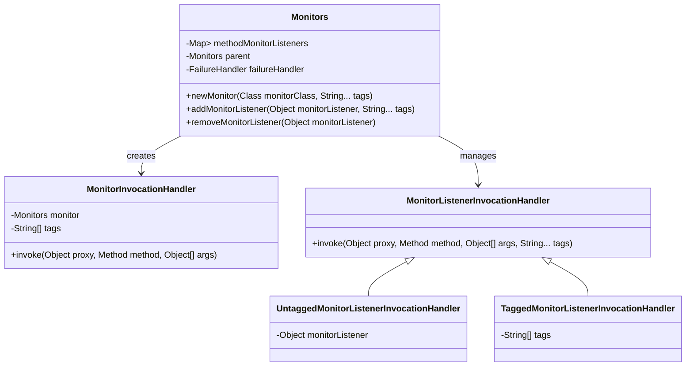
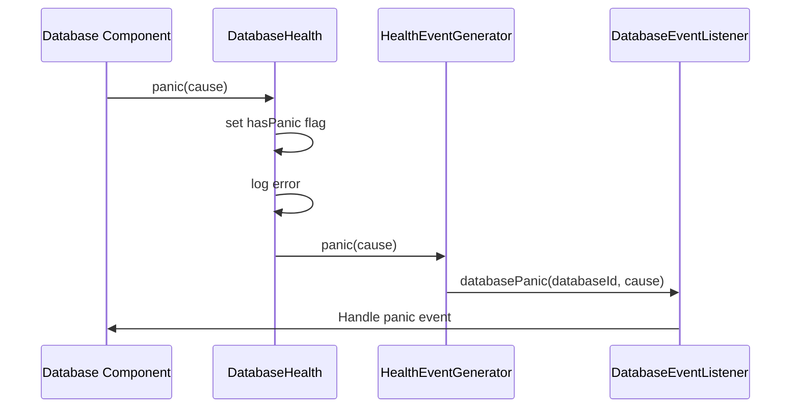
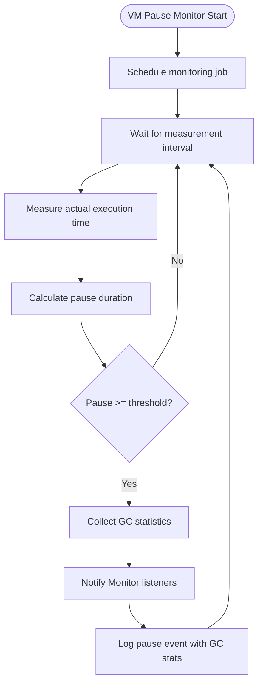
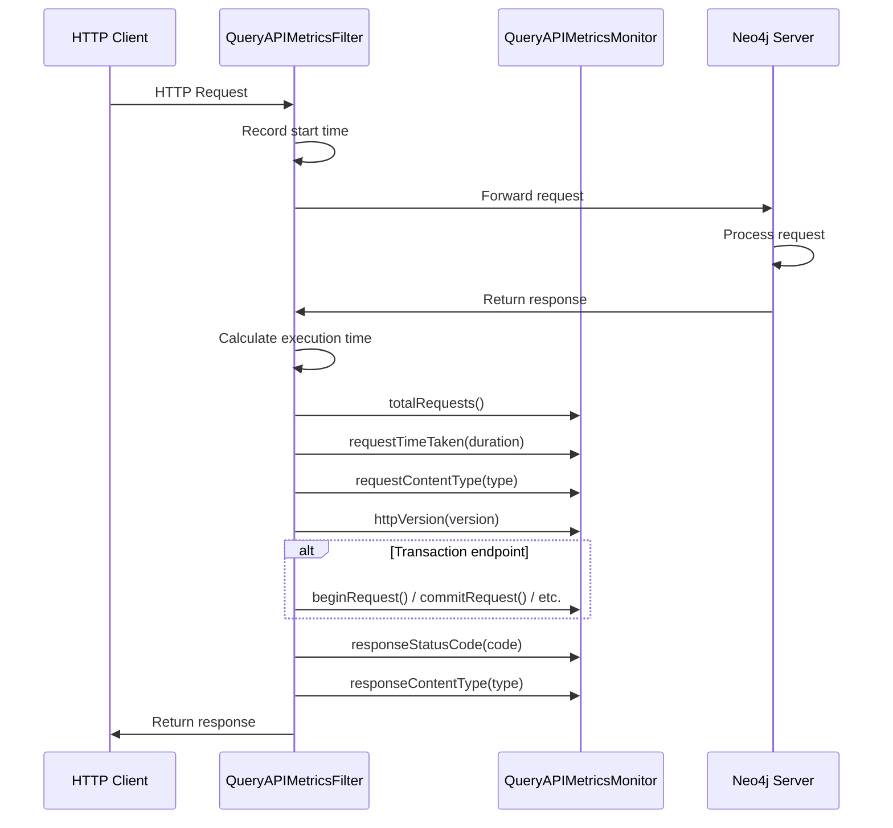

# Metrics Collection

<cite>
**Referenced Files in This Document**   
- [Monitors.java](file://community/monitoring/src/main/java/org/neo4j/monitoring/Monitors.java)
- [DatabaseHealth.java](file://community/monitoring/src/main/java/org/neo4j/monitoring/DatabaseHealth.java)
- [VmPauseMonitor.java](file://community/monitoring/src/main/java/org/neo4j/monitoring/VmPauseMonitor.java)
- [QueryAPIMetricsMonitor.java](file://community/server/src/main/java/org/neo4j/server/queryapi/metrics/QueryAPIMetricsMonitor.java)
- [QueryAPIMetricsFilter.java](file://community/server/src/main/java/org/neo4j/server/queryapi/metrics/QueryAPIMetricsFilter.java)
- [VmPauseMonitorComponent.java](file://community/kernel/src/main/java/org/neo4j/kernel/impl/cache/VmPauseMonitorComponent.java)
- [LoggingVmPauseMonitor.java](file://community/kernel/src/main/java/org/neo4j/kernel/monitoring/LoggingVmPauseMonitor.java)
- [DatabaseHealthEventGenerator.java](file://community/kernel/src/main/java/org/neo4j/kernel/monitoring/DatabaseHealthEventGenerator.java)
- [HealthEventGenerator.java](file://community/monitoring/src/main/java/org/neo4j/monitoring/HealthEventGenerator.java)
</cite>

## Table of Contents
1. [Introduction](#introduction)
2. [Monitors Service Architecture](#monitors-service-architecture)
3. [Database Health Monitoring](#database-health-monitoring)
4. [VM Pause Detection](#vm-pause-detection)
5. [Query API Metrics Collection](#query-api-metrics-collection)
6. [Metrics Registration and Consumption](#metrics-registration-and-consumption)
7. [Performance Considerations](#performance-considerations)
8. [Best Practices](#best-practices)
9. [Conclusion](#conclusion)

## Introduction
Neo4j's metrics collection system provides a comprehensive framework for monitoring database health, performance, and operational metrics. The system is built around an event-driven architecture that enables components to emit metrics and health events without direct dependencies on monitoring infrastructure. This documentation details the implementation of the Monitors service as the central registry for metric components, how DatabaseHealth tracks database state and health events, and how VmPauseMonitor detects JVM pause events that affect performance. The document also covers interfaces and usage patterns for registering and consuming metrics, including how QueryAPIMetricsMonitor captures query execution metrics through the query API.

**Section sources**
- [Monitors.java](file://community/monitoring/src/main/java/org/neo4j/monitoring/Monitors.java#L1-L244)
- [DatabaseHealth.java](file://community/monitoring/src/main/java/org/neo4j/monitoring/DatabaseHealth.java#L1-L84)
- [VmPauseMonitor.java](file://community/monitoring/src/main/java/org/neo4j/monitoring/VmPauseMonitor.java#L1-L176)

## Monitors Service Architecture
The Monitors service serves as the central registry for metric components in Neo4j, implementing a dynamic proxy-based event system that allows for flexible monitoring without tight coupling between components. The architecture is designed to be thread-safe and supports hierarchical event propagation.

The Monitors class uses Java's dynamic proxy mechanism to create monitor instances that can delegate to any number of listeners. When a monitor is created via the `newMonitor` method, it returns a proxy object that intercepts method calls and forwards them to registered listeners. This design enables components to emit events without knowing the specific implementations of the monitoring system.



**Diagram sources**
- [Monitors.java](file://community/monitoring/src/main/java/org/neo4j/monitoring/Monitors.java#L50-L244)

**Section sources**
- [Monitors.java](file://community/monitoring/src/main/java/org/neo4j/monitoring/Monitors.java#L40-L244)

## Database Health Monitoring
The DatabaseHealth component tracks the health state of a Neo4j database instance and generates health events when critical conditions are detected. It implements the Panic and OutOfDiskSpace interfaces, providing methods to signal and respond to database health issues.

DatabaseHealth works in conjunction with HealthEventGenerator to propagate health events to interested parties. When a panic condition is detected, the DatabaseHealth component sets an internal flag, logs the error, and notifies the HealthEventGenerator, which then broadcasts the event to registered listeners. This separation of concerns allows the health monitoring logic to be decoupled from the event distribution mechanism.



**Diagram sources**
- [DatabaseHealth.java](file://community/monitoring/src/main/java/org/neo4j/monitoring/DatabaseHealth.java#L27-L83)
- [DatabaseHealthEventGenerator.java](file://community/kernel/src/main/java/org/neo4j/kernel/monitoring/DatabaseHealthEventGenerator.java#L1-L43)
- [HealthEventGenerator.java](file://community/monitoring/src/main/java/org/neo4j/monitoring/HealthEventGenerator.java#L1-L36)

**Section sources**
- [DatabaseHealth.java](file://community/monitoring/src/main/java/org/neo4j/monitoring/DatabaseHealth.java#L27-L83)
- [DatabaseHealthEventGenerator.java](file://community/kernel/src/main/java/org/neo4j/kernel/monitoring/DatabaseHealthEventGenerator.java#L1-L43)

## VM Pause Detection
The VmPauseMonitor component detects JVM pause events that can affect database performance, particularly long garbage collection pauses that cause "stop-the-world" events. The monitor runs as a scheduled job that periodically measures the time between expected and actual execution intervals, identifying pauses that exceed a configurable threshold.

The VmPauseMonitor works by scheduling a job at regular intervals and measuring the actual time between executions. When the measured pause time exceeds the configured threshold, it notifies registered listeners through the Monitor interface. The implementation also tracks garbage collection statistics to provide context about GC activity during detected pauses.



**Diagram sources**
- [VmPauseMonitor.java](file://community/monitoring/src/main/java/org/neo4j/monitoring/VmPauseMonitor.java#L37-L175)
- [VmPauseMonitorComponent.java](file://community/kernel/src/main/java/org/neo4j/kernel/impl/cache/VmPauseMonitorComponent.java#L40-L66)
- [LoggingVmPauseMonitor.java](file://community/kernel/src/main/java/org/neo4j/kernel/monitoring/LoggingVmPauseMonitor.java#L1-L58)

**Section sources**
- [VmPauseMonitor.java](file://community/monitoring/src/main/java/org/neo4j/monitoring/VmPauseMonitor.java#L37-L175)
- [VmPauseMonitorComponent.java](file://community/kernel/src/main/java/org/neo4j/kernel/impl/cache/VmPauseMonitorComponent.java#L40-L66)

## Query API Metrics Collection
The QueryAPIMetricsMonitor interface defines the contract for collecting metrics related to the Neo4j Query API, capturing information about HTTP requests, transaction operations, and response characteristics. The implementation is integrated into the server's request processing pipeline through a servlet filter that intercepts and analyzes HTTP requests.

The QueryAPIMetricsFilter class implements the monitoring logic by wrapping HTTP request processing and extracting metrics from the request and response objects. It uses pattern matching to identify different types of API endpoints and records appropriate metrics for each operation type, such as transaction begins, commits, rollbacks, and auto-commit requests.



**Diagram sources**
- [QueryAPIMetricsMonitor.java](file://community/server/src/main/java/org/neo4j/server/queryapi/metrics/QueryAPIMetricsMonitor.java#L23-L55)
- [QueryAPIMetricsFilter.java](file://community/server/src/main/java/org/neo4j/server/queryapi/metrics/QueryAPIMetricsFilter.java#L1-L100)

**Section sources**
- [QueryAPIMetricsMonitor.java](file://community/server/src/main/java/org/neo4j/server/queryapi/metrics/QueryAPIMetricsMonitor.java#L23-L55)
- [QueryAPIMetricsFilter.java](file://community/server/src/main/java/org/neo4j/server/queryapi/metrics/QueryAPIMetricsFilter.java#L1-L100)

## Metrics Registration and Consumption
The metrics system in Neo4j follows a consistent pattern for registering and consuming metrics across different components. Components that need to emit metrics obtain a monitor instance from the Monitors service and invoke methods on it to signal events. Components that need to consume metrics implement the appropriate monitor interface and register themselves as listeners.

The registration process is flexible and supports both tagged and untagged monitoring. Tagged monitors allow for selective event delivery based on tags, enabling fine-grained control over which components receive which events. The system also supports hierarchical monitoring through parent-child relationships between Monitors instances, allowing events to bubble up from child components to parent containers.

```mermaid
classDiagram
class QueryAPIMetricsMonitor {
+totalRequests()
+requestTimeTaken(long timeInMillis)
+requestContentType(String contentType)
+responseContentType(String contentType)
+responseStatusCode(int code)
+httpVersion(HttpVersion httpVersion)
+beginRequest()
+continueRequest()
+commitRequest()
+rollbackRequest()
+autoCommitRequest()
}
class VmPauseMonitor$Monitor {
+started()
+stopped()
+interrupted()
+failed(Exception e)
+pauseDetected(VmPauseInfo info)
}
class LoggingVmPauseMonitor {
-InternalLog log
+started()
+stopped()
+interrupted()
+failed(Exception e)
+pauseDetected(VmPauseInfo info)
}
VmPauseMonitor$Monitor <|-- LoggingVmPauseMonitor
VmPauseMonitor$Monitor <|-- CustomMonitorImplementation
```

**Diagram sources**
- [QueryAPIMetricsMonitor.java](file://community/server/src/main/java/org/neo4j/server/queryapi/metrics/QueryAPIMetricsMonitor.java#L23-L55)
- [VmPauseMonitor.java](file://community/monitoring/src/main/java/org/neo4j/monitoring/VmPauseMonitor.java#L141-L175)
- [LoggingVmPauseMonitor.java](file://community/kernel/src/main/java/org/neo4j/kernel/monitoring/LoggingVmPauseMonitor.java#L1-L58)

**Section sources**
- [Monitors.java](file://community/monitoring/src/main/java/org/neo4j/monitoring/Monitors.java#L102-L119)
- [QueryAPIMetricsMonitor.java](file://community/server/src/main/java/org/neo4j/server/queryapi/metrics/QueryAPIMetricsMonitor.java#L23-L55)

## Performance Considerations
While the metrics collection system provides valuable insights into database operations, it can introduce performance overhead if not configured properly. The system is designed to minimize impact through several mechanisms:

1. **Lazy initialization**: Monitor instances are created only when needed, and listeners are registered only when monitoring is enabled.
2. **Efficient event propagation**: The use of dynamic proxies and method-level listener registration ensures that events are only dispatched to interested parties.
3. **Configurable thresholds**: Components like VmPauseMonitor allow configuration of measurement intervals and alert thresholds to balance sensitivity with overhead.
4. **Asynchronous processing**: Where possible, metric collection and processing occurs on separate threads to avoid blocking critical database operations.

However, excessive monitoring or inappropriate configuration can still impact performance. For example, setting very short measurement intervals for VmPauseMonitor can increase CPU usage, while registering too many listeners for high-frequency events can create contention.

**Section sources**
- [VmPauseMonitor.java](file://community/monitoring/src/main/java/org/neo4j/monitoring/VmPauseMonitor.java#L46-L67)
- [Monitors.java](file://community/monitoring/src/main/java/org/neo4j/monitoring/Monitors.java#L210-L223)

## Best Practices
To effectively use Neo4j's metrics collection system while minimizing performance impact, consider the following best practices:

1. **Use appropriate monitoring levels**: Enable detailed monitoring only when needed for troubleshooting, and use summary metrics for routine monitoring.
2. **Configure thresholds wisely**: Set appropriate thresholds for alerting components like VmPauseMonitor to avoid excessive notifications while still catching significant issues.
3. **Limit listener registration**: Register listeners only for events that are actually needed, avoiding unnecessary event processing.
4. **Use tags for filtering**: Leverage the tagging system to selectively enable monitoring for specific components or operations.
5. **Monitor monitoring overhead**: Keep an eye on the performance impact of monitoring itself, and adjust configuration if monitoring overhead becomes significant.
6. **Clean up monitors**: Ensure that monitors are properly removed when no longer needed, particularly for transient components like individual database instances.

**Section sources**
- [Monitors.java](file://community/monitoring/src/main/java/org/neo4j/monitoring/Monitors.java#L115-L119)
- [VmPauseMonitorComponent.java](file://community/kernel/src/main/java/org/neo4j/kernel/impl/cache/VmPauseMonitorComponent.java#L60-L65)

## Conclusion
Neo4j's metrics collection system provides a robust, flexible framework for monitoring database health and performance. The Monitors service acts as a central registry that enables event-driven communication between components without tight coupling. The system supports various types of monitoring, from database health tracking to JVM pause detection and API usage metrics, all through a consistent interface and implementation pattern.

By understanding the architecture and usage patterns of the metrics system, developers can effectively instrument their components, configure monitoring appropriately, and retrieve valuable performance data while minimizing the impact on database operations. The event-driven design ensures that monitoring can be enabled and disabled dynamically, making it suitable for both development and production environments.