# Monitoring and Diagnostics

<cite>
**Referenced Files in This Document**
- [Monitors.java](file://community/monitoring/src/main/java/org/neo4j/monitoring/Monitors.java)
- [DiagnosticsManager.java](file://community/diagnostics/src/main/java/org/neo4j/internal/diagnostics/DiagnosticsManager.java)
- [DiagnosticsProvider.java](file://community/diagnostics/src/main/java/org/neo4j/internal/diagnostics/DiagnosticsProvider.java)
- [DiagnosticsLogger.java](file://community/diagnostics/src/main/java/org/neo4j/internal/diagnostics/DiagnosticsLogger.java)
- [SystemDiagnostics.java](file://community/kernel/src/main/java/org/neo4j/kernel/diagnostics/providers/SystemDiagnostics.java)
- [DiagnosticsReportCommand.java](file://community/dbms/src/main/java/org/neo4j/commandline/dbms/DiagnosticsReportCommand.java)
- [QueryExecutionMonitor.java](file://community/kernel/src/main/java/org/neo4j/kernel/impl/monitoring/QueryExecutionMonitor.java)
- [TransactionCounters.java](file://community/kernel/src/main/java/org/neo4j/kernel/impl/transaction/stats/TransactionCounters.java)
- [DatabaseTransactionStats.java](file://community/kernel/src/main/java/org/neo4j/kernel/impl/transaction/stats/DatabaseTransactionStats.java)
- [PageCacheTracer.java](file://community/io/src/main/java/org/neo4j/io/pagecache/tracing/PageCacheTracer.java)
- [DefaultPageCacheTracer.java](file://community/io/src/main/java/org/neo4j/io/pagecache/tracing/DefaultPageCacheTracer.java)
- [QueryTransactionStatisticsAggregator.java](file://community/kernel/src/main/java/org/neo4j/kernel/api/query/QueryTransactionStatisticsAggregator.java)
- [QuerySnapshot.java](file://community/kernel/src/main/java/org/neo4j/kernel/api/query/QuerySnapshot.java)
</cite>

## Table of Contents
1. [Introduction](#introduction)
2. [Architecture Overview](#architecture-overview)
3. [Core Components](#core-components)
4. [Event-Driven Monitoring Architecture](#event-driven-monitoring-architecture)
5. [Metrics Collection System](#metrics-collection-system)
6. [Diagnostics Reporting System](#diagnostics-reporting-system)
7. [Query Performance Tracking](#query-performance-tracking)
8. [Transaction Monitoring](#transaction-monitoring)
9. [Page Cache Tracing](#page-cache-tracing)
10. [Practical Implementation Examples](#practical-implementation-examples)
11. [Best Practices and Guidelines](#best-practices-and-guidelines)
12. [Troubleshooting and Debugging](#troubleshooting-and-debugging)

## Introduction

Neo4j's monitoring and diagnostics system provides comprehensive visibility into database operations, performance characteristics, and operational health. This system enables administrators and developers to understand database behavior, identify performance bottlenecks, and troubleshoot issues effectively.

The monitoring framework is built around an event-driven architecture that captures metrics from various subsystems including query execution, transactions, page caching, and storage operations. The diagnostics system complements this by providing structured reporting capabilities for operational assessment and problem diagnosis.

## Architecture Overview

The monitoring and diagnostics system consists of several interconnected components that work together to provide comprehensive observability:

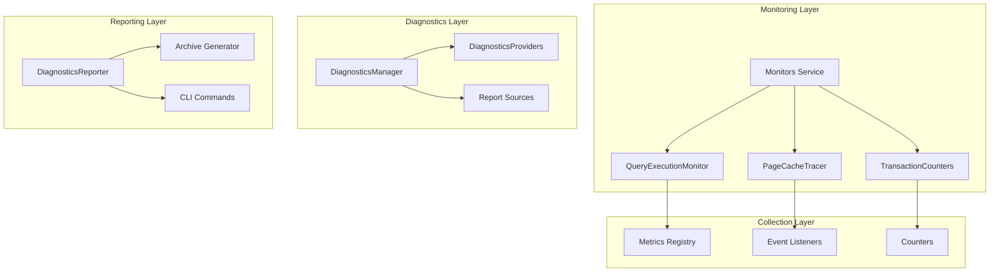

**Diagram sources**
- [Monitors.java](file://community/monitoring/src/main/java/org/neo4j/monitoring/Monitors.java#L51-L245)
- [DiagnosticsManager.java](file://community/diagnostics/src/main/java/org/neo4j/internal/diagnostics/DiagnosticsManager.java#L32-L72)

## Core Components

### Monitors Service

The Monitors service serves as the central hub for registering and managing monitoring listeners. It implements a dynamic proxy pattern to enable event-driven monitoring across the system.

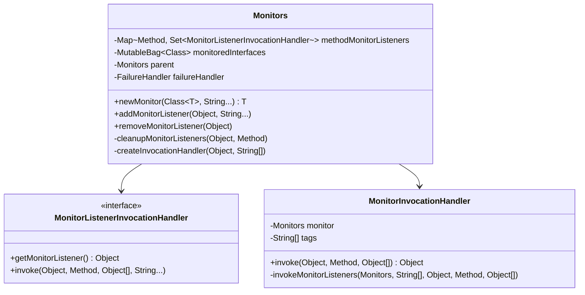

**Diagram sources**
- [Monitors.java](file://community/monitoring/src/main/java/org/neo4j/monitoring/Monitors.java#L51-L245)

**Section sources**
- [Monitors.java](file://community/monitoring/src/main/java/org/neo4j/monitoring/Monitors.java#L51-L245)

### DiagnosticsManager

The DiagnosticsManager orchestrates the collection and presentation of diagnostic information from various providers. It follows a standardized format for consistent reporting.

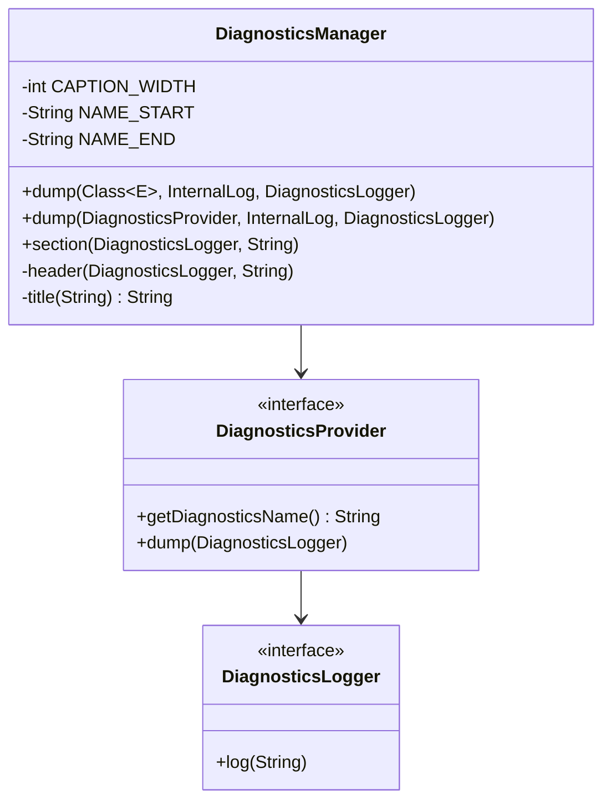

**Diagram sources**
- [DiagnosticsManager.java](file://community/diagnostics/src/main/java/org/neo4j/internal/diagnostics/DiagnosticsManager.java#L32-L72)
- [DiagnosticsProvider.java](file://community/diagnostics/src/main/java/org/neo4j/internal/diagnostics/DiagnosticsProvider.java#L22-L50)

**Section sources**
- [DiagnosticsManager.java](file://community/diagnostics/src/main/java/org/neo4j/internal/diagnostics/DiagnosticsManager.java#L32-L72)
- [DiagnosticsProvider.java](file://community/diagnostics/src/main/java/org/neo4j/internal/diagnostics/DiagnosticsProvider.java#L22-L50)

## Event-Driven Monitoring Architecture

The monitoring system operates on an event-driven model where various subsystems emit events that are captured by registered listeners. This architecture ensures minimal performance impact while providing comprehensive monitoring coverage.

### Event Flow Architecture

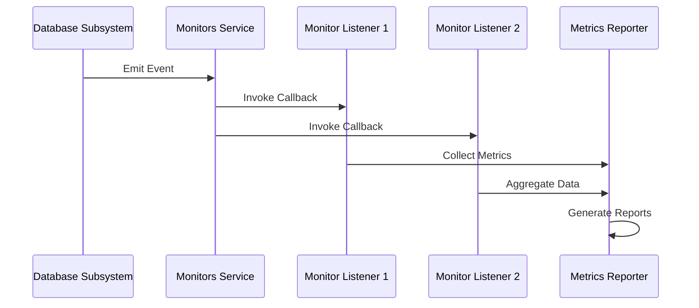

**Diagram sources**
- [Monitors.java](file://community/monitoring/src/main/java/org/neo4j/monitoring/Monitors.java#L198-L222)

### Registration and Lifecycle

The monitoring system supports dynamic registration of listeners with support for tagging and hierarchical propagation:

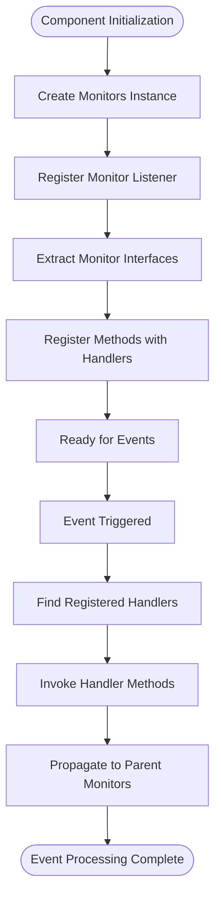

**Section sources**
- [Monitors.java](file://community/monitoring/src/main/java/org/neo4j/monitoring/Monitors.java#L102-L130)

## Metrics Collection System

### Query Execution Monitoring

Query execution monitoring tracks performance metrics for individual queries and provides insights into execution patterns:

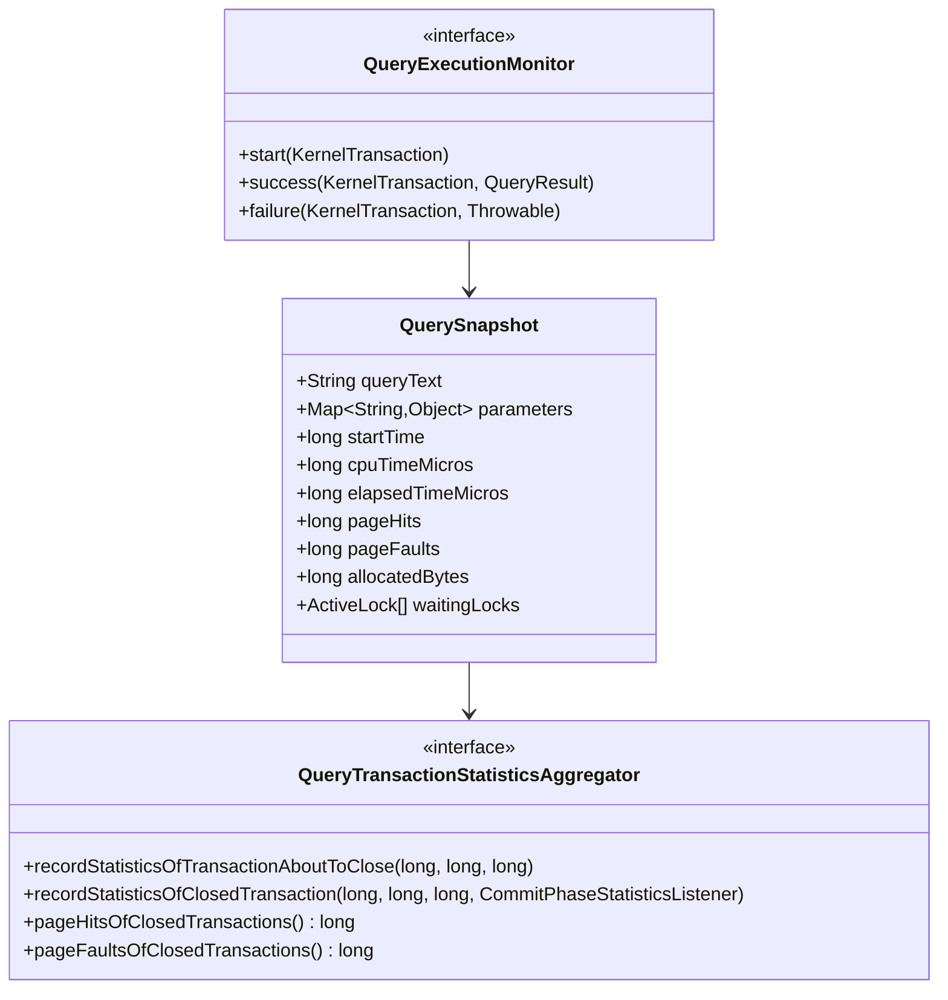

**Diagram sources**
- [QueryExecutionMonitor.java](file://community/kernel/src/main/java/org/neo4j/kernel/impl/monitoring/QueryExecutionMonitor.java#L24-L41)
- [QueryTransactionStatisticsAggregator.java](file://community/kernel/src/main/java/org/neo4j/kernel/api/query/QueryTransactionStatisticsAggregator.java#L36-L152)

**Section sources**
- [QueryExecutionMonitor.java](file://community/kernel/src/main/java/org/neo4j/kernel/impl/monitoring/QueryExecutionMonitor.java#L24-L41)
- [QueryTransactionStatisticsAggregator.java](file://community/kernel/src/main/java/org/neo4j/kernel/api/query/QueryTransactionStatisticsAggregator.java#L36-L152)

### Transaction Counters

Transaction monitoring provides comprehensive statistics about transaction lifecycle and performance:

| Metric Category | Counters | Purpose |
|----------------|----------|---------|
| **Transaction Volume** | Started, Committed, Rolled Back, Terminated | Track transaction throughput and success rates |
| **Concurrency** | Active Read/Write Transactions, Peak Concurrent | Monitor concurrent access patterns |
| **Performance** | Validation Failures, Retries | Identify transaction stability issues |
| **Resource Usage** | Heap/Native Memory Allocations | Track resource consumption |

**Section sources**
- [TransactionCounters.java](file://community/kernel/src/main/java/org/neo4j/kernel/impl/transaction/stats/TransactionCounters.java#L24-L58)
- [DatabaseTransactionStats.java](file://community/kernel/src/main/java/org/neo4j/kernel/impl/transaction/stats/DatabaseTransactionStats.java#L28-L205)

## Diagnostics Reporting System

### System Diagnostics

The system diagnostics component provides comprehensive system information for operational assessment:

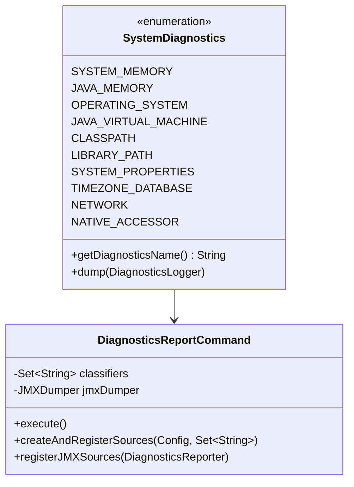

**Diagram sources**
- [SystemDiagnostics.java](file://community/kernel/src/main/java/org/neo4j/kernel/diagnostics/providers/SystemDiagnostics.java#L62-L292)
- [DiagnosticsReportCommand.java](file://community/dbms/src/main/java/org/neo4j/commandline/dbms/DiagnosticsReportCommand.java#L69-L337)

### Diagnostic Classifiers

The diagnostics system supports various classifiers for targeted information collection:

| Classifier | Description | Included Information |
|------------|-------------|---------------------|
| **logs** | Log files and rotation history | Application logs, error logs, rotation archives |
| **config** | Configuration files and settings | Neo4j configuration, JVM settings, environment variables |
| **plugins** | Plugin directory structure | Installed plugins, plugin metadata, dependencies |
| **metrics** | Performance metrics | Query performance, transaction statistics, cache hit ratios |
| **threads** | Thread dumps and execution state | Thread stacks, synchronization points, deadlock detection |
| **heap** | Memory heap analysis | Heap dumps, memory allocation patterns, garbage collection |
| **sysprop** | System properties | JVM properties, OS environment, network configuration |

**Section sources**
- [DiagnosticsReportCommand.java](file://community/dbms/src/main/java/org/neo4j/commandline/dbms/DiagnosticsReportCommand.java#L69-L337)

## Query Performance Tracking

### Execution Statistics

Query performance tracking captures detailed execution metrics for analysis and optimization:

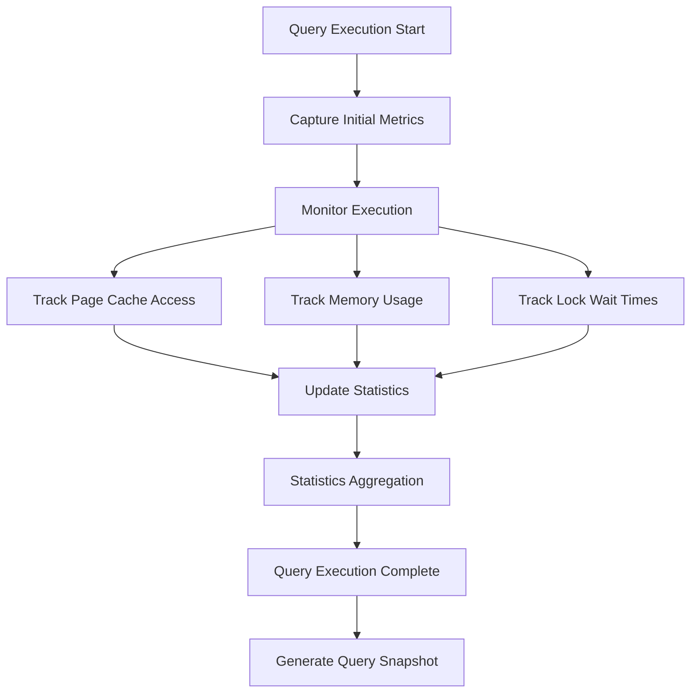

**Diagram sources**
- [QuerySnapshot.java](file://community/kernel/src/main/java/org/neo4j/kernel/api/query/QuerySnapshot.java#L249-L290)

### Performance Metrics

The system tracks multiple dimensions of query performance:

| Metric Category | Measurements | Purpose |
|----------------|--------------|---------|
| **Timing** | Elapsed time, CPU time, Wait time, Idle time | Understand query execution bottlenecks |
| **Resource Usage** | Memory allocations, Page cache hits/misses | Identify resource-intensive queries |
| **Concurrency** | Active locks, lock wait times | Detect contention and deadlocks |
| **Cache Behavior** | Cache hits, cache misses, cache utilization | Optimize caching strategies |

**Section sources**
- [QuerySnapshot.java](file://community/kernel/src/main/java/org/neo4j/kernel/api/query/QuerySnapshot.java#L249-L290)

## Transaction Monitoring

### Transaction Lifecycle Tracking

Transaction monitoring provides visibility into the complete transaction lifecycle:

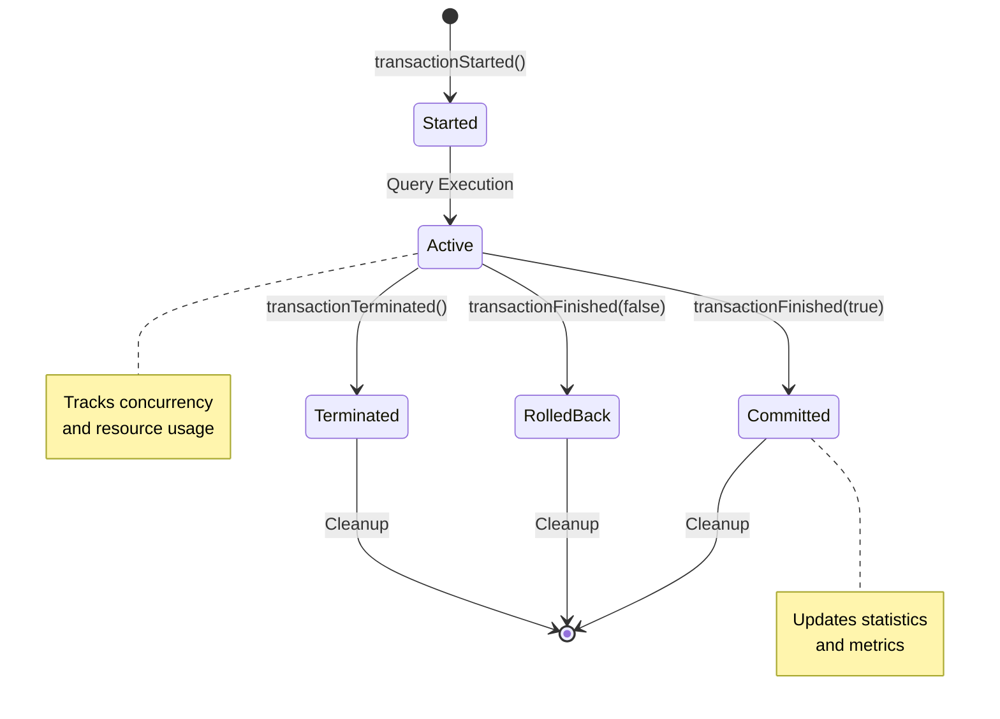

**Diagram sources**
- [DatabaseTransactionStats.java](file://community/kernel/src/main/java/org/neo4j/kernel/impl/transaction/stats/DatabaseTransactionStats.java#L48-L72)

### Concurrency and Resource Monitoring

The transaction monitoring system tracks concurrent access patterns and resource utilization:

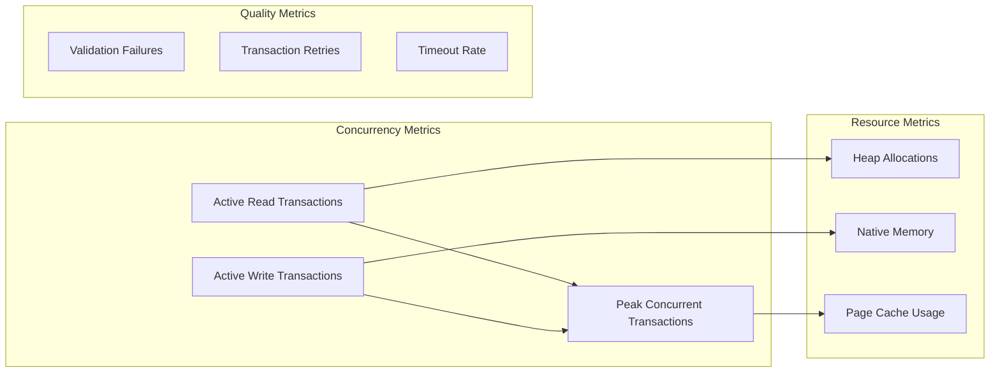

**Section sources**
- [DatabaseTransactionStats.java](file://community/kernel/src/main/java/org/neo4j/kernel/impl/transaction/stats/DatabaseTransactionStats.java#L28-L205)

## Page Cache Tracing

### Page Cache Operations

Page cache tracing provides detailed insight into storage operations and caching behavior:

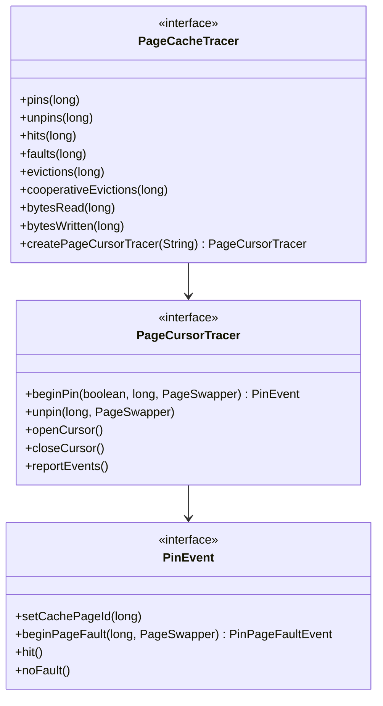

**Diagram sources**
- [PageCacheTracer.java](file://community/io/src/main/java/org/neo4j/io/pagecache/tracing/PageCacheTracer.java#L32-L544)

### Cache Performance Metrics

The page cache tracing system captures comprehensive performance metrics:

| Metric Category | Counters | Purpose |
|----------------|----------|---------|
| **Access Patterns** | Hits, Faults, Pins, Unpins | Understand cache effectiveness |
| **Performance** | Evictions, Cooperative Evictions, Flushes | Monitor cache pressure |
| **I/O Operations** | Bytes Read, Bytes Written, IOPQ | Track storage I/O patterns |
| **Memory Management** | Max Pages, Page Utilization | Monitor memory usage |

**Section sources**
- [PageCacheTracer.java](file://community/io/src/main/java/org/neo4j/io/pagecache/tracing/PageCacheTracer.java#L32-L544)
- [DefaultPageCacheTracer.java](file://community/io/src/main/java/org/neo4j/io/pagecache/tracing/DefaultPageCacheTracer.java#L34-L83)

## Practical Implementation Examples

### Registering Query Performance Monitor

```java
// Example: Registering a custom query performance monitor
Monitors monitors = new Monitors();
QueryExecutionMonitor queryMonitor = new CustomQueryExecutionMonitor();

// Register the monitor with the monitors service
monitors.addMonitorListener(queryMonitor);

// Create a monitor instance for query tracking
QueryExecutionMonitor trackingMonitor = monitors.newMonitor(QueryExecutionMonitor.class);
```

### Creating Custom Diagnostics Provider

```java
// Example: Implementing a custom diagnostics provider
public class CustomDiagnosticsProvider implements DiagnosticsProvider {
    @Override
    public String getDiagnosticsName() {
        return "Custom Performance Metrics";
    }
    
    @Override
    public void dump(DiagnosticsLogger logger) {
        // Collect and log custom performance metrics
        logger.log("Custom metric 1: " + getMetric1());
        logger.log("Custom metric 2: " + getMetric2());
    }
}
```

### Collecting Transaction Statistics

```java
// Example: Accessing transaction statistics programmatically
TransactionCounters counters = database.getDependencyResolver()
    .resolveDependency(TransactionCounters.class);

long activeTransactions = counters.getNumberOfActiveTransactions();
long committedTransactions = counters.getNumberOfCommittedTransactions();
long averageTransactionDuration = calculateAverageDuration();
```

### Generating Diagnostics Reports

```bash
# Example: Using the diagnostics command to generate reports
neo4j-admin report --to-path /tmp/diagnostics \
  --ignore-disk-space-check \
  logs config metrics threads heap
```

## Best Practices and Guidelines

### Monitoring Design Principles

1. **Minimal Performance Impact**: Use lightweight event-driven architecture to minimize overhead
2. **Granular Control**: Support selective monitoring for different subsystems
3. **Hierarchical Organization**: Enable parent-child relationships for distributed monitoring
4. **Extensibility**: Allow custom monitors and diagnostics providers

### Performance Considerations

- **Sampling Strategies**: Implement sampling for high-frequency events
- **Batch Processing**: Aggregate metrics periodically to reduce overhead
- **Memory Management**: Use efficient data structures for metric storage
- **Thread Safety**: Ensure all monitoring components are thread-safe

### Diagnostic Data Management

- **Retention Policies**: Implement appropriate data retention for historical analysis
- **Compression**: Use compression for archived diagnostic data
- **Security**: Protect sensitive diagnostic information
- **Automation**: Schedule regular diagnostic collection for proactive monitoring

## Troubleshooting and Debugging

### Common Monitoring Issues

| Issue | Symptoms | Solution |
|-------|----------|----------|
| **High Monitoring Overhead** | Performance degradation | Reduce sampling rate or disable non-critical monitors |
| **Missing Metrics** | Incomplete monitoring data | Verify monitor registration and listener configuration |
| **Memory Leaks** | Increasing memory usage | Check for proper cleanup of monitoring resources |
| **Inconsistent Data** | Erratic metric values | Review concurrent access patterns and synchronization |

### Diagnostic Analysis Workflow

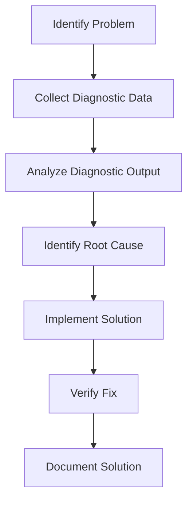

### Debugging Tools and Techniques

- **Real-time Monitoring**: Use live metrics for immediate issue identification
- **Historical Analysis**: Examine trends over time for pattern recognition
- **Comparative Analysis**: Compare current metrics against baselines
- **Correlation Analysis**: Identify relationships between different metrics

**Section sources**
- [DiagnosticsReportCommand.java](file://community/dbms/src/main/java/org/neo4j/commandline/dbms/DiagnosticsReportCommand.java#L113-L143)

## Conclusion

Neo4j's monitoring and diagnostics system provides a comprehensive foundation for understanding database behavior and optimizing performance. The event-driven architecture ensures minimal performance impact while delivering detailed insights into query execution, transaction processing, and system resource utilization.

The combination of the Monitors service for real-time event capture and the DiagnosticsManager for structured reporting creates a powerful platform for operational excellence. By leveraging these capabilities effectively, organizations can achieve optimal database performance, proactive issue resolution, and informed capacity planning.

The extensible design allows for custom monitoring solutions tailored to specific organizational needs, while the standardized interfaces ensure compatibility and maintainability across different deployment scenarios.