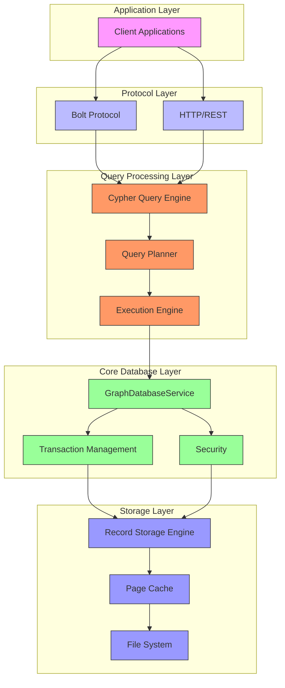
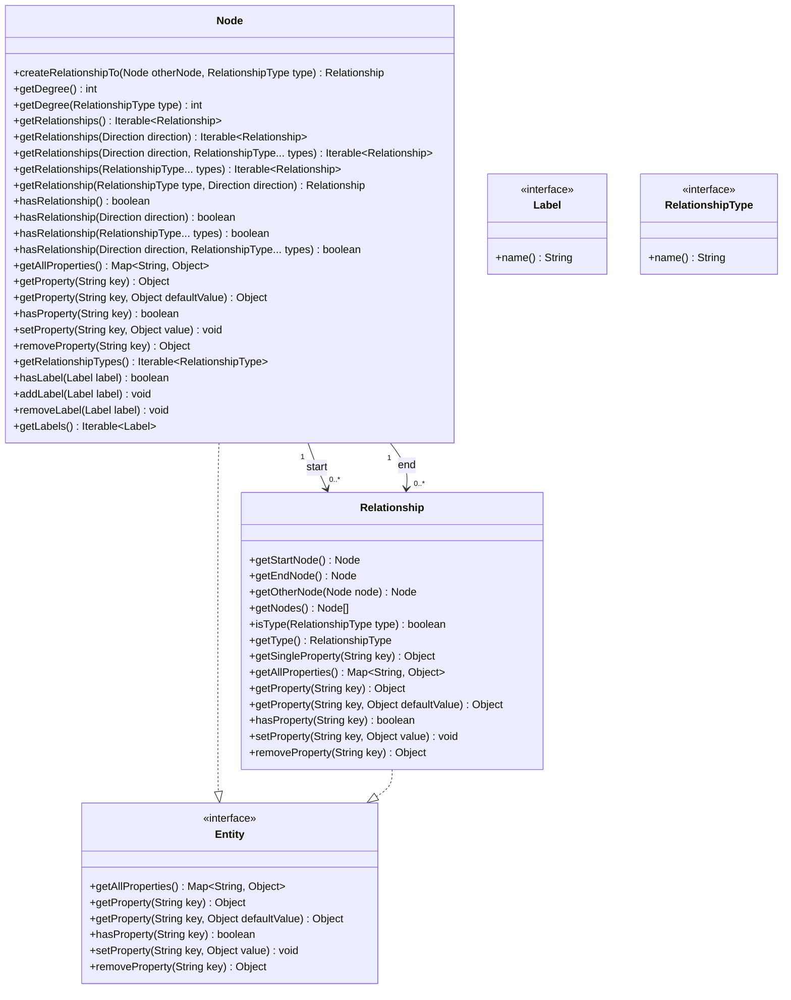
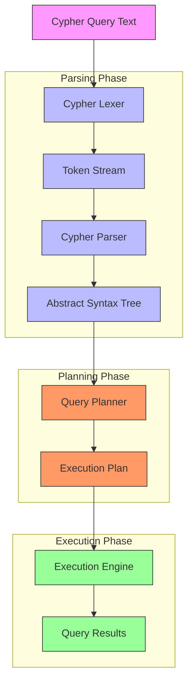
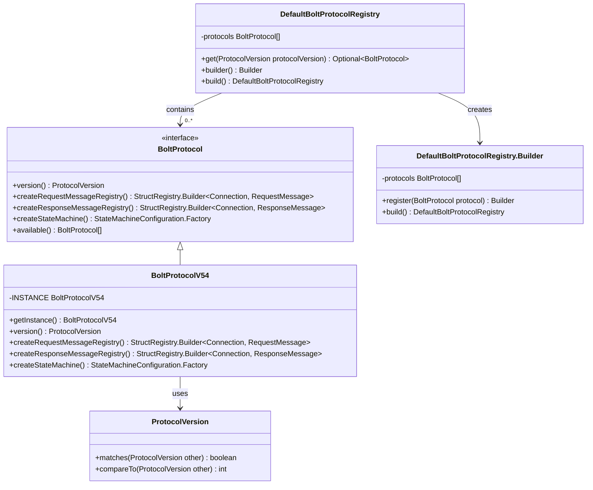
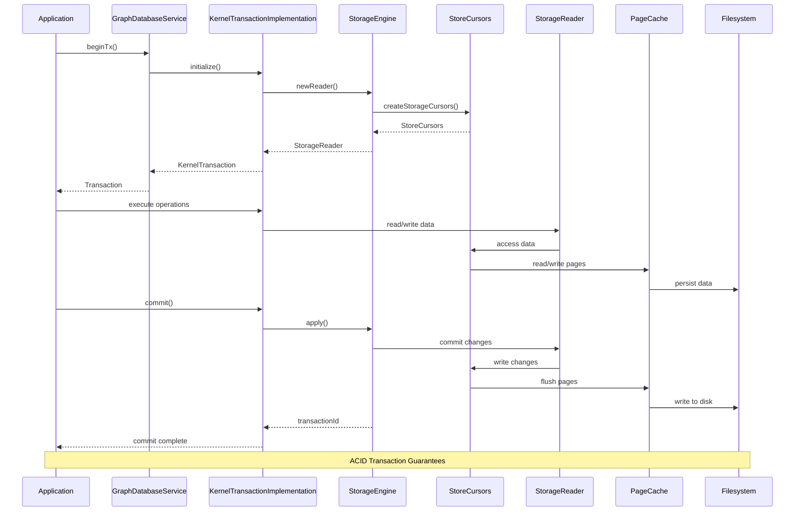
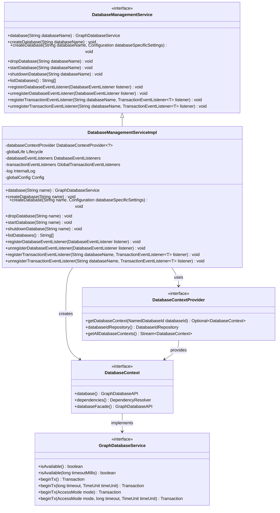

# Project Overview

<cite>
**Referenced Files in This Document**   
- [pom.xml](file://pom.xml)
- [README.asciidoc](file://README.asciidoc)
- [GraphDatabaseService.java](file://community/graphdb-api/src/main/java/org/neo4j/graphdb/GraphDatabaseService.java)
- [Node.java](file://community/graphdb-api/src/main/java/org/neo4j/graphdb/Node.java)
- [Relationship.java](file://community/graphdb-api/src/main/java/org/neo4j/graphdb/Relationship.java)
- [Entity.java](file://community/graphdb-api/src/main/java/org/neo4j/graphdb/Entity.java)
- [Cypher5AstParser.scala](file://community/cypher/front-end/parser/v5/ast-factory/src/main/scala/org/neo4j/cypher/internal/parser/v5/ast/factory/Cypher5AstParser.scala)
- [Cypher5Lexer.java](file://community/cypher/front-end/parser/v5/parser/src/main/java/org/neo4j/cypher/internal/parser/v5/Cypher5Lexer.java)
- [BoltProtocol.java](file://community/bolt/src/main/java/org/neo4j/bolt/protocol/common/BoltProtocol.java)
- [BoltProtocolV54.java](file://community/bolt/src/main/java/org/neo4j/bolt/protocol/v54/BoltProtocolV54.java)
- [DefaultBoltProtocolRegistry.java](file://community/bolt/src/main/java/org/neo4j/bolt/protocol/DefaultBoltProtocolRegistry.java)
- [RecordStorageEngine.java](file://community/record-storage-engine/src/main/java/org/neo4j/internal/recordstorage/RecordStorageEngine.java)
- [RecordStorageEngineFactory.java](file://community/record-storage-engine/src/main/java/org/neo4j/internal/recordstorage/RecordStorageEngineFactory.java)
- [StoreType.java](file://community/record-storage-engine/src/main/java/org/neo4j/kernel/impl/store/StoreType.java)
- [NeoStores.java](file://community/record-storage-engine/src/main/java/org/neo4j/kernel/impl/store/NeoStores.java)
- [StorageEngine.java](file://community/kernel-api/src/main/java/org/neo4j/storageengine/api/StorageEngine.java)
- [StorageEngineFactory.java](file://community/kernel-api/src/main/java/org/neo4j/storageengine/api/StorageEngineFactory.java)
- [KernelTransactionImplementation.java](file://community/kernel/src/main/java/org/neo4j/kernel/impl/api/KernelTransactionImplementation.java)
- [DatabaseManagementService.java](file://community/graphdb-api/src/main/java/org/neo4j/dbms/api/DatabaseManagementService.java)
- [DatabaseManagementServiceImpl.java](file://community/kernel/src/main/java/org/neo4j/dbms/database/DatabaseManagementServiceImpl.java)
</cite>

## Table of Contents
1. [Introduction](#introduction)
2. [Architecture Overview](#architecture-overview)
3. [Graph Data Model](#graph-data-model)
4. [Cypher Query Language](#cypher-query-language)
5. [Bolt Protocol](#bolt-protocol)
6. [Storage Engine](#storage-engine)
7. [Transaction Management](#transaction-management)
8. [Database Management](#database-management)
9. [Open Source and Community Edition](#open-source-and-community-edition)

## Introduction

Neo4j is a high-performance graph database system designed for managing highly connected data. As a mature and robust database, Neo4j provides a flexible network structure of nodes and relationships rather than static tables, offering significant performance benefits compared to relational databases for many applications. The system is implemented as a modular monorepo with components written in Java and Scala, providing a comprehensive platform for graph data management.

The database system is built around the concept of a graph, where data is represented as nodes (entities) and relationships (connections between entities), both of which can have properties (key-value pairs). This graph data model enables efficient traversal and querying of complex, interconnected data structures. Neo4j implements ACID (Atomicity, Consistency, Isolation, Durability) transaction guarantees, ensuring data integrity and reliability.

Neo4j's architecture is designed to be extensible and modular, with various components handling different aspects of the database functionality. The system supports both embedded and server deployment models, allowing developers to integrate Neo4j directly into their applications or access it as a standalone service. The open-source nature of the project, licensed under GPLv3, fosters a vibrant community and encourages contributions from developers worldwide.

**Section sources**
- [README.asciidoc](file://README.asciidoc#L1-L74)
- [pom.xml](file://pom.xml#L1-L800)

## Architecture Overview

Neo4j's architecture is organized as a modular monorepo with distinct components responsible for different aspects of the database system. The core architecture consists of several key layers: the graph database service layer, the query processing layer, the storage engine layer, and the network protocol layer. These components work together to provide a comprehensive graph database solution.

The system is built on a layered architecture where higher-level components depend on lower-level services through well-defined interfaces. The `GraphDatabaseService` interface serves as the primary entry point for interacting with the database, providing methods for creating transactions and accessing database functionality. This interface is implemented by `GraphDatabaseAPI`, which extends the basic functionality with additional internal methods for service resolution and database management.

The modular design is evident in the Maven project structure, where different components are organized into separate modules such as `community`, `annotations`, and `packaging`. The `community` module contains the core database functionality, including the `graphdb-api` for the public API, `cypher` for query processing, `bolt` for network communication, and `record-storage-engine` for data persistence. This modular approach allows for independent development and testing of different components while maintaining a cohesive system architecture.

**Diagram sources **
- [pom.xml](file://pom.xml#L189-L193)
- [GraphDatabaseService.java](file://community/graphdb-api/src/main/java/org/neo4j/graphdb/GraphDatabaseService.java#L20-L67)
- [GraphDatabaseAPI.java](file://community/kernel/src/main/java/org/neo4j/kernel/internal/GraphDatabaseAPI.java#L30-L72)

**Section sources**
- [pom.xml](file://pom.xml#L1-L800)
- [README.asciidoc](file://README.asciidoc#L1-L74)

## Graph Data Model

The Neo4j graph data model is based on the fundamental concepts of nodes, relationships, and properties, forming a flexible and expressive way to represent connected data. At the core of this model are nodes, which represent entities in the domain, and relationships, which represent connections between these entities. Both nodes and relationships can have properties, which are key-value pairs that store additional information.

Nodes in Neo4j are the basic units of data and can be labeled to categorize them into different types. The `Node` interface provides methods for creating relationships, accessing properties, and retrieving labels. Each node can have multiple labels, allowing for flexible categorization and efficient querying. Relationships in Neo4j are directed and have a type that describes the nature of the connection between two nodes. The `Relationship` interface provides methods for accessing the start and end nodes, the relationship type, and properties.

The `Entity` interface serves as a common base for both nodes and relationships, defining the property operations that are shared between them. Properties in Neo4j can be of various types, including primitive types (boolean, byte, short, int, long, float, double, char), strings, arrays of these types, and specialized types like spatial points and temporal values. This rich type system allows for the representation of complex data structures within the graph.

**Diagram sources **
- [Node.java](file://community/graphdb-api/src/main/java/org/neo4j/graphdb/Node.java#L20-L244)
- [Relationship.java](file://community/graphdb-api/src/main/java/org/neo4j/graphdb/Relationship.java#L20-L36)
- [Entity.java](file://community/graphdb-api/src/main/java/org/neo4j/graphdb/Entity.java#L32-L61)

**Section sources**
- [Node.java](file://community/graphdb-api/src/main/java/org/neo4j/graphdb/Node.java#L1-L244)
- [Relationship.java](file://community/graphdb-api/src/main/java/org/neo4j/graphdb/Relationship.java#L1-L36)
- [Entity.java](file://community/graphdb-api/src/main/java/org/neo4j/graphdb/Entity.java#L1-L61)

## Cypher Query Language

Cypher is Neo4j's declarative graph query language that allows for expressive and efficient querying of the graph data model. Designed to be intuitive and readable, Cypher uses a pattern-matching approach to describe graph patterns in queries, making it accessible to both beginners and experienced developers. The language is implemented as a modular component within the Neo4j codebase, with separate components for parsing, planning, and execution.

The Cypher query language is processed through a multi-stage pipeline that begins with lexical analysis and parsing. The `Cypher5Lexer` and `Cypher5AstParser` classes work together to transform Cypher text into an abstract syntax tree (AST) representation. The lexer tokenizes the input text, while the parser applies grammar rules to construct the AST. This modular design allows for different parser implementations and facilitates the evolution of the language syntax over time.

Cypher supports a rich set of operations for querying and manipulating graph data, including pattern matching, filtering, aggregation, sorting, and updating operations. The language is designed to be composable, allowing complex queries to be built from simpler components. Cypher also supports parameters, enabling the creation of reusable query templates that can be executed with different parameter values. This feature enhances security by preventing injection attacks and improves performance through query plan caching.

**Diagram sources **
- [Cypher5Lexer.java](file://community/cypher/front-end/parser/v5/parser/src/main/java/org/neo4j/cypher/internal/parser/v5/Cypher5Lexer.java#L220-L295)
- [Cypher5AstParser.scala](file://community/cypher/front-end/parser/v5/ast-factory/src/main/scala/org/neo4j/cypher/internal/parser/v5/ast/factory/Cypher5AstParser.scala#L30-L62)

**Section sources**
- [Cypher5AstParser.scala](file://community/cypher/front-end/parser/v5/ast-factory/src/main/scala/org/neo4j/cypher/internal/parser/v5/ast/factory/Cypher5AstParser.scala#L30-L62)
- [Cypher5Lexer.java](file://community/cypher/front-end/parser/v5/parser/src/main/java/org/neo4j/cypher/internal/parser/v5/Cypher5Lexer.java#L220-L295)

## Bolt Protocol

The Bolt protocol is Neo4j's binary protocol for efficient communication between clients and the database server. Designed for high performance and low overhead, Bolt enables fast and reliable data exchange, making it ideal for applications that require low-latency access to graph data. The protocol is implemented as a modular component within the Neo4j codebase, with support for multiple protocol versions and extensible message types.

The Bolt protocol architecture is based on a state machine model, where the connection progresses through different states during its lifecycle. The `BoltProtocol` interface defines the contract for protocol implementations, with concrete classes like `BoltProtocolV54` providing specific version implementations. The `DefaultBoltProtocolRegistry` manages the available protocol versions and handles version negotiation between clients and servers, ensuring compatibility across different Neo4j versions.

Bolt messages are structured as typed data packets that can be efficiently serialized and deserialized. The protocol supports various message types for different operations, including authentication, transaction management, query execution, and result streaming. Each message type is handled by a corresponding decoder and encoder, allowing for extensible message processing. The protocol also supports features like connection keep-alive, message compression, and secure communication through TLS.

**Diagram sources **
- [BoltProtocol.java](file://community/bolt/src/main/java/org/neo4j/bolt/protocol/common/BoltProtocol.java#L54-L88)
- [BoltProtocolV54.java](file://community/bolt/src/main/java/org/neo4j/bolt/protocol/v54/BoltProtocolV54.java#L46-L83)
- [DefaultBoltProtocolRegistry.java](file://community/bolt/src/main/java/org/neo4j/bolt/protocol/DefaultBoltProtocolRegistry.java#L1-L77)

**Section sources**
- [BoltProtocol.java](file://community/bolt/src/main/java/org/neo4j/bolt/protocol/common/BoltProtocol.java#L54-L88)
- [BoltProtocolV54.java](file://community/bolt/src/main/java/org/neo4j/bolt/protocol/v54/BoltProtocolV54.java#L46-L83)
- [DefaultBoltProtocolRegistry.java](file://community/bolt/src/main/java/org/neo4j/bolt/protocol/DefaultBoltProtocolRegistry.java#L1-L77)

## Storage Engine

The Neo4j storage engine is responsible for persisting graph data to disk and providing efficient access to stored data. Implemented as the `RecordStorageEngine`, this component manages the physical storage of nodes, relationships, properties, and indexes, ensuring data durability and integrity. The storage engine is designed as a pluggable component, with the `StorageEngineFactory` interface allowing for different storage implementations.

The record storage engine organizes data into multiple store files, each dedicated to a specific type of data. The `StoreType` enum defines the different store types, including node stores, relationship stores, property stores, and schema stores. Each store type is implemented as a specialized `CommonAbstractStore` that manages the storage and retrieval of its specific data type. The `NeoStores` class acts as a factory and container for all the individual stores, coordinating their lifecycle and interactions.

Data is stored in fixed-size records within paged files, with each record containing the data for a single entity (node, relationship, property, etc.). The storage engine uses a page cache to improve performance by keeping frequently accessed data in memory. The `RecordStorageEngine` coordinates operations across multiple stores, ensuring consistency and providing transactional guarantees. The engine also manages id generation, record reuse, and storage compaction to optimize space utilization and performance.

```mermaid
classDiagram
class StorageEngine {
<<interface>>
+name() String
+id() byte
+newCommandCreationContext(boolean multiVersioned) CommandCreationContext
+createTransactionValidatorFactory(Config config) TransactionValidatorFactory
+createStorageLocks(ResourceLocker locker) StorageLocks
+addIndexUpdateListener(IndexUpdateListener indexUpdateListener) void
+createCommands(ReadableTransactionState state, StorageReader storageReader, CommandCreationContext context, LockTracer lockTracer, Decorator decorator, CursorContext cursorContext, StoreCursors storeCursors, MemoryTracker memoryTracker) void
+apply(StorageEngineTransaction transaction, TransactionApplicationMode mode) long
+newReader() StorageReader
+createStorageCursors(CursorContext initialContext) StoreCursors
+indexingBehaviour() StorageEngineIndexingBehaviour
+getOpenOptions() ImmutableSet~OpenOption~
+costCharacteristics() StorageEngineCostCharacteristics
}
class RecordStorageEngine {
-databaseLayout RecordDatabaseLayout
-config Config
-pageCache PageCache
-fs FileSystemAbstraction
-internalLogProvider InternalLogProvider
-userLogProvider InternalLogProvider
-tokenHolders TokenHolders
-schemaState SchemaState
-constraintSemantics ConstraintRuleAccessor
-indexConfigCompleter IndexConfigCompleter
-lockService LockService
-idGeneratorFactory IdGeneratorFactory
-databaseHealth DatabaseHealth
-recoveryCleanupWorkCollector RecoveryCleanupWorkCollector
-otherMemoryTracker MemoryTracker
-logTailMetadata LogTailMetadata
-kernelVersionRepository KernelVersionRepository
-lockVerificationFactory LockVerificationFactory
-contextFactory CursorContextFactory
-pageCacheTracer PageCacheTracer
-indexUpdateListener IndexUpdateListener
-closed boolean
+newReader() StorageReader
+createStorageCursors(CursorContext initialContext) StoreCursors
+indexingBehaviour() StorageEngineIndexingBehaviour
+getOpenOptions() ImmutableSet~OpenOption~
+costCharacteristics() StorageEngineCostCharacteristics
+newCommandCreationContext(boolean multiVersioned) CommandCreationContext
+createTransactionValidatorFactory(Config config) TransactionValidatorFactory
+createStorageLocks(ResourceLocker locker) StorageLocks
+addIndexUpdateListener(IndexUpdateListener indexUpdateListener) void
+createCommands(ReadableTransactionState state, StorageReader storageReader, CommandCreationContext context, LockTracer lockTracer, Decorator decorator, CursorContext cursorContext, StoreCursors storeCursors, MemoryTracker memoryTracker) void
+apply(StorageEngineTransaction transaction, TransactionApplicationMode mode) long
}
class StorageEngineFactory {
<<interface>>
+name() String
+id() byte
+retrieveStoreId(FileSystemAbstraction fs, DatabaseLayout databaseLayout, PageCache pageCache, CursorContext cursorContext) StoreId
+versionCheck(Config config, DatabaseLayout databaseLayout, PageCache pageCache, CursorContext cursorContext) StoreVersionCheck
+migrationParticipants(Config config, FileSystemAbstraction fs, PageCache pageCache, JobScheduler jobScheduler, LogService logService, MemoryTracker memoryTracker, PageCacheTracer pageCacheTracer, CursorContextFactory contextFactory, boolean forceBtreeIndexesToRange) StoreMigrationParticipant[]
+instantiate(FileSystemAbstraction fs, Clock clock, DatabaseLayout databaseLayout, Config config, PageCache pageCache, TokenHolders tokenHolders, SchemaState schemaState, ConstraintRuleAccessor constraintSemantics, IndexConfigCompleter indexConfigCompleter, LockService lockService, IdGeneratorFactory idGeneratorFactory, DatabaseHealth databaseHealth, InternalLogProvider internalLogProvider, InternalLogProvider userLogProvider, RecoveryCleanupWorkCollector recoveryCleanupWorkCollector, LogTailMetadata logTailMetadata, KernelVersionRepository kernelVersionRepository, MemoryTracker memoryTracker, CursorContextFactory contextFactory, PageCacheTracer pageCacheTracer, VersionStorage versionStorage, PagePrefetcher pagePrefetcher) StorageEngine
}
class RecordStorageEngineFactory {
+name() String
+id() byte
+retrieveStoreId(FileSystemAbstraction fs, DatabaseLayout databaseLayout, PageCache pageCache, CursorContext cursorContext) StoreId
+versionCheck(Config config, DatabaseLayout databaseLayout, PageCache pageCache, CursorContext cursorContext) StoreVersionCheck
+migrationParticipants(Config config, FileSystemAbstraction fs, PageCache pageCache, JobScheduler jobScheduler, LogService logService, MemoryTracker memoryTracker, PageCacheTracer pageCacheTracer, CursorContextFactory contextFactory, boolean forceBtreeIndexesToRange) StoreMigrationParticipant[]
+instantiate(FileSystemAbstraction fs, Clock clock, DatabaseLayout databaseLayout, Config config, PageCache pageCache, TokenHolders tokenHolders, SchemaState schemaState, ConstraintRuleAccessor constraintSemantics, IndexConfigCompleter indexConfigCompleter, LockService lockService, IdGeneratorFactory idGeneratorFactory, DatabaseHealth databaseHealth, InternalLogProvider internalLogProvider, InternalLogProvider userLogProvider, RecoveryCleanupWorkCollector recoveryCleanupWorkCollector, LogTailMetadata logTailMetadata, KernelVersionRepository kernelVersionRepository, MemoryTracker memoryTracker, CursorContextFactory contextFactory, PageCacheTracer pageCacheTracer, VersionStorage versionStorage, PagePrefetcher pagePrefetcher) StorageEngine
}
class StoreType {
<<enumeration>>
NODE
RELATIONSHIP
PROPERTY
PROPERTY_KEY_TOKEN
PROPERTY_KEY_TOKEN_NAME
PROPERTY_STRING
PROPERTY_ARRAY
LABEL_TOKEN
LABEL_TOKEN_NAME
RELATIONSHIP_TYPE_TOKEN
RELATIONSHIP_TYPE_TOKEN_NAME
SCHEMA
RELATIONSHIP_GROUP
META_DATA
}
class NeoStores {
-fileSystem FileSystemAbstraction
-layout DatabaseLayout
-config Config
-idGeneratorFactory IdGeneratorFactory
-pageCache PageCache
-pageCacheTracer PageCacheTracer
-logProvider InternalLogProvider
-recordFormats RecordFormats
-readOnly boolean
-databaseName String
-openOptions ImmutableSet~OpenOption~
-stores Map~StoreType, CommonAbstractStore~
+createNodeStore() CommonAbstractStore
+createRelationshipStore() CommonAbstractStore
+createPropertyStore() CommonAbstractStore
+createPropertyKeyTokenStore() CommonAbstractStore
+createPropertyKeyTokenNamesStore() CommonAbstractStore
+createPropertyStringStore() CommonAbstractStore
+createPropertyArrayStore() CommonAbstractStore
+createLabelTokenStore() CommonAbstractStore
+createLabelTokenNamesStore() CommonAbstractStore
+createRelationshipTypeTokenStore() CommonAbstractStore
+createRelationshipTypeTokenNamesStore() CommonAbstractStore
+createSchemaStore() CommonAbstractStore
+createRelationshipGroupStore() CommonAbstractStore
+createMetadataStore() CommonAbstractStore
}
StorageEngine <|-- RecordStorageEngine
StorageEngineFactory <|-- RecordStorageEngineFactory
RecordStorageEngineFactory --> RecordStorageEngine : creates
RecordStorageEngine --> NeoStores : uses
NeoStores --> StoreType : uses
```

**Diagram sources **
- [RecordStorageEngine.java](file://community/record-storage-engine/src/main/java/org/neo4j/internal/recordstorage/RecordStorageEngine.java#L175-L205)
- [RecordStorageEngineFactory.java](file://community/record-storage-engine/src/main/java/org/neo4j/internal/recordstorage/RecordStorageEngineFactory.java#L147-L274)
- [StorageEngine.java](file://community/kernel-api/src/main/java/org/neo4j/storageengine/api/StorageEngine.java#L33-L86)
- [StorageEngineFactory.java](file://community/kernel-api/src/main/java/org/neo4j/storageengine/api/StorageEngineFactory.java#L85-L175)
- [StoreType.java](file://community/record-storage-engine/src/main/java/org/neo4j/kernel/impl/store/StoreType.java#L34-L137)
- [NeoStores.java](file://community/record-storage-engine/src/main/java/org/neo4j/kernel/impl/store/NeoStores.java#L382-L414)

**Section sources**
- [RecordStorageEngine.java](file://community/record-storage-engine/src/main/java/org/neo4j/internal/recordstorage/RecordStorageEngine.java#L175-L205)
- [RecordStorageEngineFactory.java](file://community/record-storage-engine/src/main/java/org/neo4j/internal/recordstorage/RecordStorageEngineFactory.java#L147-L274)
- [StorageEngine.java](file://community/kernel-api/src/main/java/org/neo4j/storageengine/api/StorageEngine.java#L33-L86)
- [StorageEngineFactory.java](file://community/kernel-api/src/main/java/org/neo4j/storageengine/api/StorageEngineFactory.java#L85-L175)
- [StoreType.java](file://community/record-storage-engine/src/main/java/org/neo4j/kernel/impl/store/StoreType.java#L34-L137)
- [NeoStores.java](file://community/record-storage-engine/src/main/java/org/neo4j/kernel/impl/store/NeoStores.java#L382-L414)

## Transaction Management

Neo4j provides robust transaction management with full ACID (Atomicity, Consistency, Isolation, Durability) guarantees, ensuring data integrity and reliability. The transaction system is implemented through the `KernelTransactionImplementation` class, which manages the lifecycle of transactions and coordinates their interaction with the storage engine. Transactions in Neo4j are thread-bound, meaning that each transaction is associated with a specific thread and cannot be accessed from other threads.

The transaction management system supports both implicit and explicit transactions. Implicit transactions are automatically created for single operations, while explicit transactions allow developers to group multiple operations into a single atomic unit. The `GraphDatabaseService.beginTx()` method creates a new transaction, which must be explicitly committed or rolled back to complete its lifecycle. All database operations must occur within a transaction context, and attempting to access the graph outside of a transaction will result in a `NotInTransactionException`.

The transaction implementation includes sophisticated concurrency control mechanisms to ensure isolation between concurrent transactions. The system uses a combination of locking and optimistic concurrency control to manage access to graph data. Transaction timeouts can be configured to prevent long-running transactions from holding resources indefinitely. The transaction system also provides detailed monitoring and diagnostic capabilities, allowing administrators to track transaction performance and identify potential issues.

**Diagram sources **
- [GraphDatabaseService.java](file://community/graphdb-api/src/main/java/org/neo4j/graphdb/GraphDatabaseService.java#L1-L67)
- [KernelTransactionImplementation.java](file://community/kernel/src/main/java/org/neo4j/kernel/impl/api/KernelTransactionImplementation.java#L1007-L1647)

**Section sources**
- [GraphDatabaseService.java](file://community/graphdb-api/src/main/java/org/neo4j/graphdb/GraphDatabaseService.java#L1-L67)
- [KernelTransactionImplementation.java](file://community/kernel/src/main/java/org/neo4j/kernel/impl/api/KernelTransactionImplementation.java#L1007-L1647)

## Database Management

The database management system in Neo4j provides a comprehensive API for managing databases and accessing database services. The `DatabaseManagementService` interface serves as the primary entry point for database administration, allowing for the creation, retrieval, and management of database instances. This service is implemented by `DatabaseManagementServiceImpl`, which coordinates the lifecycle of database components and provides access to individual database services.

The database management system supports multi-database capabilities, allowing multiple databases to coexist within a single Neo4j instance. Each database is represented by a `GraphDatabaseService` instance, which can be accessed by name through the `database(String name)` method. The system provides methods for creating new databases, dropping existing databases, and listing available databases. Database configuration can be specified at creation time, allowing for fine-grained control over database settings.

The implementation uses a component-based architecture where different aspects of database management are handled by specialized components. The `DatabaseContext` class provides a container for database-specific services and dependencies, while the `DatabaseContextProvider` manages the lifecycle of database contexts. This modular design allows for flexible configuration and extension of database functionality. The system also includes event listeners for monitoring database lifecycle events and transaction events.

**Diagram sources **
- [DatabaseManagementService.java](file://community/graphdb-api/src/main/java/org/neo4j/dbms/api/DatabaseManagementService.java#L1-L62)
- [DatabaseManagementServiceImpl.java](file://community/kernel/src/main/java/org/neo4j/dbms/database/DatabaseManagementServiceImpl.java#L33-L89)

**Section sources**
- [DatabaseManagementService.java](file://community/graphdb-api/src/main/java/org/neo4j/dbms/api/DatabaseManagementService.java#L1-L62)
- [DatabaseManagementServiceImpl.java](file://community/kernel/src/main/java/org/neo4j/dbms/database/DatabaseManagementServiceImpl.java#L33-L89)

## Open Source and Community Edition

Neo4j Community Edition is an open-source graph database licensed under the GNU General Public License version 3 (GPLv3). This open-source nature allows developers to freely use, modify, and distribute the software, fostering a vibrant community of contributors and users. The community edition provides a robust foundation for graph data management, including core database functionality, the Cypher query language, and the Bolt protocol.

The project is hosted in a public repository, enabling transparent development and community contributions. The CONTRIBUTING.md file outlines the process for contributing to the project, including signing a Contributor License Agreement (CLA) to ensure proper licensing of contributions. This open development model encourages experimentation and innovation, with community members able to build extensions, develop libraries, and contribute directly to the core product.

The community edition includes a comprehensive set of features for graph database management, including ACID transaction guarantees, high-performance storage, and a rich query language. While the community edition provides a powerful foundation, Neo4j Enterprise Edition includes additional closed-source components and features that require a commercial license. This dual-licensing model allows Neo4j to support both open-source development and commercial offerings, creating a sustainable ecosystem for graph database technology.

**Section sources**
- [README.asciidoc](file://README.asciidoc#L65-L69)
- [pom.xml](file://pom.xml#L26-L44)