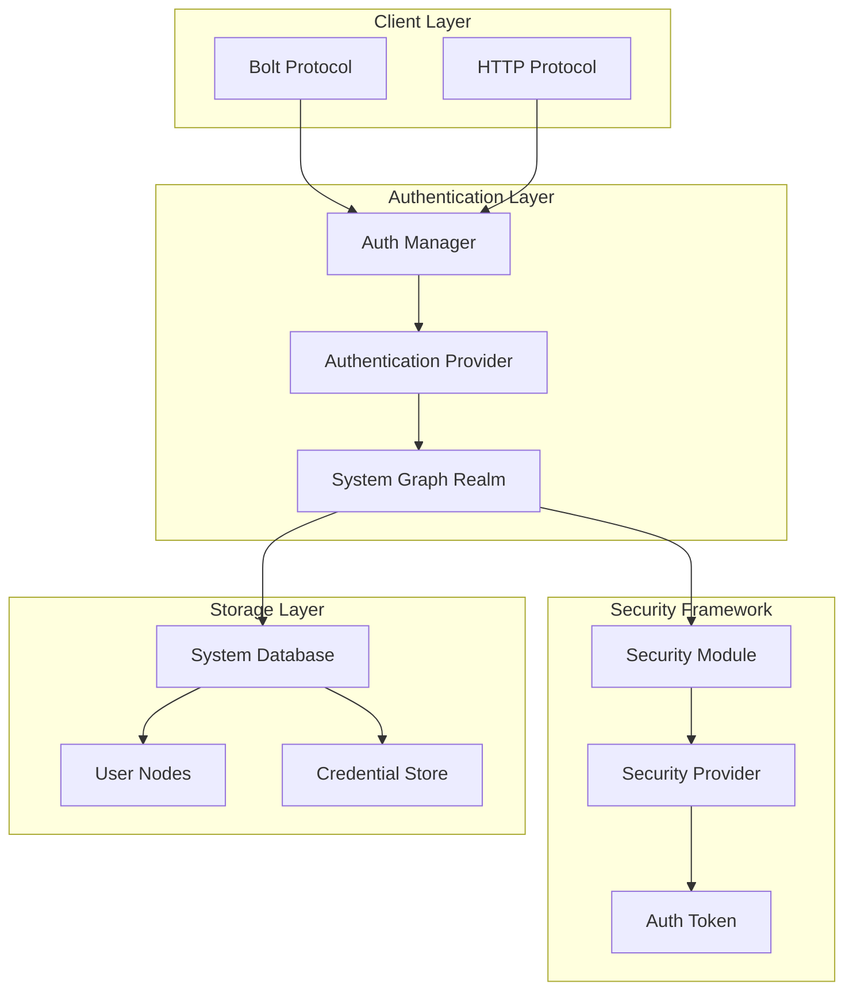
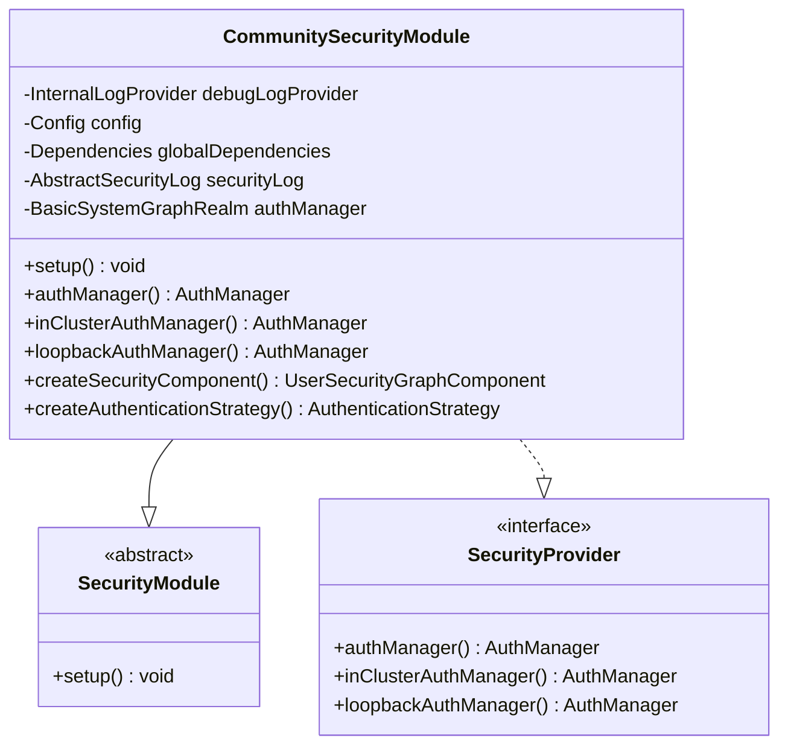
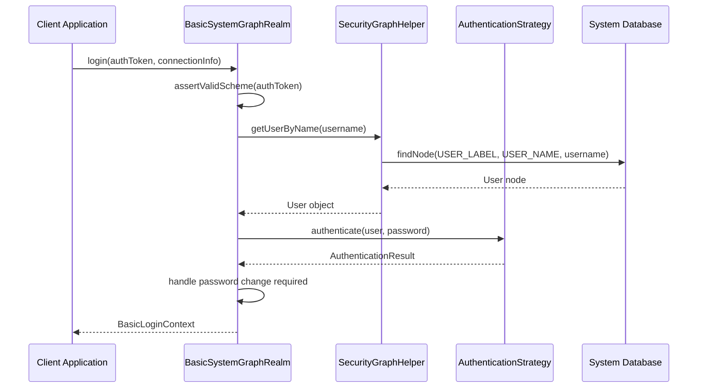
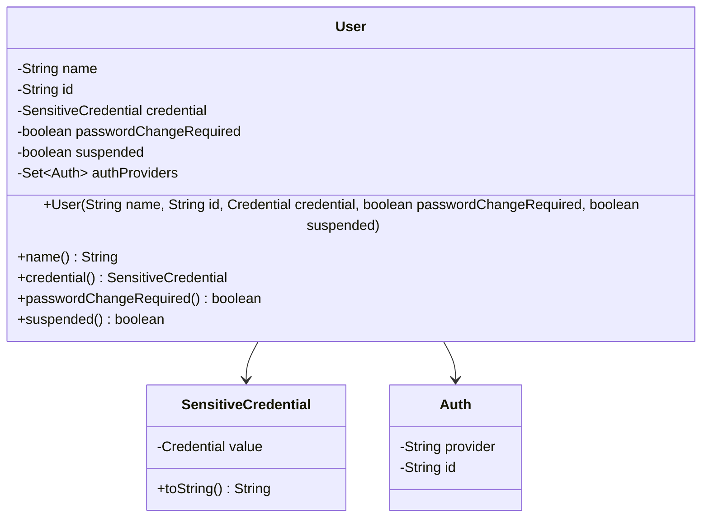
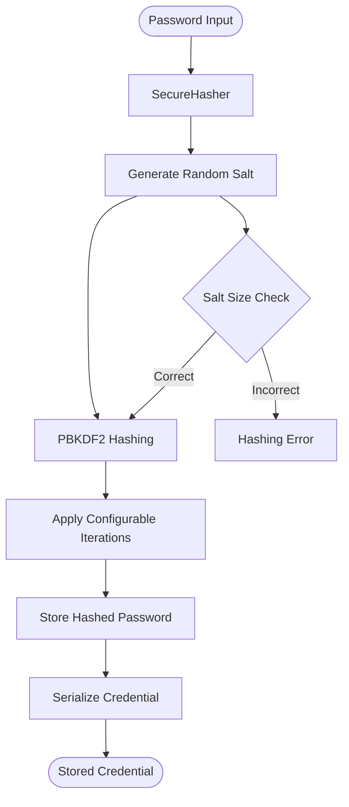
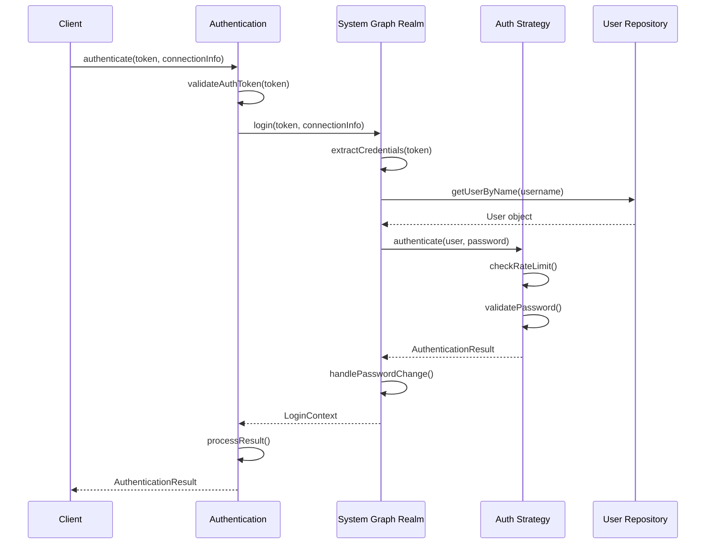
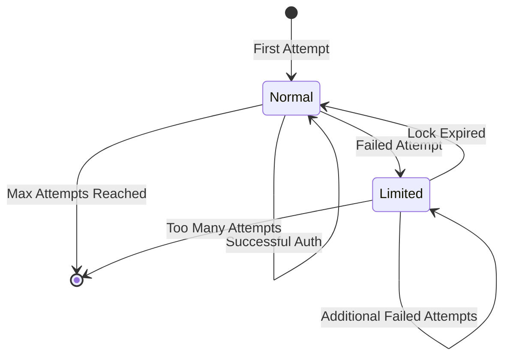
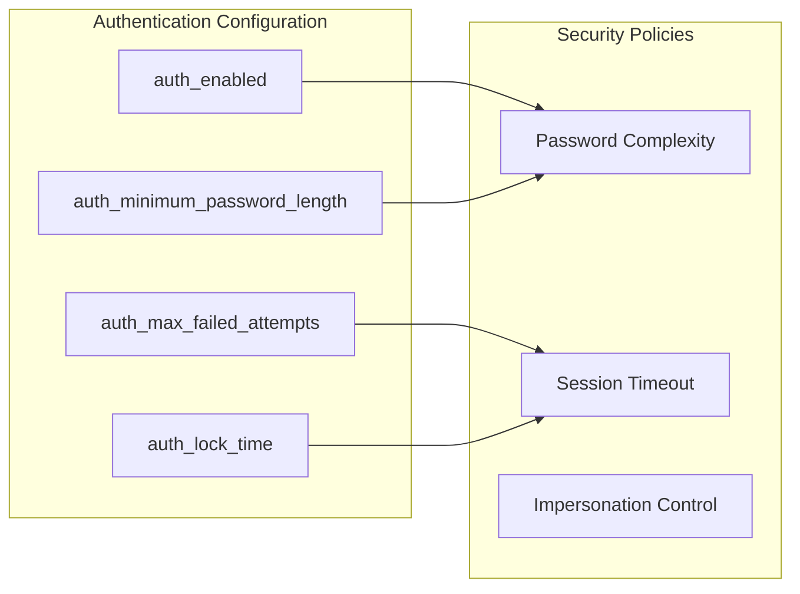
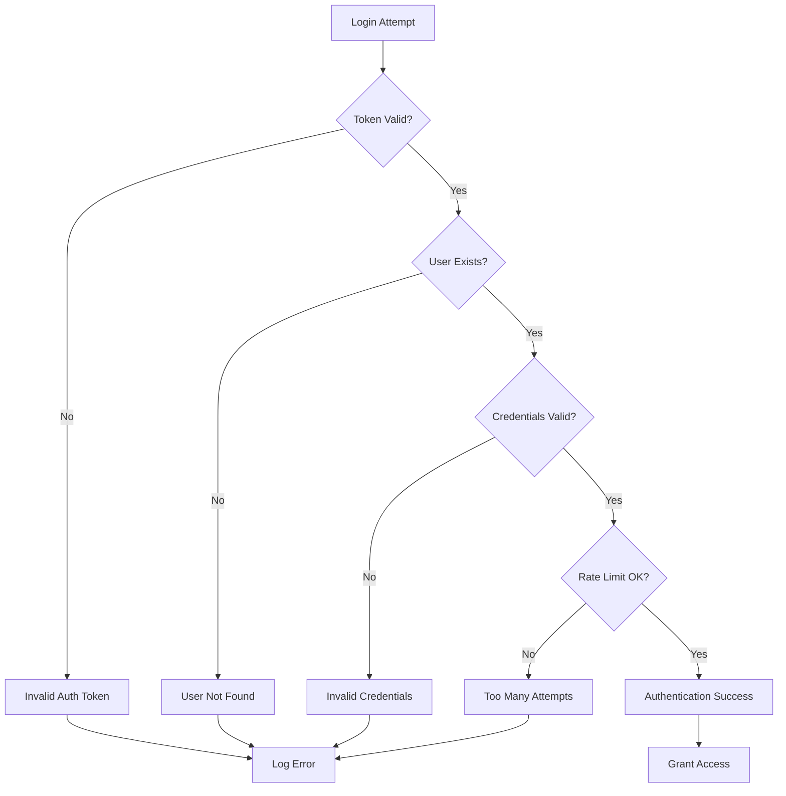

# Authentication

<cite>
**Referenced Files in This Document**
- [CommunitySecurityModule.java](file://community/security/src/main/java/org/neo4j/server/security/auth/CommunitySecurityModule.java)
- [Authentication.java](file://community/bolt/security/Authentication.java)
- [SecurityProvider.java](file://community/kernel/api/security/provider/SecurityProvider.java)
- [BasicSystemGraphRealm.java](file://community/security/src/main/java/org/neo4j/server/security/systemgraph/BasicSystemGraphRealm.java)
- [SecureHasher.java](file://community/security/src/main/java/org/neo4j/server/security/SecureHasher.java)
- [RateLimitedAuthenticationStrategy.java](file://community/security/src/main/java/org/neo4j/server/security/auth/RateLimitedAuthenticationStrategy.java)
- [AuthToken.java](file://community/kernel/api/security/AuthToken.java)
- [BasicLoginContext.java](file://community/security/src/main/java/org/neo4j/server/security/auth/BasicLoginContext.java)
- [SecurityGraphHelper.java](file://community/security/src/main/java/org/neo4j/server/security/systemgraph/SecurityGraphHelper.java)
- [GraphDatabaseSettings.java](file://community/configuration/src/main/java/org/neo4j/configuration/GraphDatabaseSettings.java)
- [AuthorizationEnabledFilter.java](file://community/server/src/main/java/org/neo4j/server/rest/dbms/AuthorizationEnabledFilter.java)
- [BasicAuthentication.java](file://community/bolt/src/main/java/org/neo4j/bolt/security/basic/BasicAuthentication.java)
- [AuthenticationResult.java](file://community/kernel-api/src/main/java/org/neo4j/internal/kernel/api/security/AuthenticationResult.java)
- [User.java](file://community/kernel/src/main/java/org/neo4j/kernel/impl/security/User.java)
- [Credential.java](file://community/kernel/src/main/java/org/neo4j/kernel/impl/security/Credential.java)
- [SystemGraphCredential.java](file://community/security/src/main/java/org/neo4j/server/security/SystemGraphCredential.java)
</cite>

## Table of Contents
1. [Introduction](#introduction)
2. [Authentication Architecture Overview](#authentication-architecture-overview)
3. [Core Components](#core-components)
4. [Authentication Providers and Framework Integration](#authentication-providers-and-framework-integration)
5. [Domain Model](#domain-model)
6. [Password Hashing and Credential Validation](#password-hashing-and-credential-validation)
7. [Authentication Request Processing](#authentication-request-processing)
8. [Failed Login Attempts and Account Lockout](#failed-login-attempts-and-account-lockout)
9. [Configuration Options](#configuration-options)
10. [Extension Development](#extension-development)
11. [Common Issues and Troubleshooting](#common-issues-and-troubleshooting)
12. [Conclusion](#conclusion)

## Introduction

Neo4j's authentication system provides a robust security framework that protects database access through multiple authentication mechanisms. The system is built around a modular architecture that integrates seamlessly with both Bolt (binary protocol) and HTTP (REST API) protocols, offering comprehensive protection against unauthorized access while maintaining flexibility for various deployment scenarios.

The authentication subsystem serves as the foundation for Neo4j's security model, implementing industry-standard cryptographic practices, rate limiting, and extensible provider architectures. This system ensures that only authorized users can access database resources while providing administrators with fine-grained control over authentication policies.

## Authentication Architecture Overview

Neo4j's authentication architecture follows a layered approach with clear separation of concerns between protocol handling, authentication logic, and credential management.

**Diagram sources**
- [CommunitySecurityModule.java](file://community/security/src/main/java/org/neo4j/server/security/auth/CommunitySecurityModule.java#L47-L97)
- [BasicSystemGraphRealm.java](file://community/security/src/main/java/org/neo4j/server/security/systemgraph/BasicSystemGraphRealm.java#L39-L70)
- [SecurityProvider.java](file://community/kernel/api/security/provider/SecurityProvider.java#L24-L30)

The architecture consists of four primary layers:

1. **Client Layer**: Handles incoming authentication requests from Bolt and HTTP protocols
2. **Authentication Layer**: Processes authentication tokens and manages authentication state
3. **Security Framework**: Provides the core security infrastructure and policy enforcement
4. **Storage Layer**: Manages user data and credentials in the system database

**Section sources**
- [CommunitySecurityModule.java](file://community/security/src/main/java/org/neo4j/server/security/auth/CommunitySecurityModule.java#L47-L97)
- [BasicSystemGraphRealm.java](file://community/security/src/main/java/org/neo4j/server/security/systemgraph/BasicSystemGraphRealm.java#L39-L70)

## Core Components

### CommunitySecurityModule

The [`CommunitySecurityModule`](file://community/security/src/main/java/org/neo4j/server/security/auth/CommunitySecurityModule.java) serves as the central orchestrator for authentication in Neo4j's Community edition. It implements the [`SecurityModule`](file://community/kernel/src/main/java/org/neo4j/kernel/api/security/SecurityModule.java) abstract class and provides the main entry point for authentication functionality.

Key responsibilities include:
- Initializing the authentication manager and security components
- Setting up the system graph repository for user management
- Registering authentication procedures for administrative operations
- Creating and configuring the authentication strategy with rate limiting

**Diagram sources**
- [CommunitySecurityModule.java](file://community/security/src/main/java/org/neo4j/server/security/auth/CommunitySecurityModule.java#L47-L129)
- [SecurityProvider.java](file://community/kernel/api/security/provider/SecurityProvider.java#L24-L30)

### Authentication Interface

The [`Authentication`](file://community/bolt/security/Authentication.java) interface defines the contract for authentication providers within the Bolt protocol layer. It specifies how authentication tokens are processed and validated.

Key methods:
- `authenticate(Map<String, Object> authToken, ClientConnectionInfo connectionInfo)`: Validates authentication tokens
- `impersonate(LoginContext context, String userToImpersonate)`: Handles user impersonation (not supported in community edition)

**Section sources**
- [CommunitySecurityModule.java](file://community/security/src/main/java/org/neo4j/server/security/auth/CommunitySecurityModule.java#L47-L129)
- [Authentication.java](file://community/bolt/security/Authentication.java#L41-L56)

## Authentication Providers and Framework Integration

### BasicSystemGraphRealm

The [`BasicSystemGraphRealm`](file://community/security/src/main/java/org/neo4j/server/security/systemgraph/BasicSystemGraphRealm.java) implements the core authentication logic using Neo4j's system graph database. It serves as the bridge between the authentication framework and the underlying user storage.

**Diagram sources**
- [BasicSystemGraphRealm.java](file://community/security/src/main/java/org/neo4j/server/security/systemgraph/BasicSystemGraphRealm.java#L49-L70)
- [SecurityGraphHelper.java](file://community/security/src/main/java/org/neo4j/server/security/systemgraph/SecurityGraphHelper.java#L81-L95)

### Integration with Bolt Protocol

The authentication system integrates with the Bolt protocol through the [`BasicAuthentication`](file://community/bolt/src/main/java/org/neo4j/bolt/security/basic/BasicAuthentication.java) class, which implements the Bolt protocol's authentication interface.

**Section sources**
- [BasicSystemGraphRealm.java](file://community/security/src/main/java/org/neo4j/server/security/systemgraph/BasicSystemGraphRealm.java#L39-L70)
- [BasicAuthentication.java](file://community/bolt/src/main/java/org/neo4j/bolt/security/basic/BasicAuthentication.java#L35-L68)

## Domain Model

### User Entity

The [`User`](file://community/kernel/src/main/java/org/neo4j/kernel/impl/security/User.java) class represents the core domain entity for authentication subjects. It encapsulates user identity, credentials, and authentication state.

**Diagram sources**
- [User.java](file://community/kernel/src/main/java/org/neo4j/kernel/impl/security/User.java#L38-L50)

### Credential Management

The [`Credential`](file://community/kernel/src/main/java/org/neo4j/kernel/impl/security/Credential.java) interface defines the contract for password storage and validation. Neo4j supports multiple credential types through implementations like [`SystemGraphCredential`](file://community/security/src/main/java/org/neo4j/server/security/SystemGraphCredential.java).

**Section sources**
- [User.java](file://community/kernel/src/main/java/org/neo4j/kernel/impl/security/User.java#L38-L50)
- [Credential.java](file://community/kernel/src/main/java/org/neo4j/kernel/impl/security/Credential.java#L22-L36)

## Password Hashing and Credential Validation

### SecureHasher Implementation

Neo4j uses the [`SecureHasher`](file://community/security/src/main/java/org/neo4j/server/security/SecureHasher.java) class to implement PBKDF2-based password hashing with configurable parameters. The system supports multiple hashing configurations for backward compatibility.

**Diagram sources**
- [SecureHasher.java](file://community/security/src/main/java/org/neo4j/server/security/SecureHasher.java#L57-L60)

### PBKDF2 Configuration

The SecureHasher supports multiple PBKDF2 configurations through the [`SecureHasherConfigurations`](file://community/security/src/main/java/org/neo4j/server/security/SecureHasherConfigurations.java) class, allowing for gradual migration to stronger hashing parameters.

**Section sources**
- [SecureHasher.java](file://community/security/src/main/java/org/neo4j/server/security/SecureHasher.java#L30-L90)

## Authentication Request Processing

### Authentication Flow

The authentication process follows a structured flow that handles token validation, credential verification, and result processing.

**Diagram sources**
- [BasicAuthentication.java](file://community/bolt/src/main/java/org/neo4j/bolt/security/basic/BasicAuthentication.java#L42-L62)
- [BasicSystemGraphRealm.java](file://community/security/src/main/java/org/neo4j/server/security/systemgraph/BasicSystemGraphRealm.java#L49-L70)

### Authentication Tokens

The [`AuthToken`](file://community/kernel/api/security/AuthToken.java) interface defines the structure for authentication tokens used across different protocols. It supports various authentication schemes including basic authentication.

**Section sources**
- [BasicAuthentication.java](file://community/bolt/src/main/java/org/neo4j/bolt/security/basic/BasicAuthentication.java#L42-L62)
- [AuthToken.java](file://community/kernel/api/security/AuthToken.java#L31-L157)

## Failed Login Attempts and Account Lockout

### Rate Limiting Strategy

The [`RateLimitedAuthenticationStrategy`](file://community/security/src/main/java/org/neo4j/server/security/auth/RateLimitedAuthenticationStrategy.java) implements sophisticated rate limiting to prevent brute force attacks while maintaining usability.

**Diagram sources**
- [RateLimitedAuthenticationStrategy.java](file://community/security/src/main/java/org/neo4j/server/security/auth/RateLimitedAuthenticationStrategy.java#L39-L59)

### Configuration Parameters

The rate limiting system uses several configuration parameters:

| Parameter | Description | Default Value |
|-----------|-------------|---------------|
| `auth_max_failed_attempts` | Maximum failed attempts before lockout | 3 |
| `auth_lock_time` | Duration of account lockout period | 5 seconds |

**Section sources**
- [RateLimitedAuthenticationStrategy.java](file://community/security/src/main/java/org/neo4j/server/security/auth/RateLimitedAuthenticationStrategy.java#L34-L107)
- [GraphDatabaseSettings.java](file://community/configuration/src/main/java/org/neo4j/configuration/GraphDatabaseSettings.java#L851-L870)

## Configuration Options

### Authentication Settings

Neo4j provides comprehensive configuration options for authentication behavior:

### Custom Authentication Providers

While Neo4j's community edition focuses on native authentication, the framework is designed to support custom authentication providers through the SecurityProvider interface. Enterprise editions extend this capability with additional provider types.

**Section sources**
- [GraphDatabaseSettings.java](file://community/configuration/src/main/java/org/neo4j/configuration/GraphDatabaseSettings.java#L851-L870)
- [CommunitySecurityModule.java](file://community/security/src/main/java/org/neo4j/server/security/auth/CommunitySecurityModule.java#L126-L128)

## Extension Development

### Custom Authentication Strategies

Developers can implement custom authentication strategies by extending the [`AuthenticationStrategy`](file://community/security/src/main/java/org/neo4j/server/security/auth/AuthenticationStrategy.java) interface. This allows integration with external authentication systems like LDAP, OAuth, or custom SSO solutions.

### Authentication Result Handling

The [`AuthenticationResult`](file://community/kernel-api/src/main/java/org/neo4j/internal/kernel/api/security/AuthenticationResult.java) enumeration defines possible outcomes of authentication attempts:

| Result | Description | Action Required |
|--------|-------------|-----------------|
| `SUCCESS` | Authentication successful | Grant full access |
| `FAILURE` | Authentication failed | Deny access |
| `TOO_MANY_ATTEMPTS` | Rate limit exceeded | Apply lockout |
| `PASSWORD_CHANGE_REQUIRED` | Password expired | Force password change |

**Section sources**
- [AuthenticationResult.java](file://community/kernel-api/src/main/java/org/neo4j/internal/kernel/api/security/AuthenticationResult.java#L22-L27)
- [RateLimitedAuthenticationStrategy.java](file://community/security/src/main/java/org/neo4j/server/security/auth/RateLimitedAuthenticationStrategy.java#L76-L91)

## Common Issues and Troubleshooting

### Failed Login Scenarios

Common authentication failures and their resolutions:

### Error Handling and Responses

The authentication system provides detailed error responses for different failure scenarios:

| Error Type | HTTP Status | Bolt Status | Description |
|------------|-------------|-------------|-------------|
| Unauthorized | 401 | AUTH_UNAUTHORIZED | Invalid credentials |
| Bad Request | 400 | INVALID_FORMAT | Malformed authentication token |
| Too Many Requests | 429 | RATE_LIMITED | Rate limit exceeded |
| Authentication Timeout | 504 | TIMEOUT | Auth provider timeout |

**Section sources**
- [AuthorizationEnabledFilter.java](file://community/server/src/main/java/org/neo4j/server/rest/dbms/AuthorizationEnabledFilter.java#L112-L137)

### Debugging Authentication Issues

For troubleshooting authentication problems:

1. **Enable Debug Logging**: Configure security logs to capture detailed authentication events
2. **Check User Existence**: Verify users exist in the system database
3. **Validate Credentials**: Ensure passwords are properly hashed and stored
4. **Review Rate Limits**: Check if accounts are locked due to excessive failed attempts
5. **Verify Configuration**: Confirm authentication settings are properly configured

## Conclusion

Neo4j's authentication system provides a comprehensive security framework that balances security, usability, and extensibility. The modular architecture allows for easy integration with existing authentication infrastructure while maintaining strong security practices through PBKDF2 password hashing, rate limiting, and comprehensive error handling.

The system's design enables both immediate deployment with native authentication and future extensibility for custom authentication providers. Through careful configuration of rate limits, password policies, and logging, administrators can create secure environments tailored to their specific requirements.

For developers implementing custom authentication schemes, the framework provides clear extension points and well-defined interfaces that facilitate integration with external authentication systems while maintaining the security guarantees provided by Neo4j's core authentication infrastructure.