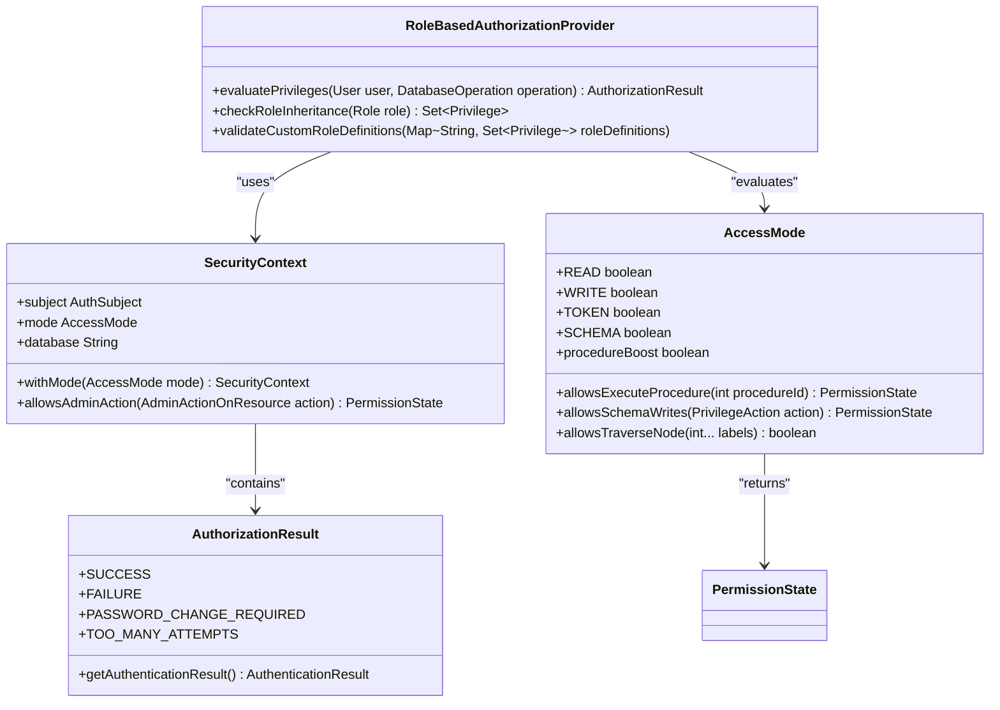
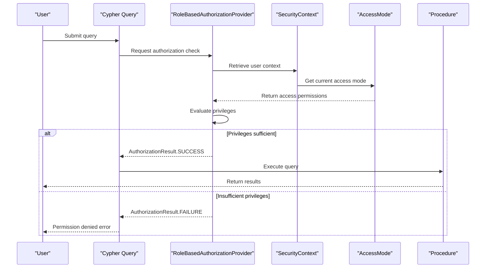
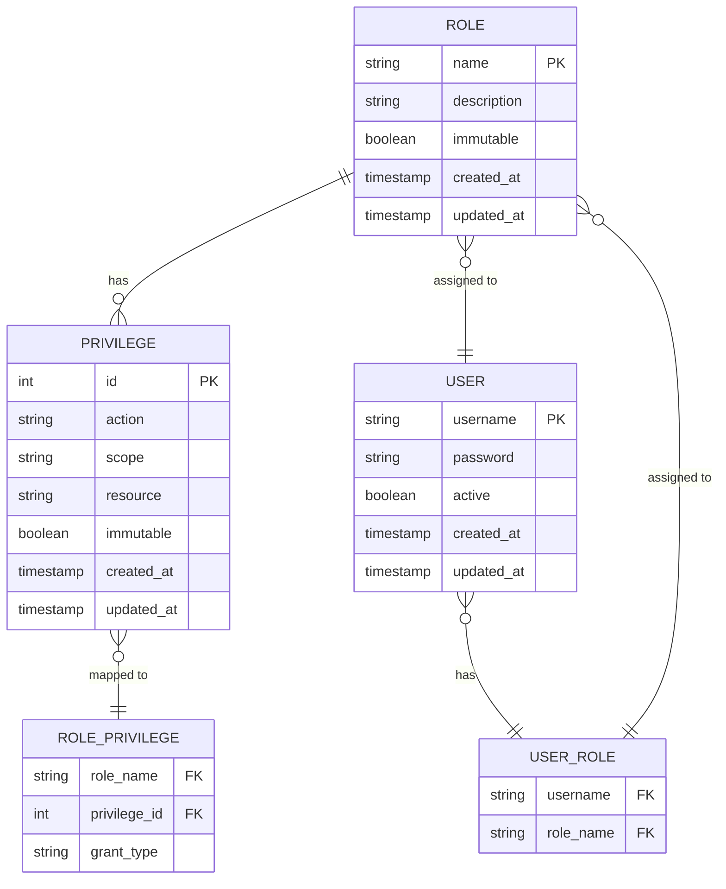

# Authorization

<cite>
**Referenced Files in This Document**   
- [BasicLoginContext.java](file://community/security/src/main/java/org/neo4j/server/security/auth/BasicLoginContext.java)
- [AccessMode.java](file://community/kernel-api/src/main/java/org/neo4j/internal/kernel/api/security/AccessMode.java)
- [Mode.java](file://community/procedure-api/src/main/java/org/neo4j/procedure/Mode.java)
- [SecurityContext.java](file://community/kernel-api/src/main/java/org/neo4j/internal/kernel/api/security/SecurityContext.java)
- [ProcedureCaller.java](file://community/kernel/src/main/java/org/neo4j/kernel/impl/newapi/ProcedureCaller.java)
- [PrivilegeAction.java](file://community/kernel-api/src/main/java/org/neo4j/internal/kernel/api/security/PrivilegeAction.java)
- [PermissionState.java](file://community/kernel-api/src/main/java/org/neo4j/internal/kernel/api/security/PermissionState.java)
- [Neo4jPrincipal.java](file://community/security/src/main/java/org/neo4j/server/security/auth/Neo4jPrincipal.java)
- [ActionMapper.scala](file://community/cypher/cypher/src/main/scala/org/neo4j/cypher/internal/procs/ActionMapper.scala)
- [AuthorizationViolationException.java](file://community/graphdb-api/src/main/java/org/neo4j/graphdb/security/AuthorizationViolationException.java)
</cite>

## Table of Contents
1. [Introduction](#introduction)
2. [Core Components](#core-components)
3. [Role-Based Access Control Implementation](#role-based-access-control-implementation)
4. [Authorization Flow and Cypher Query Execution](#authorization-flow-and-cypher-query-execution)
5. [Domain Model of Roles, Privileges, and Permissions](#domain-model-of-roles-privileges-and-permissions)
6. [Configuration and Custom Role Definitions](#configuration-and-custom-role-definitions)
7. [Common Issues and Troubleshooting](#common-issues-and-troubleshooting)
8. [Conclusion](#conclusion)

## Introduction
The authorization sub-feature in Neo4j's security system implements a comprehensive role-based access control (RBAC) mechanism that governs user privileges and database operations. This system evaluates user permissions through the RoleBasedAuthorizationProvider, which determines access rights based on roles, privileges, and permission inheritance. The authorization framework integrates with Cypher query execution, ensuring that all database operations are subject to security checks. The system supports predefined roles such as Reader, Editor, Publisher, and Admin, each with specific privilege levels that control access to database resources. Authorization decisions are made through a hierarchical evaluation process that considers both explicit grants and implicit permissions based on role inheritance. The system also provides mechanisms for custom role definitions and procedure access control through configuration parameters and annotations.

**Section sources**
- [BasicLoginContext.java](file://community/security/src/main/java/org/neo4j/server/security/auth/BasicLoginContext.java#L20-L112)
- [AccessMode.java](file://community/kernel-api/src/main/java/org/neo4j/internal/kernel/api/security/AccessMode.java#L20-L612)

## Core Components

The authorization system in Neo4j consists of several core components that work together to enforce security policies. The Principal class represents the authenticated user and contains information about their identity and session. The AuthorizationResult class encapsulates the outcome of authorization checks, indicating whether access is granted or denied. The RoleBasedAuthorizationProvider serves as the central authority for evaluating user privileges against database operations, implementing the logic for role-based access control. This provider interacts with the SecurityContext, which maintains the current user's permissions and access mode throughout the transaction lifecycle. The AccessMode interface defines different levels of database access, from read-only operations to full administrative privileges. The system also includes specialized components for handling procedure execution, where the Mode annotation on procedures determines the required access level for invocation.

**Section sources**
- [Neo4jPrincipal.java](file://community/security/src/main/java/org/neo4j/server/security/auth/Neo4jPrincipal.java#L20-L38)
- [SecurityContext.java](file://community/kernel-api/src/main/java/org/neo4j/internal/kernel/api/security/SecurityContext.java#L20-L152)
- [AccessMode.java](file://community/kernel-api/src/main/java/org/neo4j/internal/kernel/api/security/AccessMode.java#L20-L612)

## Role-Based Access Control Implementation

**Diagram sources**
- [AccessMode.java](file://community/kernel-api/src/main/java/org/neo4j/internal/kernel/api/security/AccessMode.java#L20-L612)
- [SecurityContext.java](file://community/kernel-api/src/main/java/org/neo4j/internal/kernel/api/security/SecurityContext.java#L20-L152)

**Section sources**
- [AccessMode.java](file://community/kernel-api/src/main/java/org/neo4j/internal/kernel/api/security/AccessMode.java#L20-L612)
- [SecurityContext.java](file://community/kernel-api/src/main/java/org/neo4j/internal/kernel/api/security/SecurityContext.java#L20-L152)

## Authorization Flow and Cypher Query Execution

**Diagram sources**
- [SecurityContext.java](file://community/kernel-api/src/main/java/org/neo4j/internal/kernel/api/security/SecurityContext.java#L20-L152)
- [AccessMode.java](file://community/kernel-api/src/main/java/org/neo4j/internal/kernel/api/security/AccessMode.java#L20-L612)

**Section sources**
- [SecurityContext.java](file://community/kernel-api/src/main/java/org/neo4j/internal/kernel/api/security/SecurityContext.java#L20-L152)
- [AccessMode.java](file://community/kernel-api/src/main/java/org/neo4j/internal/kernel/api/security/AccessMode.java#L20-L612)

## Domain Model of Roles, Privileges, and Permissions

**Diagram sources**
- [PrivilegeAction.java](file://community/kernel-api/src/main/java/org/neo4j/internal/kernel/api/security/PrivilegeAction.java#L20-L391)
- [AccessMode.java](file://community/kernel-api/src/main/java/org/neo4j/internal/kernel/api/security/AccessMode.java#L20-L612)

**Section sources**
- [PrivilegeAction.java](file://community/kernel-api/src/main/java/org/neo4j/internal/kernel/api/security/PrivilegeAction.java#L20-L391)
- [AccessMode.java](file://community/kernel-api/src/main/java/org/neo4j/internal/kernel/api/security/AccessMode.java#L20-L612)

## Configuration and Custom Role Definitions

The authorization system supports configuration options for custom role definitions and procedure access control. The @Mode annotation on procedures specifies the required access level, with options including READ, WRITE, SCHEMA, and DBMS. Configuration parameters allow administrators to define custom roles with specific privilege sets, which are stored in the system database. The procedure access control mechanism evaluates these configurations during procedure invocation, ensuring that only authorized users can execute specific procedures. Return values from authorization checks include explicit grants, denials, or conditional access based on the user's role and the operation being performed. The system also supports privilege inheritance, where higher-level roles automatically inherit the privileges of lower-level roles, creating a hierarchical permission structure.

**Section sources**
- [Mode.java](file://community/procedure-api/src/main/java/org/neo4j/procedure/Mode.java#L20-L41)
- [ProcedureCaller.java](file://community/kernel/src/main/java/org/neo4j/kernel/impl/newapi/ProcedureCaller.java#L158-L182)

## Common Issues and Troubleshooting

Common issues in the authorization system include permission denied errors, privilege escalation scenarios, and troubleshooting authorization failures. Permission denied errors typically occur when a user attempts to perform an operation without the necessary privileges, resulting in an AuthorizationViolationException. Privilege escalation scenarios can arise when role inheritance is not properly configured, potentially allowing users to gain unintended access to sensitive operations. Troubleshooting authorization failures involves examining the SecurityContext to verify the user's current access mode and privileges, checking the AccessMode configuration for the specific operation, and validating the role assignments in the system database. The system logs detailed information about authorization decisions, which can be used to diagnose and resolve access issues. Additionally, administrators should regularly audit role definitions and privilege assignments to ensure compliance with security policies.

**Section sources**
- [AuthorizationViolationException.java](file://community/graphdb-api/src/main/java/org/neo4j/graphdb/security/AuthorizationViolationException.java#L64-L91)
- [SecurityContext.java](file://community/kernel-api/src/main/java/org/neo4j/internal/kernel/api/security/SecurityContext.java#L20-L152)

## Conclusion
The authorization sub-feature in Neo4j's security system provides a robust and flexible framework for managing user privileges and database operations. Through the RoleBasedAuthorizationProvider, the system implements comprehensive role-based access control that evaluates user permissions against database operations. The integration with Cypher query execution ensures that all data access is subject to security checks, while the domain model of roles, privileges, and permission inheritance provides a structured approach to managing access rights. The system supports custom role definitions and procedure access control through configuration parameters and annotations, allowing administrators to tailor security policies to their specific requirements. By understanding the implementation details and common issues, developers can effectively implement and troubleshoot custom authorization logic in their Neo4j applications.