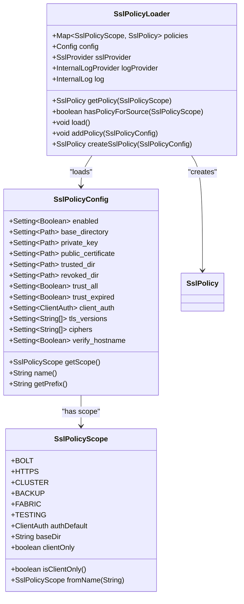
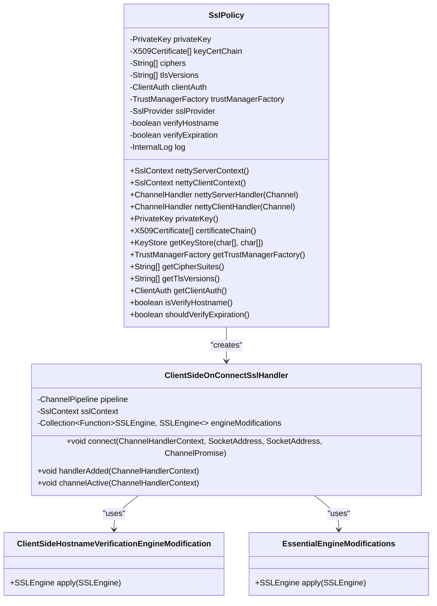
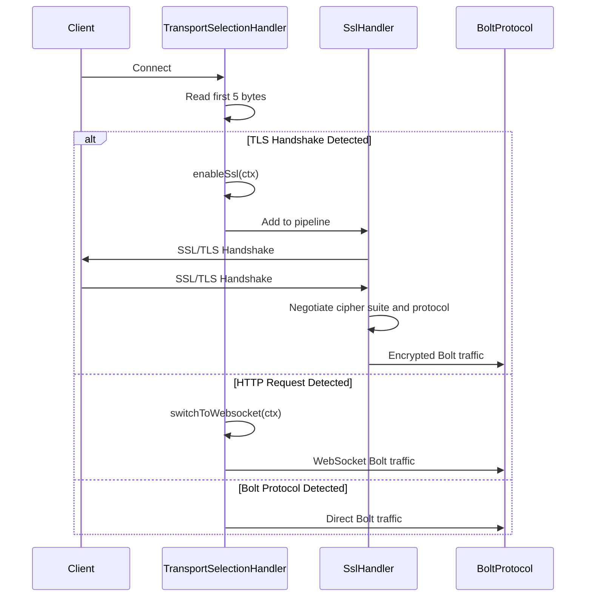
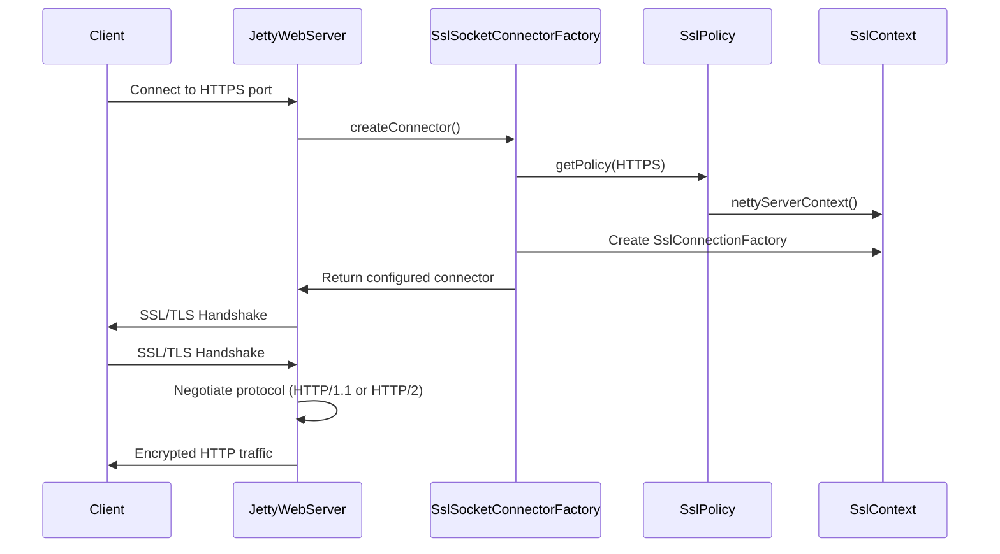
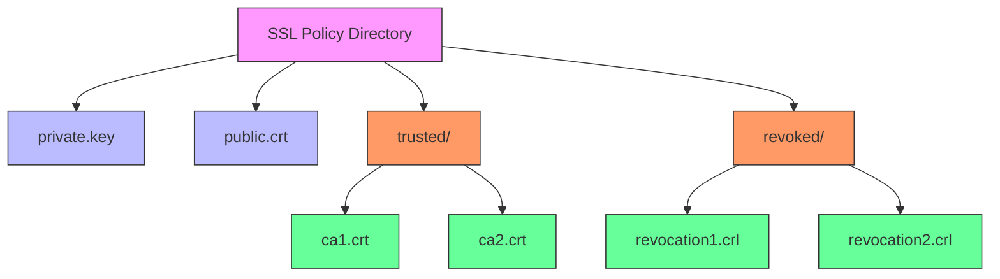

# Encryption

<cite>
**Referenced Files in This Document**   
- [SslPolicy.java](file://community\ssl\src\main\java\org\neo4j\ssl\SslPolicy.java)
- [SslPolicyLoader.java](file://community\ssl\src\main\java\org\neo4j\ssl\config\SslPolicyLoader.java)
- [SslPolicyConfig.java](file://community\configuration\src\main\java\org\neo4j\configuration\ssl\SslPolicyConfig.java)
- [SslPolicyScope.java](file://community\configuration\src\main\java\org\neo4j\configuration\ssl\SslPolicyScope.java)
- [BoltServer.java](file://community\bolt\src\main\java\org\neo4j\bolt\BoltServer.java)
- [JettyWebServer.java](file://community\server\src\main\java\org\neo4j\server\web\JettyWebServer.java)
- [SslSocketConnectorFactory.java](file://community\server\src\main\java\org\neo4j\server\security\ssl\SslSocketConnectorFactory.java)
- [ClientSideOnConnectSslHandler.java](file://community\ssl\src\main\java\org\neo4j\ssl\ClientSideOnConnectSslHandler.java)
- [ClientSideHostnameVerificationEngineModification.java](file://community\ssl\src\main\java\org\neo4j\ssl\ClientSideHostnameVerificationEngineModification.java)
- [TransportSelectionHandler.java](file://community\bolt\src\main\java\org\neo4j\bolt\protocol\common\handler\TransportSelectionHandler.java)
- [neo4j.conf](file://packaging\standalone\standalone-community\src\main\distribution\text\community\conf\neo4j.conf)
</cite>

## Table of Contents
1. [Introduction](#introduction)
2. [SSL Policy Configuration](#ssl-policy-configuration)
3. [SSL Policy Domain Model](#ssl-policy-domain-model)
4. [Bolt Protocol Encryption](#bolt-protocol-encryption)
5. [HTTP/HTTPS Encryption](#httphttps-encryption)
6. [Certificate Management](#certificate-management)
7. [Configuration Options](#configuration-options)
8. [Troubleshooting SSL Issues](#troubleshooting-ssl-issues)
9. [Conclusion](#conclusion)

## Introduction

Neo4j provides comprehensive encryption capabilities for both Bolt and HTTP connections through SSL/TLS protocols. The security system is designed to protect data in transit between clients and the database server, ensuring confidentiality, integrity, and authentication. This document details the implementation of SSL/TLS encryption in Neo4j, focusing on how SslPolicyConfig objects are created from configuration settings and applied to network transports.

The encryption system supports both Bolt and HTTP protocols, with configurable SSL policies that can be tailored to specific security requirements. The architecture is built around a policy-based approach where SSL configurations are defined through configuration files and then loaded into SslPolicy objects that are used by the respective protocol handlers. This design allows for flexible security configurations while maintaining a consistent implementation across different transport protocols.

The system supports modern TLS versions (1.2 and 1.3) and provides options for cipher suite selection, certificate validation, and mutual TLS authentication. The implementation leverages Netty for Bolt protocol handling and Jetty for HTTP/HTTPS connections, integrating SSL/TLS functionality at the network transport layer.

**Section sources**
- [SslPolicy.java](file://community\ssl\src\main\java\org\neo4j\ssl\SslPolicy.java#L1-L195)
- [SslPolicyLoader.java](file://community\ssl\src\main\java\org\neo4j\ssl\config\SslPolicyLoader.java#L1-L347)

## SSL Policy Configuration

The SSL policy configuration in Neo4j is managed through the SslPolicyConfig class, which defines all configurable parameters for SSL/TLS settings. The configuration system follows a hierarchical structure where policies are defined for specific scopes such as Bolt, HTTPS, cluster, and backup connections.

The SslPolicyConfig class implements the GroupSetting interface, allowing it to be integrated with Neo4j's configuration system. Each SSL policy is identified by a scope (SslPolicyScope) which determines its application context. The configuration parameters include:

- **enabled**: Boolean flag to enable or disable the SSL policy
- **base_directory**: Base directory for cryptographic objects
- **private_key**: Path to the private PKCS#8 key in PEM format
- **public_certificate**: Path to the X.509 certificate chain in PEM format
- **trusted_dir**: Directory containing trusted X.509 certificates
- **revoked_dir**: Directory containing Certificate Revocation Lists (CRLs)
- **trust_all**: Flag to trust all remote parties (not recommended)
- **trust_expired**: Flag to trust expired certificates
- **client_auth**: Client authentication stance (NONE, OPTIONAL, REQUIRE)
- **tls_versions**: List of allowed TLS protocol versions
- **ciphers**: List of allowed cipher suites
- **verify_hostname**: Flag to enable hostname verification

The configuration system uses a prefix-based naming convention where SSL policy settings are prefixed with "dbms.ssl.policy". For example, the Bolt SSL policy settings are prefixed with "dbms.ssl.policy.bolt". This allows multiple SSL policies to coexist with clear namespace separation.

The SslPolicyLoader class is responsible for loading and validating SSL policies from the configuration. It processes all SslPolicyConfig instances, creates SslPolicy objects, and stores them in a map indexed by their SslPolicyScope. During the loading process, the loader performs several validation checks including verifying the existence of the base directory and ensuring that required cryptographic files are present.



**Diagram sources**
- [SslPolicyConfig.java](file://community\configuration\src\main\java\org\neo4j\configuration\ssl\SslPolicyConfig.java#L1-L155)
- [SslPolicyScope.java](file://community\configuration\src\main\java\org\neo4j\configuration\ssl\SslPolicyScope.java#L1-L64)
- [SslPolicyLoader.java](file://community\ssl\src\main\java\org\neo4j\ssl\config\SslPolicyLoader.java#L1-L347)

**Section sources**
- [SslPolicyConfig.java](file://community\configuration\src\main\java\org\neo4j\configuration\ssl\SslPolicyConfig.java#L1-L155)
- [SslPolicyScope.java](file://community\configuration\src\main\java\org\neo4j\configuration\ssl\SslPolicyScope.java#L1-L64)
- [SslPolicyLoader.java](file://community\ssl\src\main\java\org\neo4j\ssl\config\SslPolicyLoader.java#L1-L347)

## SSL Policy Domain Model

The SSL policy domain model in Neo4j consists of several key components that work together to provide secure communication. The core of the model is the SslPolicy class, which encapsulates all the cryptographic parameters and objects needed for SSL/TLS operations.

The SslPolicy class contains the following key components:

- **Private key and certificate chain**: The server's private key and its associated X.509 certificate chain
- **Trust manager factory**: Responsible for managing trusted certificates and performing certificate validation
- **TLS versions**: List of allowed TLS protocol versions (e.g., TLSv1.2, TLSv1.3)
- **Cipher suites**: List of allowed cipher suites for encryption
- **Client authentication**: Configuration for client certificate verification (NONE, OPTIONAL, REQUIRE)
- **Hostname verification**: Flag to enable or disable hostname verification
- **Certificate expiration**: Flag to control whether expired certificates are accepted

The SslPolicy class provides methods to create Netty SSL contexts for both server and client operations. The nettyServerContext() method creates an SslContext for server-side operations, while the nettyClientContext() method creates an SslContext for client-side operations. These contexts are used by the respective protocol handlers to establish encrypted connections.

The certificate validation process involves several steps:
1. Loading the certificate chain from PEM files
2. Creating a trust store from trusted certificates
3. Configuring the trust manager factory with the trust store
4. Optionally enabling certificate revocation checking using CRLs
5. Validating certificate expiration based on the trust_expired setting

The system also supports certificate revocation checking through Certificate Revocation Lists (CRLs). If a revoked_dir is configured, the system will load all CRL files from that directory and use them to validate that certificates have not been revoked. This provides an additional layer of security beyond basic certificate validation.



**Diagram sources**
- [SslPolicy.java](file://community\ssl\src\main\java\org\neo4j\ssl\SslPolicy.java#L1-L195)
- [ClientSideOnConnectSslHandler.java](file://community\ssl\src\main\java\org\neo4j\ssl\ClientSideOnConnectSslHandler.java#L1-L136)
- [ClientSideHostnameVerificationEngineModification.java](file://community\ssl\src\main\java\org\neo4j\ssl\ClientSideHostnameVerificationEngineModification.java#L1-L63)

**Section sources**
- [SslPolicy.java](file://community\ssl\src\main\java\org\neo4j\ssl\SslPolicy.java#L1-L195)
- [ClientSideOnConnectSslHandler.java](file://community\ssl\src\main\java\org\neo4j\ssl\ClientSideOnConnectSslHandler.java#L1-L136)
- [ClientSideHostnameVerificationEngineModification.java](file://community\ssl\src\main\java\org\neo4j\ssl\ClientSideHostnameVerificationEngineModification.java#L1-L63)

## Bolt Protocol Encryption

The Bolt protocol encryption in Neo4j is implemented using Netty's SSL/TLS support. The encryption process begins with the BoltServer class, which is responsible for configuring and starting the Bolt connector. When the server initializes, it checks the encryption level configuration and loads the appropriate SSL policy if encryption is enabled.

The BoltServer class uses the SslPolicyLoader to obtain the SSL policy for the BOLT scope. If encryption is required but no policy is configured, the server throws an IllegalStateException. Once the SSL policy is obtained, the server creates an SslContext using the policy's nettyServerContext() method. This context is then passed to the socket connector configuration.

The transport selection process is handled by the TransportSelectionHandler class, which examines the first few bytes of incoming data to determine the protocol. When SSL/TLS is detected (typically by the presence of the TLS handshake record), the handler enables SSL on the channel by adding an SslHandler to the pipeline. This ensures that all subsequent data is encrypted according to the negotiated TLS parameters.

For server-side operations, the SslPolicy creates an SslHandler using the private key and certificate chain. The handler is configured with the allowed TLS versions and cipher suites from the policy. Client authentication is configured based on the client_auth setting, with three possible modes:
- NONE: No client certificate is requested
- OPTIONAL: Client certificate is requested but not required
- REQUIRE: Client certificate is required for connection

The Bolt protocol supports both encrypted and unencrypted connections on the same port through protocol detection. When a client connects, the server examines the initial bytes to determine whether it's a TLS handshake, HTTP request, or Bolt protocol message. This allows clients to connect using either encrypted or unencrypted connections without requiring separate ports.



**Diagram sources**
- [BoltServer.java](file://community\bolt\src\main\java\org\neo4j\bolt\BoltServer.java#L290-L316)
- [TransportSelectionHandler.java](file://community\bolt\src\main\java\org\neo4j\bolt\protocol\common\handler\TransportSelectionHandler.java#L105-L115)

**Section sources**
- [BoltServer.java](file://community\bolt\src\main\java\org\neo4j\bolt\BoltServer.java#L290-L316)
- [TransportSelectionHandler.java](file://community\bolt\src\main\java\org\neo4j\bolt\protocol\common\handler\TransportSelectionHandler.java#L81-L122)

## HTTP/HTTPS Encryption

The HTTP/HTTPS encryption in Neo4j is implemented using Jetty's SSL/TLS support. The JettyWebServer class is responsible for configuring and starting the HTTP connectors, including both HTTP and HTTPS. The server configuration is handled by the AbstractNeoWebServer class, which sets up the SSL policy for HTTPS connections.

When the web server starts, it checks if HTTPS is enabled and whether an SSL policy is configured for the HTTPS scope. If both conditions are met, the server obtains the SSL policy from the SslPolicyLoader and sets it on the web server instance. The SslSocketConnectorFactory class is then used to create the HTTPS connector with the configured SSL policy.

The SslSocketConnectorFactory creates a Jetty ServerConnector with SSL/TLS support by:
1. Creating an HttpConfiguration with appropriate customizers
2. Creating connection factories for HTTP/1.1 and HTTP/2 as configured
3. Creating an SslConnectionFactory with the SSL context from the policy
4. Configuring ALPN (Application-Layer Protocol Negotiation) for HTTP/2 support
5. Creating the ServerConnector with the configured connection factories

For client-side operations, the system uses the ClientSideOnConnectSslHandler to establish encrypted connections. This handler is responsible for creating the SSL context and applying necessary modifications to the SSLEngine. The handler supports hostname verification through the ClientSideHostnameVerificationEngineModification class, which sets the endpoint identification algorithm to "HTTPS" to enable RFC 2818 hostname verification.

The HTTP server supports both HTTP/1.1 and HTTP/2 protocols over HTTPS. When HTTP/2 is enabled, the server uses ALPN to negotiate the protocol version during the TLS handshake. This allows clients to use the most efficient protocol version available while maintaining backward compatibility.



**Diagram sources**
- [JettyWebServer.java](file://community\server\src\main\java\org\neo4j\server\web\JettyWebServer.java#L104-L126)
- [SslSocketConnectorFactory.java](file://community\server\src\main\java\org\neo4j\server\security\ssl\SslSocketConnectorFactory.java#L68-L100)
- [SslPolicy.java](file://community\ssl\src\main\java\org\neo4j\ssl\SslPolicy.java#L81-L88)

**Section sources**
- [JettyWebServer.java](file://community\server\src\main\java\org\neo4j\server\web\JettyWebServer.java#L97-L126)
- [SslSocketConnectorFactory.java](file://community\server\src\main\java\org\neo4j\server\security\ssl\SslSocketConnectorFactory.java#L48-L110)
- [SslPolicy.java](file://community\ssl\src\main\java\org\neo4j\ssl\SslPolicy.java#L81-L88)

## Certificate Management

Certificate management in Neo4j follows a structured directory layout and file format convention. Each SSL policy scope has its own base directory under the certificates directory, with subdirectories for different types of cryptographic objects.

The default directory structure for SSL policies is:
- certificates/bolt/ - For Bolt connector certificates
- certificates/https/ - For HTTPS connector certificates  
- certificates/cluster/ - For cluster communication certificates
- certificates/backup/ - For backup communication certificates

Within each policy directory, the following files are typically present:
- private.key - The private PKCS#8 key in PEM format
- public.crt - The X.509 certificate chain in PEM format
- trusted/ - Directory containing trusted certificates
- revoked/ - Directory containing Certificate Revocation Lists (CRLs)

The system supports PEM format for both private keys and certificates, which is a base64-encoded format with header and footer lines. Private keys may be password-protected, with the password specified in the configuration. Certificate chains are stored as a concatenation of individual certificates in PEM format, with the server's certificate first followed by intermediate CA certificates.

For certificate validation, the system performs the following checks:
1. Certificate chain validation against trusted CAs
2. Certificate expiration validation (unless trust_expired is true)
3. Hostname verification (unless verify_hostname is false)
4. Certificate revocation checking (if CRLs are configured)

The system also supports self-signed certificates for development and testing purposes. The SelfSignedCertificateFactory class in the test-utils module can generate self-signed certificates with appropriate subject alternative names for hostname verification testing.



**Diagram sources**
- [SslPolicyConfig.java](file://community\configuration\src\main\java\org\neo4j\configuration\ssl\SslPolicyConfig.java#L48-L90)
- [SslPolicyScope.java](file://community\configuration\src\main\java\org\neo4j\configuration\ssl\SslPolicyScope.java#L30-L35)

**Section sources**
- [SslPolicyConfig.java](file://community\configuration\src\main\java\org\neo4j\configuration\ssl\SslPolicyConfig.java#L48-L90)
- [SslPolicyScope.java](file://community\configuration\src\main\java\org\neo4j\configuration\ssl\SslPolicyScope.java#L30-L35)

## Configuration Options

Neo4j provides extensive configuration options for SSL/TLS settings through the neo4j.conf file. The configuration parameters are organized by SSL policy scope, with each scope having its own set of configuration options.

The main configuration options for SSL policies include:

### General SSL Configuration
- **dbms.ssl.policy.<scope>.enabled**: Enables or disables the SSL policy for the specified scope
- **dbms.ssl.policy.<scope>.base_directory**: Base directory for cryptographic objects
- **dbms.ssl.policy.<scope>.private_key**: Path to the private PKCS#8 key in PEM format
- **dbms.ssl.policy.<scope>.public_certificate**: Path to the X.509 certificate chain in PEM format
- **dbms.ssl.policy.<scope>.trusted_dir**: Directory containing trusted X.509 certificates
- **dbms.ssl.policy.<scope>.revoked_dir**: Directory containing Certificate Revocation Lists (CRLs)

### Security Settings
- **dbms.ssl.policy.<scope>.trust_all**: Trusts all remote parties (not recommended)
- **dbms.ssl.policy.<scope>.trust_expired**: Trusts expired certificates
- **dbms.ssl.policy.<scope>.client_auth**: Client authentication stance (NONE, OPTIONAL, REQUIRE)
- **dbms.ssl.policy.<scope>.verify_hostname**: Enables hostname verification

### Protocol and Cipher Configuration
- **dbms.ssl.policy.<scope>.tls_versions**: Comma-separated list of allowed TLS versions (default: TLSv1.2,TLSv1.3)
- **dbms.ssl.policy.<scope>.ciphers**: Comma-separated list of allowed cipher suites

For the Bolt connector, the encryption level is configured with:
- **server.bolt.tls_level**: Encryption level for Bolt connections (DISABLED, OPTIONAL, REQUIRED)

For the HTTPS connector, the connector must be enabled:
- **server.https.enabled**: Enables the HTTPS connector

The default configuration in neo4j.conf provides commented examples for both Bolt and HTTPS SSL policies:

```
# Bolt SSL configuration
#dbms.ssl.policy.bolt.enabled=true
#dbms.ssl.policy.bolt.base_directory=certificates/bolt
#dbms.ssl.policy.bolt.private_key=private.key
#dbms.ssl.policy.bolt.public_certificate=public.crt
#dbms.ssl.policy.bolt.client_auth=NONE

# Https SSL configuration
#dbms.ssl.policy.https.enabled=true
#dbms.ssl.policy.https.base_directory=certificates/https
#dbms.ssl.policy.https.private_key=private.key
#dbms.ssl.policy.https.public_certificate=public.crt
#dbms.ssl.policy.https.client_auth=NONE
```

The configuration system validates settings during startup and provides meaningful error messages for common configuration issues such as missing files, invalid paths, or incompatible settings.

**Section sources**
- [SslPolicyConfig.java](file://community\configuration\src\main\java\org\neo4j\configuration\ssl\SslPolicyConfig.java#L46-L154)
- [BoltConnector.java](file://community\configuration\src\main\java\org\neo4j\configuration\connectors\BoltConnector.java#L66-L68)
- [HttpsConnector.java](file://community\configuration\src\main\java\org\neo4j\configuration\connectors\HttpsConnector.java#L41-L42)
- [neo4j.conf](file://packaging\standalone\standalone-community\src\main\distribution\text\community\conf\neo4j.conf#L156-L178)

## Troubleshooting SSL Issues

When troubleshooting SSL/TLS issues in Neo4j, several common problems may occur. Understanding these issues and their solutions can help maintain secure and reliable connections.

### Certificate Expiration
Certificate expiration is a common issue that can cause connection failures. When a certificate has expired, the SSL handshake will fail with an exception indicating certificate expiration. To resolve this issue:
1. Check the certificate's validity period using openssl: `openssl x509 -in public.crt -text -noout`
2. Renew the certificate before it expires
3. Update the certificate files in the appropriate directory
4. Restart the Neo4j server to load the new certificate

The system can be configured to accept expired certificates by setting `dbms.ssl.policy.<scope>.trust_expired=true`, but this is not recommended for production environments.

### Hostname Mismatch
Hostname verification failures occur when the hostname used to connect does not match the names in the certificate's Subject Alternative Name (SAN) field. To resolve this:
1. Ensure the certificate includes the correct hostnames or IP addresses in the SAN field
2. Use the correct hostname or IP address when connecting
3. Disable hostname verification with `dbms.ssl.policy.<scope>.verify_hostname=false` (not recommended)

During certificate generation, include the appropriate SAN entries:
```
Subject Alternative Name:
  DNS:localhost, DNS:myserver.example.com, IP:127.0.0.1
```

### SSL Handshake Failures
SSL handshake failures can have several causes:
- **Protocol version mismatch**: Ensure client and server support compatible TLS versions
- **Cipher suite mismatch**: Verify that client and server have at least one common cipher suite
- **Certificate chain issues**: Ensure the complete certificate chain is provided
- **Private key mismatch**: Verify the private key matches the certificate

Enable debug logging to diagnose handshake issues:
```
# In neo4j.conf
dbms.jvm.additional=-Djavax.net.debug=ssl:handshake
```

### Configuration Issues
Common configuration problems include:
- Missing or incorrect file paths
- Incorrect file permissions
- Typos in configuration parameter names
- Using absolute paths when relative paths are expected

Verify configuration with:
```
# Check if policy exists
dbms.ssl.policy.bolt.enabled=true

# Verify file paths are correct
dbms.ssl.policy.bolt.base_directory=certificates/bolt
dbms.ssl.policy.bolt.private_key=private.key
dbms.ssl.policy.bolt.public_certificate=public.crt
```

### Mutual TLS Configuration
For mutual TLS (client certificate authentication), ensure:
1. Client authentication is enabled: `dbms.ssl.policy.<scope>.client_auth=REQUIRE`
2. Trusted client certificates are in the trusted_dir
3. Client certificates are valid and not expired
4. Client private keys are available and correctly configured

The system logs detailed information about SSL operations, which can be invaluable for troubleshooting. Enable appropriate log levels to capture SSL-related messages during connection attempts.

**Section sources**
- [SslPolicyLoader.java](file://community\ssl\src\main\java\org\neo4j\ssl\config\SslPolicyLoader.java#L158-L162)
- [SslPolicy.java](file://community\ssl\src\main\java\org\neo4j\ssl\SslPolicy.java#L224-L234)
- [SslPolicyLoader.java](file://community\ssl\src\main\java\org\neo4j\ssl\config\SslPolicyLoader.java#L320-L323)

## Conclusion

Neo4j's encryption system provides robust SSL/TLS support for both Bolt and HTTP connections, ensuring secure communication between clients and the database server. The system is built around a flexible policy-based configuration model that allows administrators to tailor security settings to their specific requirements.

The implementation leverages industry-standard libraries (Netty for Bolt and Jetty for HTTP) to provide reliable SSL/TLS functionality. The architecture separates configuration (SslPolicyConfig) from implementation (SslPolicy), making it easy to manage and extend. The system supports modern security features including TLS 1.2 and 1.3, configurable cipher suites, certificate revocation checking, and mutual TLS authentication.

Key strengths of the implementation include:
- Consistent API across different transport protocols
- Comprehensive configuration options
- Robust certificate management
- Detailed logging for troubleshooting
- Support for both server and client SSL operations

For production deployments, it is recommended to:
1. Use strong, up-to-date certificates from trusted CAs
2. Enable hostname verification
3. Disable the trust_all option
4. Regularly rotate certificates before expiration
5. Monitor SSL-related logs for potential issues
6. Keep TLS versions and cipher suites up to date with current security recommendations

The modular design of the SSL system makes it extensible for future security enhancements while maintaining backward compatibility with existing configurations.