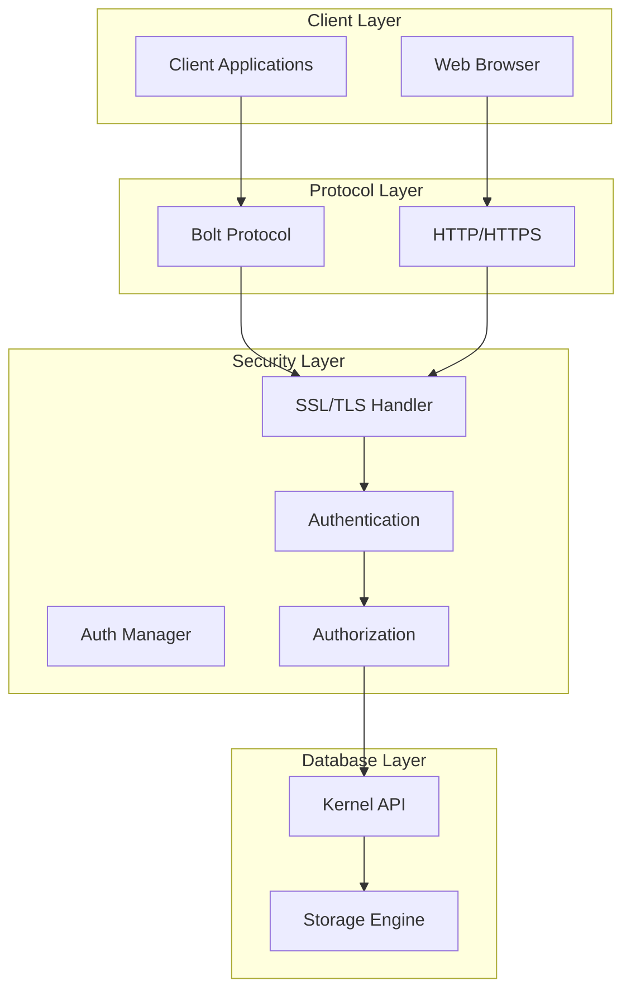
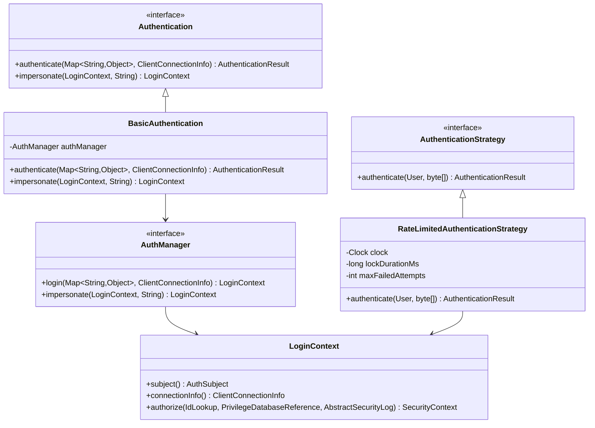
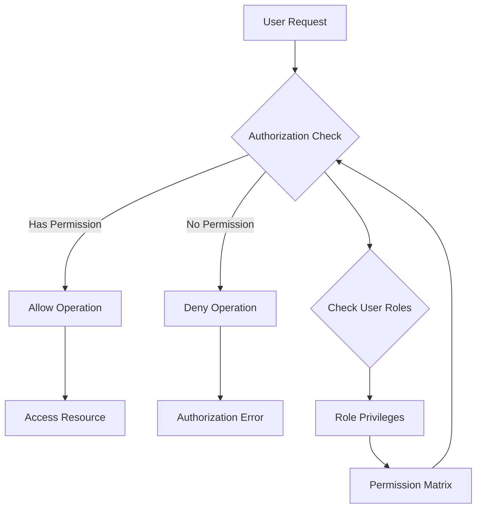
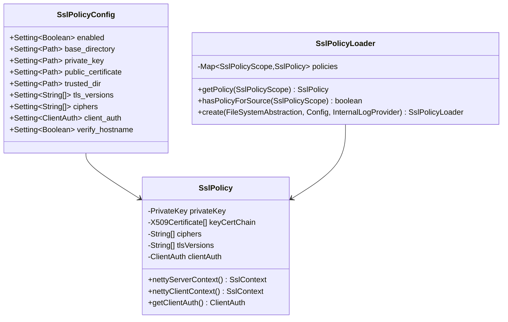
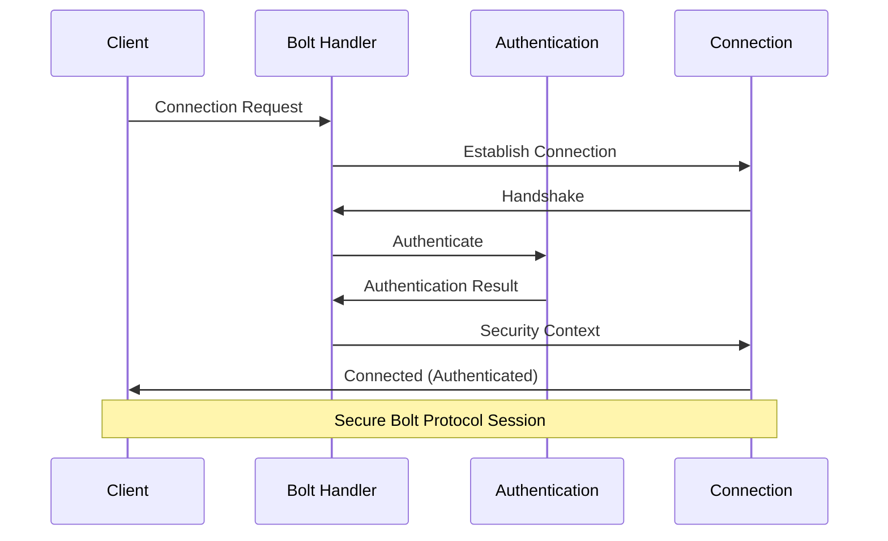
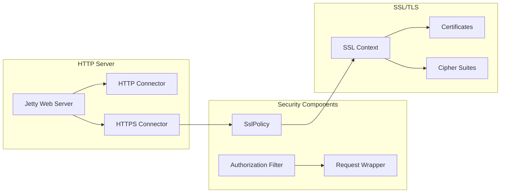
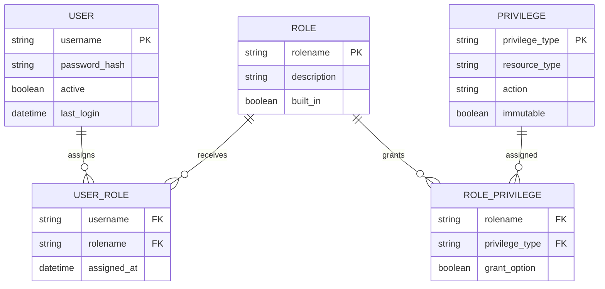
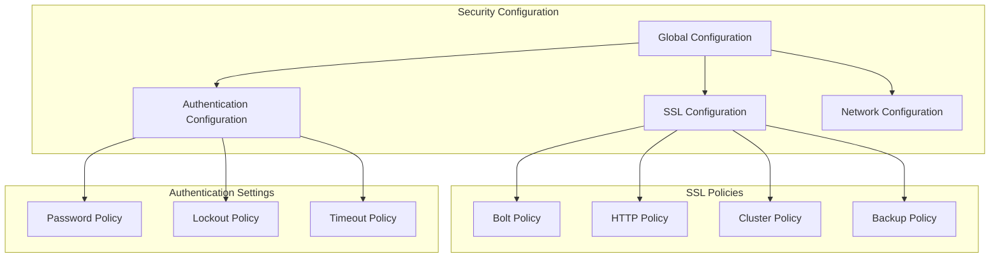

# Security System

<cite>
**Referenced Files in This Document**
- [CommunitySecurityModule.java](file://community/security/src/main/java/org/neo4j/server/security/auth/CommunitySecurityModule.java)
- [SslPolicyLoader.java](file://community/ssl/src/main/java/org/neo4j/ssl/config/SslPolicyLoader.java)
- [SslPolicy.java](file://community/ssl/src/main/java/org/neo4j/ssl/SslPolicy.java)
- [SslPolicyConfig.java](file://community/configuration/src/main/java/org/neo4j/configuration/ssl/SslPolicyConfig.java)
- [SslPolicyScope.java](file://community/configuration/src/main/java/org/neo4j/configuration/ssl/SslPolicyScope.java)
- [SecureHasher.java](file://community/security/src/main/java/org/neo4j/server/security/SecureHasher.java)
- [RateLimitedAuthenticationStrategy.java](file://community/security/src/main/java/org/neo4j/server/security/auth/RateLimitedAuthenticationStrategy.java)
- [BasicAuthentication.java](file://community/bolt/src/main/java/org/neo4j/bolt/security/basic/BasicAuthentication.java)
- [Authentication.java](file://community/bolt/src/main/java/org/neo4j/bolt/security/Authentication.java)
- [LoginContext.java](file://community/kernel-api/src/main/java/org/neo4j/internal/kernel/api/security/LoginContext.java)
- [SecurityModule.java](file://community/kernel/src/main/java/org/neo4j/kernel/api/security/SecurityModule.java)
- [SecurityProvider.java](file://community/kernel-api/src/main/java/org/neo4j/kernel/api/security/provider/SecurityProvider.java)
- [AbstractEditionModule.java](file://community/neo4j/src/main/java/org/neo4j/graphdb/factory/module/edition/AbstractEditionModule.java)
- [CommunityEditionModule.java](file://community/neo4j/src/main/java/org/neo4j/graphdb/factory/module/edition/CommunityEditionModule.java)
- [SslSocketConnectorFactory.java](file://community/server/src/main/java/org/neo4j/server/security/ssl/SslSocketConnectorFactory.java)
- [AbstractNeoWebServer.java](file://community/server/src/main/java/org/neo4j/server/AbstractNeoWebServer.java)
- [TransportSelectionHandler.java](file://community/bolt/src/main/java/org/neo4j/bolt/protocol/common/handler/TransportSelectionHandler.java)
</cite>

## Table of Contents
1. [Introduction](#introduction)
2. [Security System Architecture](#security-system-architecture)
3. [Authentication System](#authentication-system)
4. [Authorization Framework](#authorization-framework)
5. [SSL/TLS Encryption](#ssltls-encryption)
6. [Bolt Protocol Security](#bolt-protocol-security)
7. [HTTP Server Security](#http-server-security)
8. [Role-Based Access Control](#role-based-access-control)
9. [Security Configuration](#security-configuration)
10. [Practical Examples](#practical-examples)
11. [Troubleshooting](#troubleshooting)
12. [Best Practices](#best-practices)

## Introduction

Neo4j's security system provides comprehensive protection for database access through a multi-layered architecture that includes authentication, authorization, encryption, and access control mechanisms. The system is designed to protect against unauthorized access while maintaining high performance and scalability.

The security framework operates on several key principles:
- **Defense in Depth**: Multiple security layers work together to provide comprehensive protection
- **Pluggable Architecture**: Modular design allows for flexible security implementations
- **Performance Optimization**: Security measures are optimized to minimize impact on database operations
- **Standards Compliance**: Implements industry-standard security protocols and encryption

## Security System Architecture

Neo4j's security system follows a layered architecture that separates concerns and provides flexibility for different security implementations.



**Diagram sources**
- [SecurityModule.java](file://community/kernel/src/main/java/org/neo4j/kernel/api/security/SecurityModule.java#L27-L39)
- [CommunitySecurityModule.java](file://community/security/src/main/java/org/neo4j/server/security/auth/CommunitySecurityModule.java#L47-L61)

### Core Components

The security system consists of several interconnected components:

**SecurityModule**: The main entry point that manages security providers and authentication strategies
**AuthManager**: Handles user authentication and session management
**SSL/TLS Policies**: Manages cryptographic configurations and certificate handling
**Authentication Strategies**: Implements various authentication methods and rate limiting
**Authorization Framework**: Controls access to database resources and operations

**Section sources**
- [SecurityModule.java](file://community/kernel/src/main/java/org/neo4j/kernel/api/security/SecurityModule.java#L27-L39)
- [CommunitySecurityModule.java](file://community/security/src/main/java/org/neo4j/server/security/auth/CommunitySecurityModule.java#L47-L61)

## Authentication System

Neo4j implements a robust authentication system that supports multiple authentication schemes and provides protection against various attack vectors.

### Authentication Architecture



**Diagram sources**
- [Authentication.java](file://community/bolt/src/main/java/org/neo4j/bolt/security/Authentication.java#L41-L55)
- [BasicAuthentication.java](file://community/bolt/src/main/java/org/neo4j/bolt/security/basic/BasicAuthentication.java#L35-L68)
- [LoginContext.java](file://community/kernel-api/src/main/java/org/neo4j/internal/kernel/api/security/LoginContext.java#L32-L106)
- [RateLimitedAuthenticationStrategy.java](file://community/security/src/main/java/org/neo4j/server/security/auth/RateLimitedAuthenticationStrategy.java#L34-L106)

### Authentication Process

The authentication process follows a structured flow that ensures security while maintaining usability:

1. **Token Validation**: Initial authentication token validation
2. **Credential Verification**: Password or token verification against stored credentials
3. **Rate Limiting**: Protection against brute force attacks
4. **Session Creation**: Establishment of authenticated session
5. **Context Assignment**: Assignment of user context and permissions

**Section sources**
- [BasicAuthentication.java](file://community/bolt/src/main/java/org/neo4j/bolt/security/basic/BasicAuthentication.java#L42-L68)
- [RateLimitedAuthenticationStrategy.java](file://community/security/src/main/java/org/neo4j/server/security/auth/RateLimitedAuthenticationStrategy.java#L76-L106)

## Authorization Framework

Neo4j implements a sophisticated authorization framework that controls access to database resources through role-based access control (RBAC) and privilege management.

### Privilege Management

The authorization system operates on a privilege-based model where users are granted specific permissions to perform database operations:



**Diagram sources**
- [LoginContext.java](file://community/kernel-api/src/main/java/org/neo4j/internal/kernel/api/security/LoginContext.java#L71-L86)

### Access Control Mechanisms

The system provides multiple layers of access control:

**Database-Level Access**: Controls access to entire databases and their contents
**Graph-Level Access**: Granular control over specific graph elements and relationships
**Procedure-Level Access**: Controls execution permissions for database procedures
**Administrative Access**: Special permissions for system administration tasks

**Section sources**
- [LoginContext.java](file://community/kernel-api/src/main/java/org/neo4j/internal/kernel/api/security/LoginContext.java#L71-L86)

## SSL/TLS Encryption

Neo4j provides comprehensive SSL/TLS encryption support to protect data in transit between clients and the database server.

### SSL Policy Configuration



**Diagram sources**
- [SslPolicyConfig.java](file://community/configuration/src/main/java/org/neo4j/configuration/ssl/SslPolicyConfig.java#L45-L155)
- [SslPolicy.java](file://community/ssl/src/main/java/org/neo4j/ssl/SslPolicy.java#L41-L196)
- [SslPolicyLoader.java](file://community/ssl/src/main/java/org/neo4j/ssl/config/SslPolicyLoader.java#L75-L347)

### SSL Policy Scopes

Neo4j defines different SSL policy scopes for various components:

| Scope | Purpose | Client Authentication |
|-------|---------|----------------------|
| BOLT | Bolt protocol connections | OPTIONAL |
| HTTPS | Web interface connections | OPTIONAL |
| CLUSTER | Cluster communication | REQUIRED |
| BACKUP | Backup operations | REQUIRED |
| FABRIC | Fabric protocol | NONE |
| TESTING | Development environments | REQUIRED |

**Section sources**
- [SslPolicyScope.java](file://community/configuration/src/main/java/org/neo4j/configuration/ssl/SslPolicyScope.java#L29-L35)
- [SslPolicyConfig.java](file://community/configuration/src/main/java/org/neo4j/configuration/ssl/SslPolicyConfig.java#L64-L155)

## Bolt Protocol Security

The Bolt protocol implements security measures specifically designed for efficient database communication over network connections.

### Protocol Security Features



**Diagram sources**
- [TransportSelectionHandler.java](file://community/bolt/src/main/java/org/neo4j/bolt/protocol/common/handler/TransportSelectionHandler.java#L81-L122)

### Bolt Security Implementation

The Bolt protocol security implementation includes:

**Connection Encryption**: Automatic SSL/TLS encryption for secure connections
**Authentication Handshake**: Secure authentication process during connection establishment
**Protocol Negotiation**: Version negotiation with security considerations
**Rate Limiting**: Protection against authentication attacks
**Timeout Management**: Secure handling of connection timeouts

**Section sources**
- [TransportSelectionHandler.java](file://community/bolt/src/main/java/org/neo4j/bolt/protocol/common/handler/TransportSelectionHandler.java#L81-L122)

## HTTP Server Security

Neo4j's HTTP server provides secure web interfaces with comprehensive SSL/TLS support and authentication mechanisms.

### HTTP Security Architecture



**Diagram sources**
- [AbstractNeoWebServer.java](file://community/server/src/main/java/org/neo4j/server/AbstractNeoWebServer.java#L296-L333)
- [SslSocketConnectorFactory.java](file://community/server/src/main/java/org/neo4j/server/security/ssl/SslSocketConnectorFactory.java#L48-L110)

### HTTP Security Features

The HTTP server security implementation provides:

**SSL/TLS Termination**: Full SSL/TLS support for HTTPS connections
**Certificate Management**: Automated certificate handling and validation
**Protocol Configuration**: Flexible protocol version and cipher suite selection
**Security Headers**: Implementation of security-related HTTP headers
**Authentication Integration**: Seamless integration with Neo4j authentication

**Section sources**
- [AbstractNeoWebServer.java](file://community/server/src/main/java/org/neo4j/server/AbstractNeoWebServer.java#L296-L333)
- [SslSocketConnectorFactory.java](file://community/server/src/main/java/org/neo4j/server/security/ssl/SslSocketConnectorFactory.java#L48-L110)

## Role-Based Access Control

Neo4j implements a comprehensive role-based access control (RBAC) system that provides fine-grained permission management.

### RBAC Architecture



### Role Management Operations

The RBAC system supports comprehensive role management:

**Role Creation and Deletion**: Dynamic role lifecycle management
**Privilege Assignment**: Granular permission assignment to roles
**User Role Assignment**: Flexible user-role relationship management
**Privilege Inheritance**: Hierarchical privilege inheritance through role chains
**Immutable Privileges**: Protection against privilege modification

## Security Configuration

Neo4j provides extensive configuration options for customizing security behavior to meet specific organizational requirements.

### Configuration Structure



### Key Configuration Options

| Category | Configuration | Purpose |
|----------|---------------|---------|
| Authentication | `dbms.security.auth_enabled` | Enable/disable authentication |
| Authentication | `dbms.security.auth_max_failed_attempts` | Maximum failed attempts |
| Authentication | `dbms.security.auth_lock_time` | Lockout duration |
| SSL/TLS | `dbms.ssl.policy.bolt.enabled` | Enable Bolt SSL |
| SSL/TLS | `dbms.ssl.policy.bolt.tls_versions` | Allowed TLS versions |
| SSL/TLS | `dbms.ssl.policy.bolt.ciphers` | Allowed cipher suites |
| Network | `dbms.connectors.default_listen_address` | Default listen address |
| Network | `dbms.connectors.default_advertised_address` | Advertised address |

**Section sources**
- [SslPolicyConfig.java](file://community/configuration/src/main/java/org/neo4j/configuration/ssl/SslPolicyConfig.java#L45-L155)
- [CommunityEditionModule.java](file://community/neo4j/src/main/java/org/neo4j/graphdb/factory/module/edition/CommunityEditionModule.java#L121-L145)

## Practical Examples

### Setting Up SSL/TLS Encryption

Configure SSL/TLS for Bolt protocol connections:

```bash
# Enable SSL for Bolt protocol
dbms.ssl.policy.bolt.enabled=true

# Configure SSL policy directory
dbms.ssl.policy.bolt.base_directory=/path/to/certs/bolt

# Specify certificate files
dbms.ssl.policy.bolt.private_key=private.key
dbms.ssl.policy.bolt.public_certificate=public.crt
dbms.ssl.policy.bolt.trusted_dir=trusted

# Configure TLS versions and cipher suites
dbms.ssl.policy.bolt.tls_versions=TLSv1.2,TLSv1.3
dbms.ssl.policy.bolt.ciphers=TLS_ECDHE_RSA_WITH_AES_256_GCM_SHA384,TLS_ECDHE_ECDSA_WITH_AES_256_GCM_SHA384
```

### Configuring Authentication

Set up authentication with rate limiting:

```bash
# Enable authentication
dbms.security.auth_enabled=true

# Configure maximum failed attempts
dbms.security.auth_max_failed_attempts=5

# Set lockout duration (5 minutes)
dbms.security.auth_lock_time=5m

# Configure password complexity requirements
dbms.security.password_policy.enabled=true
dbms.security.password_policy.min_length=12
dbms.security.password_policy.require_uppercase=true
dbms.security.password_policy.require_lowercase=true
dbms.security.password_policy.require_digit=true
```

### Managing User Accounts

Create and manage user accounts:

```cypher
# Create a new user
CREATE USER alice IDENTIFIED BY 'securePassword123!';

# Set user password
ALTER USER alice SET PASSWORD 'newSecurePassword456!';

# Enable/disable user account
ALTER USER alice SET STATUS ACTIVE;
ALTER USER bob SET STATUS DISABLED;

# Change user home database
ALTER USER alice SET HOME DATABASE my_database;
```

### Role-Based Access Control

Implement role-based access control:

```cypher
# Create roles
CREATE ROLE analyst;
CREATE ROLE developer;
CREATE ROLE admin;

# Grant privileges to roles
GRANT ACCESS ON DATABASE * TO analyst;
GRANT WRITE ON GRAPH * TO developer;
GRANT ALL PRIVILEGES TO admin;

# Assign roles to users
GRANT ROLE analyst TO alice;
GRANT ROLE developer TO bob;
GRANT ROLE admin TO charlie;

# Revoke privileges
REVOKE ROLE analyst FROM alice;
REVOKE ACCESS ON DATABASE * FROM analyst;
```

## Troubleshooting

### Common Security Issues

**Authentication Failures**
- Verify user credentials and account status
- Check authentication configuration settings
- Review authentication logs for detailed error messages
- Ensure proper password policy compliance

**SSL/TLS Connection Problems**
- Verify certificate validity and expiration dates
- Check SSL policy configuration and file paths
- Ensure proper certificate chain installation
- Validate cipher suite compatibility

**Authorization Errors**
- Review user role assignments and privileges
- Check privilege inheritance and role hierarchies
- Verify database and graph access permissions
- Confirm administrative privilege requirements

### Diagnostic Commands

```cypher
# Check user status and roles
SHOW USERS;

# View role privileges
SHOW PRIVILEGES FOR role_name;

# Monitor authentication attempts
SHOW AUTHENTICATION ATTEMPTS;

# Check SSL/TLS configuration
SHOW CONFIGURATION WHERE name LIKE '%ssl%';
```

## Best Practices

### Security Hardening

**Authentication Security**
- Implement strong password policies
- Enable multi-factor authentication where supported
- Regularly rotate passwords and certificates
- Monitor and audit authentication attempts
- Use rate limiting to prevent brute force attacks

**Encryption Best Practices**
- Use TLS 1.2 or higher
- Implement Perfect Forward Secrecy (PFS)
- Regularly update and rotate certificates
- Use strong cipher suites only
- Implement certificate pinning where appropriate

**Access Control**
- Follow principle of least privilege
- Regularly review and audit user permissions
- Implement role-based access control
- Use immutable privileges for critical roles
- Monitor access patterns and anomalies

### Performance Optimization

**Authentication Performance**
- Use efficient hashing algorithms
- Implement connection pooling
- Optimize certificate validation
- Cache authentication results where appropriate

**SSL/TLS Performance**
- Use hardware acceleration for cryptographic operations
- Implement connection reuse
- Optimize cipher suite selection
- Use OCSP stapling for certificate validation

**Monitoring and Maintenance**
- Regular security audits and vulnerability assessments
- Continuous monitoring of security events
- Regular updates and patch management
- Incident response planning and testing